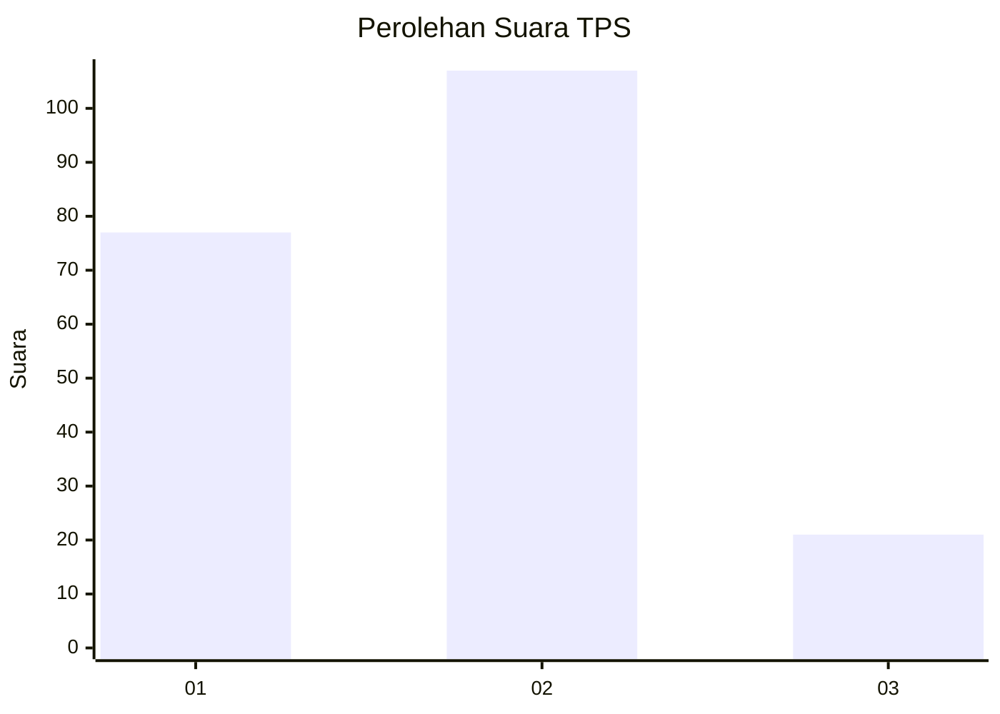
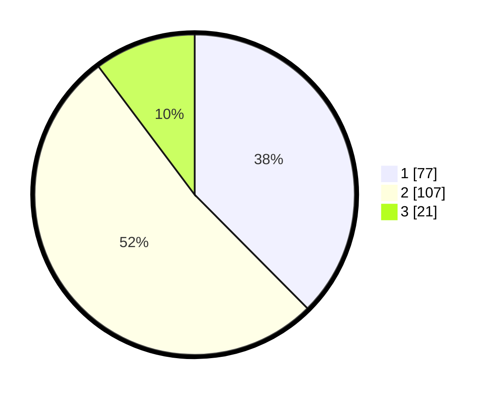

# Hasil

## Grafik

## Tabel

| No. | Nama Paslon    | Suara | Suara (raw) | Persentase |
|:--- |:-------------- | -----:| -----------:| ----------:|
| 1   | ANIES MUHAIMIN | 77    | [77][p-1]   | 37,56      |
| 2   | PRABOWO GIBRAN | 107   | [107][p-2]  | 52,20      |
| 3   | GANJAR MAHFUD  | 21    | [21][p-3]   | 10,24      |

[p-1]: https://github.com/gigit-pemilu/pemilu-2024-32-jawa-barat/blob/main/pilpres/hitung-suara/sub/32-jawa-barat/sub/74-kota-cirebon/sub/01-kejaksan/sub/1001-kejaksan/sub/004-tps/sub/paslon-1.txt
[p-2]: https://github.com/gigit-pemilu/pemilu-2024-32-jawa-barat/blob/main/pilpres/hitung-suara/sub/32-jawa-barat/sub/74-kota-cirebon/sub/01-kejaksan/sub/1001-kejaksan/sub/004-tps/sub/paslon-2.txt
[p-3]: https://github.com/gigit-pemilu/pemilu-2024-32-jawa-barat/blob/main/pilpres/hitung-suara/sub/32-jawa-barat/sub/74-kota-cirebon/sub/01-kejaksan/sub/1001-kejaksan/sub/004-tps/sub/paslon-3.txt

## Foto C Plano

https://sirekap-obj-formc.kpu.go.id/4a25/pemilu/ppwp/32/74/01/10/01/3274011001004-20240214-155901--b7b699ef-84db-4cd8-b50a-d9eaf6332ce5.jpg

https://sirekap-obj-formc.kpu.go.id/4a25/pemilu/ppwp/32/74/01/10/01/3274011001004-20240214-155829--07b236e0-07da-4aa6-a4cf-391c6ddc159e.jpg

https://sirekap-obj-formc.kpu.go.id/4a25/pemilu/ppwp/32/74/01/10/01/3274011001004-20240214-194858--fc364865-f0b9-40d9-8d5f-70e2cadffb0e.jpg

## Metadata

| Key        | Value               |
| ---------- | ------------------- |
| Time Stamp | 2024-02-21 10:00:00 |

