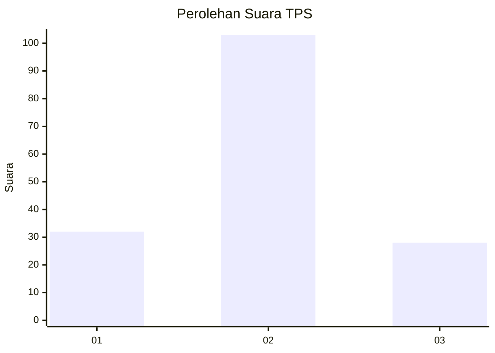

# Hasil

## Grafik

## Tabel

| No. | Nama Paslon    | Suara | Suara (raw) | Persentase |
|:--- |:-------------- | -----:| -----------:| ----------:|
| 1   | ANIES MUHAIMIN | 32    | [32][p-1]   | 19,63      |
| 2   | PRABOWO GIBRAN | 103   | [103][p-2]  | 63,19      |
| 3   | GANJAR MAHFUD  | 28    | [28][p-3]   | 17,18      |

[p-1]: https://github.com/gigit-pemilu/pemilu-2024-32-jawa-barat/blob/main/pilpres/hitung-suara/sub/32-jawa-barat/sub/74-kota-cirebon/sub/01-kejaksan/sub/1001-kejaksan/sub/006-tps/sub/paslon-1.txt
[p-2]: https://github.com/gigit-pemilu/pemilu-2024-32-jawa-barat/blob/main/pilpres/hitung-suara/sub/32-jawa-barat/sub/74-kota-cirebon/sub/01-kejaksan/sub/1001-kejaksan/sub/006-tps/sub/paslon-2.txt
[p-3]: https://github.com/gigit-pemilu/pemilu-2024-32-jawa-barat/blob/main/pilpres/hitung-suara/sub/32-jawa-barat/sub/74-kota-cirebon/sub/01-kejaksan/sub/1001-kejaksan/sub/006-tps/sub/paslon-3.txt

## Foto C Plano

https://sirekap-obj-formc.kpu.go.id/1e5b/pemilu/ppwp/32/74/01/10/01/3274011001006-20240214-192529--82989169-1753-4f16-b6c8-531b2020fd80.jpg

https://sirekap-obj-formc.kpu.go.id/1e5b/pemilu/ppwp/32/74/01/10/01/3274011001006-20240214-192559--2e252671-4688-48b4-8f8f-5c3ba505da3f.jpg

https://sirekap-obj-formc.kpu.go.id/1e5b/pemilu/ppwp/32/74/01/10/01/3274011001006-20240214-190731--89116cd7-6b2e-4d94-a99c-1d32832f18e1.jpg

## Metadata

| Key        | Value               |
| ---------- | ------------------- |
| Time Stamp | 2024-02-14 21:46:01 |

