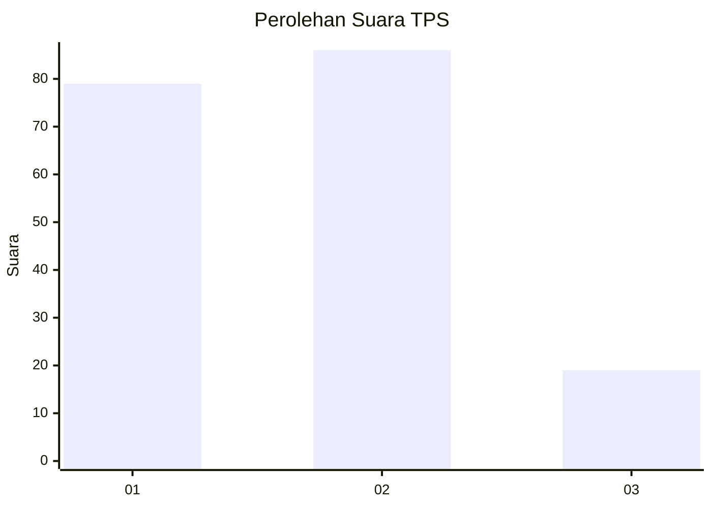
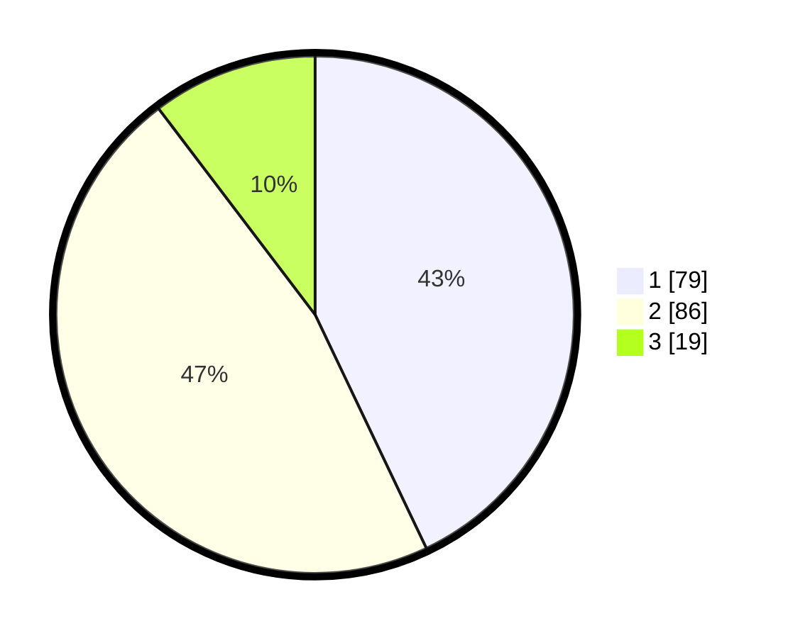

# Hasil

## Grafik

## Tabel

| No. | Nama Paslon    | Suara | Suara (raw) | Persentase |
|:--- |:-------------- | -----:| -----------:| ----------:|
| 1   | ANIES MUHAIMIN | 79    | [79][p-1]   | 42,93      |
| 2   | PRABOWO GIBRAN | 86    | [86][p-2]   | 46,74      |
| 3   | GANJAR MAHFUD  | 19    | [19][p-3]   | 10,33      |

[p-1]: https://github.com/gigit-pemilu/pemilu-2024-32-jawa-barat/blob/main/pilpres/hitung-suara/sub/32-jawa-barat/sub/74-kota-cirebon/sub/02-lemahwungkuk/sub/1001-pegambiran/sub/001-tps/sub/paslon-1.txt
[p-2]: https://github.com/gigit-pemilu/pemilu-2024-32-jawa-barat/blob/main/pilpres/hitung-suara/sub/32-jawa-barat/sub/74-kota-cirebon/sub/02-lemahwungkuk/sub/1001-pegambiran/sub/001-tps/sub/paslon-2.txt
[p-3]: https://github.com/gigit-pemilu/pemilu-2024-32-jawa-barat/blob/main/pilpres/hitung-suara/sub/32-jawa-barat/sub/74-kota-cirebon/sub/02-lemahwungkuk/sub/1001-pegambiran/sub/001-tps/sub/paslon-3.txt

## Foto C Plano

https://sirekap-obj-formc.kpu.go.id/3a1c/pemilu/ppwp/32/74/02/10/01/3274021001001-20240214-215016--cf339117-1d64-429e-98b3-4e5d441176d7.jpg

https://sirekap-obj-formc.kpu.go.id/3a1c/pemilu/ppwp/32/74/02/10/01/3274021001001-20240214-215157--b0be94d7-fcbe-4f11-b6f2-1ad47ac38acd.jpg

https://sirekap-obj-formc.kpu.go.id/3a1c/pemilu/ppwp/32/74/02/10/01/3274021001001-20240214-215331--f4d6fefe-424a-4df1-aa05-490671add93d.jpg

## Metadata

| Key        | Value               |
| ---------- | ------------------- |
| Time Stamp | 2024-02-15 09:00:24 |

