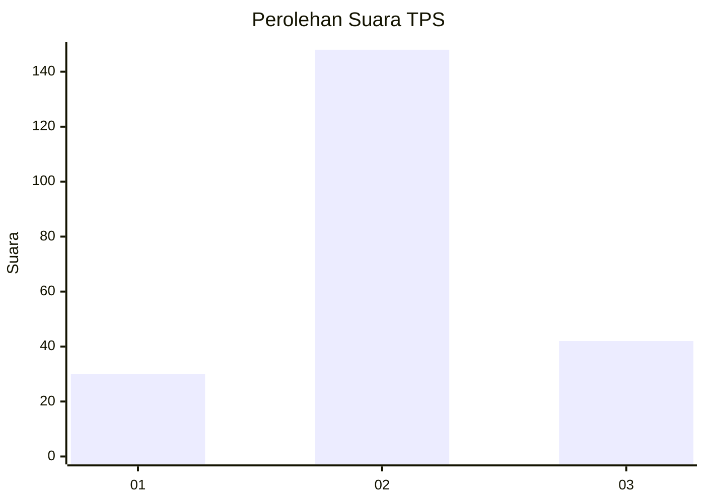
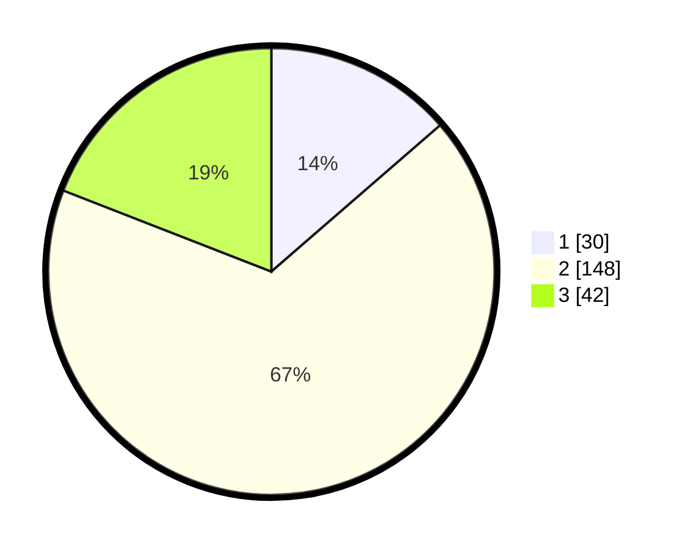

# Hasil

## Grafik

## Tabel

| No. | Nama Paslon    | Suara | Suara (raw) | Persentase |
|:--- |:-------------- | -----:| -----------:| ----------:|
| 1   | ANIES MUHAIMIN | 30    | [30][p-1]   | 13,64      |
| 2   | PRABOWO GIBRAN | 148   | [148][p-2]  | 67,27      |
| 3   | GANJAR MAHFUD  | 42    | [42][p-3]   | 19,09      |

[p-1]: https://github.com/gigit-pemilu/pemilu-2024/blob/main/pilpres/hitung-suara/sub/32-jawa-barat/sub/74-kota-cirebon/sub/02-lemahwungkuk/sub/1001-pegambiran/sub/004-tps/sub/paslon-1.txt
[p-2]: https://github.com/gigit-pemilu/pemilu-2024/blob/main/pilpres/hitung-suara/sub/32-jawa-barat/sub/74-kota-cirebon/sub/02-lemahwungkuk/sub/1001-pegambiran/sub/004-tps/sub/paslon-2.txt
[p-3]: https://github.com/gigit-pemilu/pemilu-2024/blob/main/pilpres/hitung-suara/sub/32-jawa-barat/sub/74-kota-cirebon/sub/02-lemahwungkuk/sub/1001-pegambiran/sub/004-tps/sub/paslon-3.txt

## Foto C Plano

https://sirekap-obj-formc.kpu.go.id/cfe1/pemilu/ppwp/32/74/02/10/01/3274021001004-20240215-010345--c5b6f1cd-c41d-424b-bf03-f0bc2ca1db1e.jpg

https://sirekap-obj-formc.kpu.go.id/cfe1/pemilu/ppwp/32/74/02/10/01/3274021001004-20240215-010517--6f6f162b-4c0a-4b8f-b4a7-f5c1c1b106a9.jpg

https://sirekap-obj-formc.kpu.go.id/cfe1/pemilu/ppwp/32/74/02/10/01/3274021001004-20240215-010630--21a33d27-53f7-415c-a692-4b42c121f60a.jpg

## Metadata

| Key        | Value               |
| ---------- | ------------------- |
| Time Stamp | 2024-02-15 12:00:28 |

