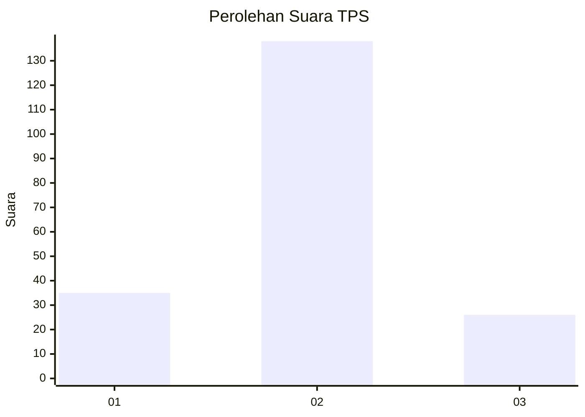
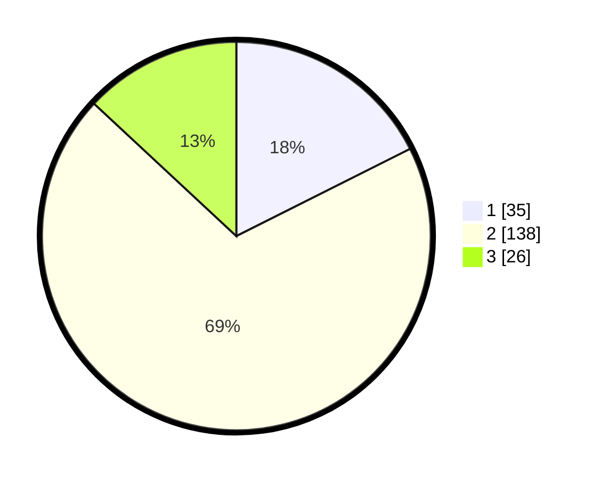

# Hasil

## Grafik

## Tabel

| No. | Nama Paslon    | Suara | Suara (raw) | Persentase |
|:--- |:-------------- | -----:| -----------:| ----------:|
| 1   | ANIES MUHAIMIN | 35    | [35][p-1]   | 17,59      |
| 2   | PRABOWO GIBRAN | 138   | [138][p-2]  | 69,35      |
| 3   | GANJAR MAHFUD  | 26    | [26][p-3]   | 13,07      |

[p-1]: https://github.com/gigit-pemilu/pemilu-2024/blob/main/pilpres/hitung-suara/sub/32-jawa-barat/sub/74-kota-cirebon/sub/02-lemahwungkuk/sub/1001-pegambiran/sub/007-tps/sub/paslon-1.txt
[p-2]: https://github.com/gigit-pemilu/pemilu-2024/blob/main/pilpres/hitung-suara/sub/32-jawa-barat/sub/74-kota-cirebon/sub/02-lemahwungkuk/sub/1001-pegambiran/sub/007-tps/sub/paslon-2.txt
[p-3]: https://github.com/gigit-pemilu/pemilu-2024/blob/main/pilpres/hitung-suara/sub/32-jawa-barat/sub/74-kota-cirebon/sub/02-lemahwungkuk/sub/1001-pegambiran/sub/007-tps/sub/paslon-3.txt

## Foto C Plano

https://sirekap-obj-formc.kpu.go.id/0718/pemilu/ppwp/32/74/02/10/01/3274021001007-20240214-215301--41bf7ddc-14e8-4ea3-8253-7004b963c5b3.jpg

https://sirekap-obj-formc.kpu.go.id/0718/pemilu/ppwp/32/74/02/10/01/3274021001007-20240214-202041--be85ee29-edf0-4269-8a91-4a734f62fd01.jpg

https://sirekap-obj-formc.kpu.go.id/0718/pemilu/ppwp/32/74/02/10/01/3274021001007-20240215-010901--779606a3-2bf0-4915-a8d7-6b60f5e8913c.jpg

## Metadata

| Key        | Value               |
| ---------- | ------------------- |
| Time Stamp | 2024-02-15 19:30:26 |

