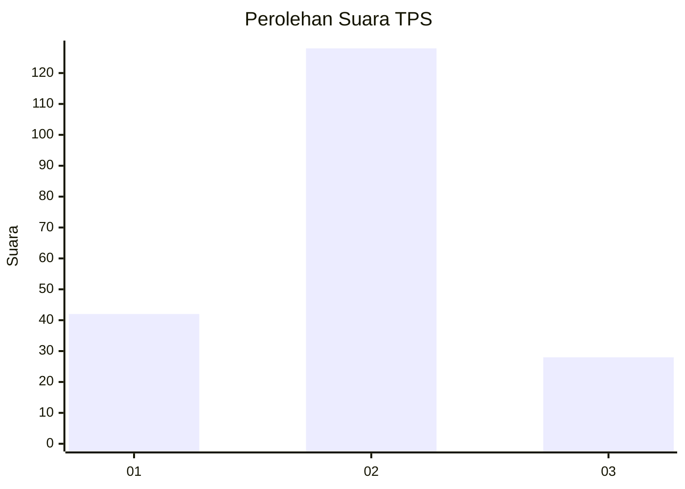
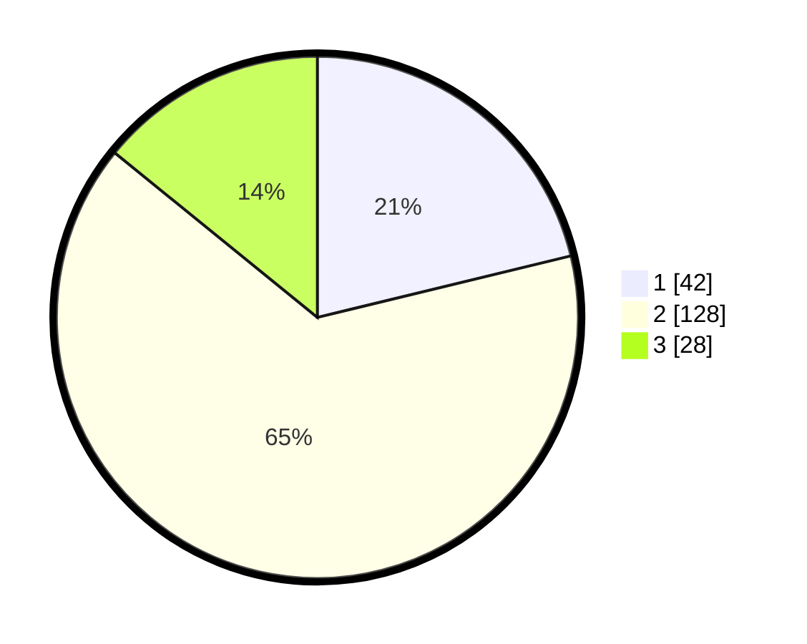

# Hasil

## Grafik

## Tabel

| No. | Nama Paslon    | Suara | Suara (raw) | Persentase |
|:--- |:-------------- | -----:| -----------:| ----------:|
| 1   | ANIES MUHAIMIN | 42    | [42][p-1]   | 21,21      |
| 2   | PRABOWO GIBRAN | 128   | [128][p-2]  | 64,65      |
| 3   | GANJAR MAHFUD  | 28    | [28][p-3]   | 14,14      |

[p-1]: https://github.com/gigit-pemilu/pemilu-2024-32-jawa-barat/blob/main/pilpres/hitung-suara/sub/32-jawa-barat/sub/74-kota-cirebon/sub/03-harjamukti/sub/1001-kalijaga/sub/066-tps/sub/paslon-1.txt
[p-2]: https://github.com/gigit-pemilu/pemilu-2024-32-jawa-barat/blob/main/pilpres/hitung-suara/sub/32-jawa-barat/sub/74-kota-cirebon/sub/03-harjamukti/sub/1001-kalijaga/sub/066-tps/sub/paslon-2.txt
[p-3]: https://github.com/gigit-pemilu/pemilu-2024-32-jawa-barat/blob/main/pilpres/hitung-suara/sub/32-jawa-barat/sub/74-kota-cirebon/sub/03-harjamukti/sub/1001-kalijaga/sub/066-tps/sub/paslon-3.txt

## Foto C Plano

https://sirekap-obj-formc.kpu.go.id/ece8/pemilu/ppwp/32/74/03/10/01/3274031001066-20240225-122324--97fced08-b86c-427b-92e6-4e1c1f4470c3.jpg

https://sirekap-obj-formc.kpu.go.id/ece8/pemilu/ppwp/32/74/03/10/01/3274031001066-20240225-122621--6f151c15-0321-48bc-97e5-9b579257a649.jpg

https://sirekap-obj-formc.kpu.go.id/ece8/pemilu/ppwp/32/74/03/10/01/3274031001066-20240225-122819--9f291a80-9226-4168-99c7-8cedd5c98ad9.jpg

## Metadata

| Key        | Value               |
| ---------- | ------------------- |
| Time Stamp | 2024-02-25 17:00:00 |

## DATA PEMILIH TETAP

Jumlah pemilih dalam DPT: **254**.
 * L: **624**.
 * P: **627**.

## DATA PENGGUNA HAK PILIH

Jumlah pengguna hak pilih dalam DPT: **899**.
 * L: **96**.
 * P: **98**.

Jumlah pengguna hak pilih dalam DPTb: **864**.
 * L: **860**.
 * P: **882**.

Jumlah pengguna hak pilih dalam DPK: **88**.
 * L: **800**.
 * P: **808**.

Jumlah pengguna hak pilih: **208**.
 * L: **206**.
 * P: **102**.

## JUMLAH SUARA SAH DAN TIDAK SAH

JUMLAH SELURUH SUARA SAH: **198**.

JUMLAH SUARA TIDAK SAH: **10**.

JUMLAH SELURUH SUARA SAH DAN SUARA TIDAK SAH: **208**.

