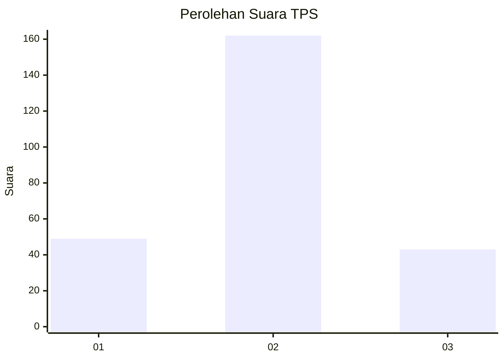
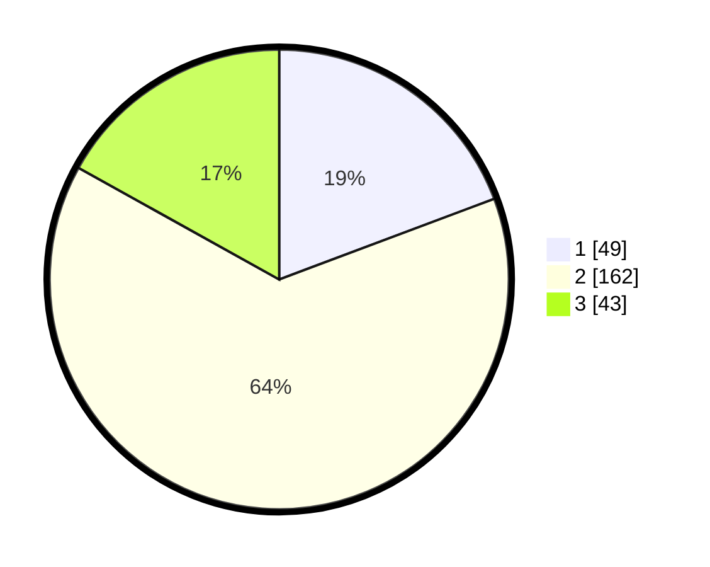

# Hasil

## Grafik

## Tabel

| No. | Nama Paslon    | Suara | Suara (raw) | Persentase |
|:--- |:-------------- | -----:| -----------:| ----------:|
| 1   | ANIES MUHAIMIN | 49    | [49][p-1]   | 19,29      |
| 2   | PRABOWO GIBRAN | 162   | [162][p-2]  | 63,78      |
| 3   | GANJAR MAHFUD  | 43    | [43][p-3]   | 16,93      |

[p-1]: https://github.com/gigit-pemilu/pemilu-2024/blob/main/pilpres/hitung-suara/sub/32-jawa-barat/sub/74-kota-cirebon/sub/04-pekalipan/sub/1001-jagasatru/sub/005-tps/sub/paslon-1.txt
[p-2]: https://github.com/gigit-pemilu/pemilu-2024/blob/main/pilpres/hitung-suara/sub/32-jawa-barat/sub/74-kota-cirebon/sub/04-pekalipan/sub/1001-jagasatru/sub/005-tps/sub/paslon-2.txt
[p-3]: https://github.com/gigit-pemilu/pemilu-2024/blob/main/pilpres/hitung-suara/sub/32-jawa-barat/sub/74-kota-cirebon/sub/04-pekalipan/sub/1001-jagasatru/sub/005-tps/sub/paslon-3.txt

## Foto C Plano

https://sirekap-obj-formc.kpu.go.id/2f15/pemilu/ppwp/32/74/04/10/01/3274041001005-20240215-035622--8598ae8f-af61-4825-bd3b-df0fa4a7ba2b.jpg

https://sirekap-obj-formc.kpu.go.id/2f15/pemilu/ppwp/32/74/04/10/01/3274041001005-20240215-030952--5285402b-7129-4ca8-a99b-bc66d7aca723.jpg

https://sirekap-obj-formc.kpu.go.id/2f15/pemilu/ppwp/32/74/04/10/01/3274041001005-20240215-030225--9700c00c-b170-4e2d-b0d6-d87bcf36f16c.jpg

## Metadata

| Key        | Value               |
| ---------- | ------------------- |
| Time Stamp | 2024-02-15 20:30:46 |

