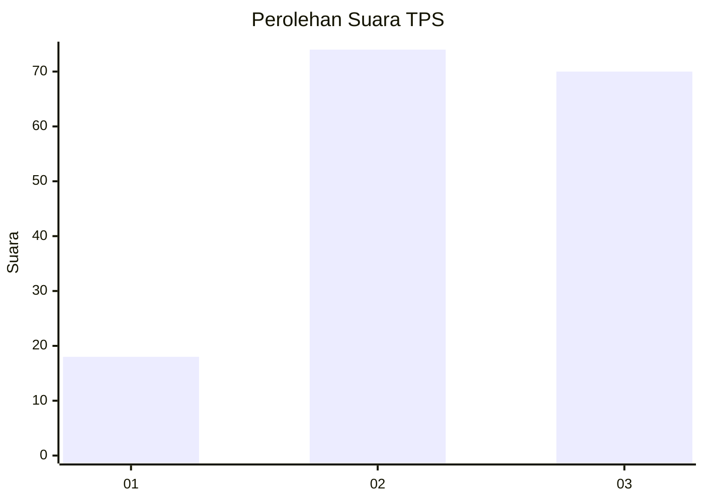
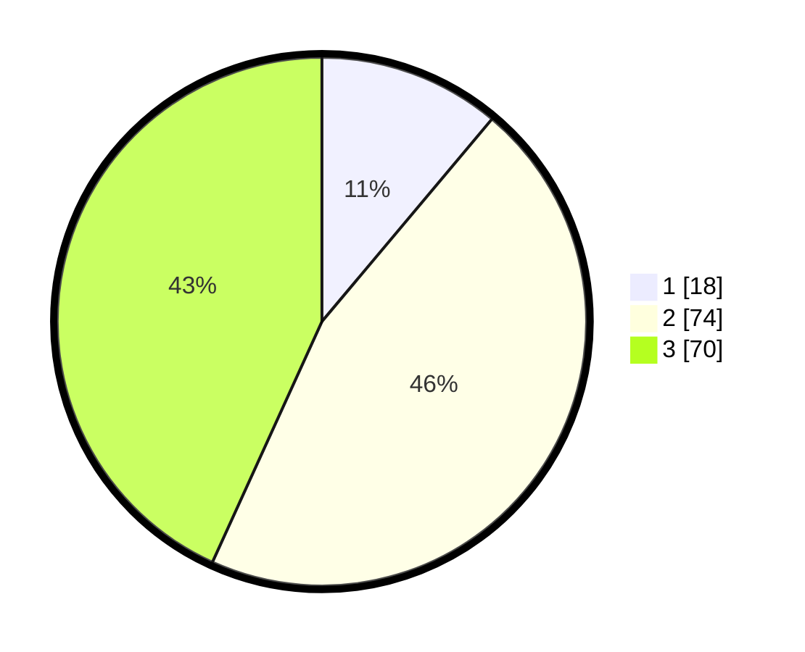

# Hasil

## Grafik

## Tabel

| No. | Nama Paslon    | Suara | Suara (raw) | Persentase |
|:--- |:-------------- | -----:| -----------:| ----------:|
| 1   | ANIES MUHAIMIN | 18    | [18][p-1]   | 11,11      |
| 2   | PRABOWO GIBRAN | 74    | [74][p-2]   | 45,68      |
| 3   | GANJAR MAHFUD  | 70    | [70][p-3]   | 43,21      |

[p-1]: https://github.com/gigit-pemilu/pemilu-2024-32-jawa-barat/blob/main/pilpres/hitung-suara/sub/32-jawa-barat/sub/74-kota-cirebon/sub/05-kesambi/sub/1001-pekiringan/sub/003-tps/sub/paslon-1.txt
[p-2]: https://github.com/gigit-pemilu/pemilu-2024-32-jawa-barat/blob/main/pilpres/hitung-suara/sub/32-jawa-barat/sub/74-kota-cirebon/sub/05-kesambi/sub/1001-pekiringan/sub/003-tps/sub/paslon-2.txt
[p-3]: https://github.com/gigit-pemilu/pemilu-2024-32-jawa-barat/blob/main/pilpres/hitung-suara/sub/32-jawa-barat/sub/74-kota-cirebon/sub/05-kesambi/sub/1001-pekiringan/sub/003-tps/sub/paslon-3.txt

## Foto C Plano

https://sirekap-obj-formc.kpu.go.id/7d16/pemilu/ppwp/32/74/05/10/01/3274051001003-20240215-001632--7c34d3e0-9d20-4539-bb22-b9f443440e6e.jpg

https://sirekap-obj-formc.kpu.go.id/7d16/pemilu/ppwp/32/74/05/10/01/3274051001003-20240215-001739--72d49e59-f82a-4415-b291-e75b83bfa56a.jpg

https://sirekap-obj-formc.kpu.go.id/7d16/pemilu/ppwp/32/74/05/10/01/3274051001003-20240215-001843--3ae32387-e88e-48ba-b7f3-1aa98b79d3e8.jpg

## Metadata

| Key        | Value               |
| ---------- | ------------------- |
| Time Stamp | 2024-02-15 18:00:26 |

