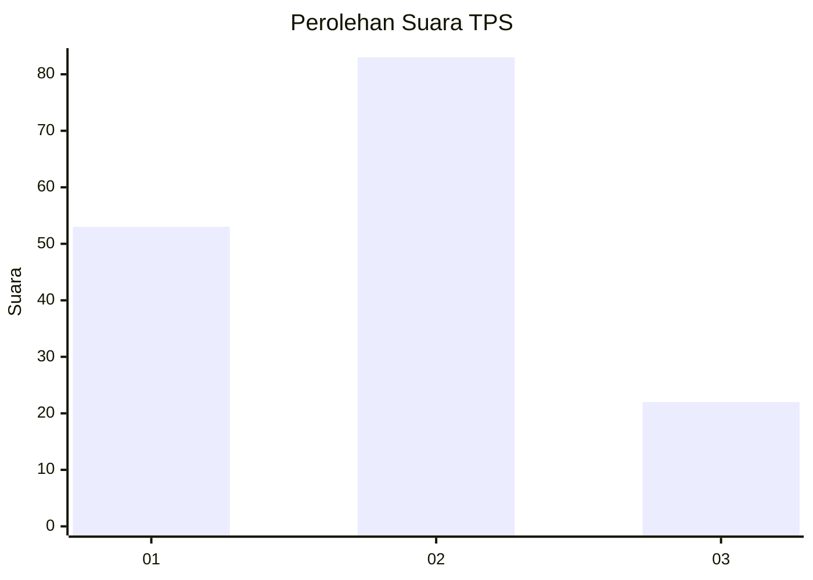
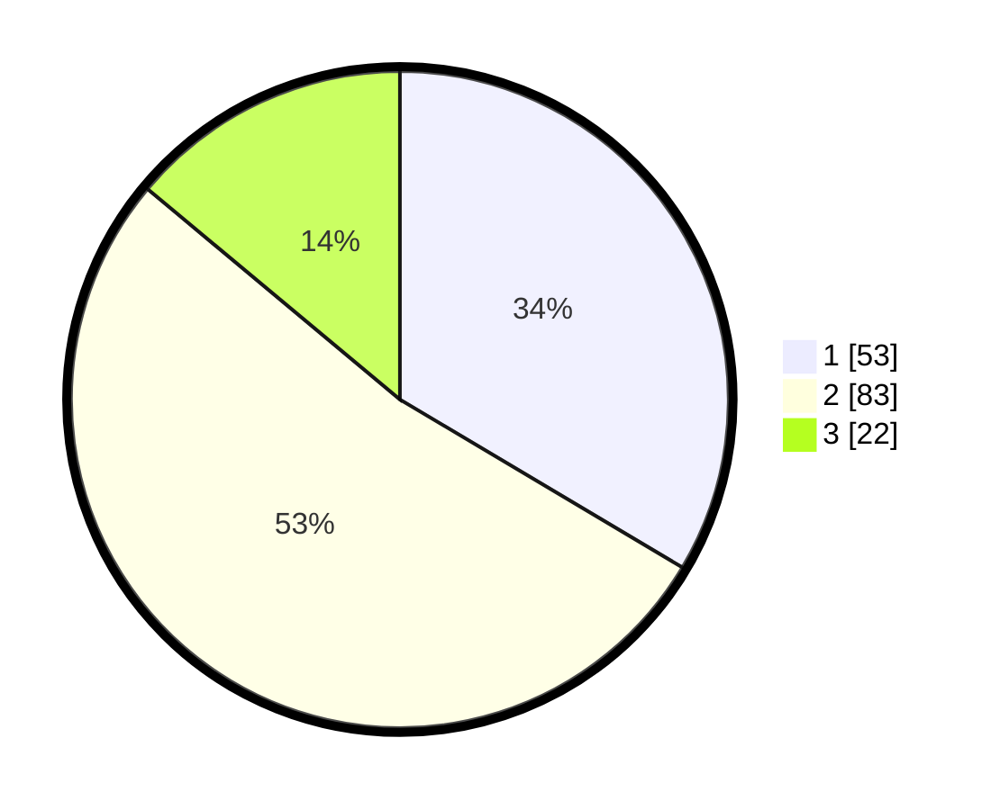

# Hasil

## Grafik

## Tabel

| No. | Nama Paslon    | Suara | Suara (raw) | Persentase |
|:--- |:-------------- | -----:| -----------:| ----------:|
| 1   | ANIES MUHAIMIN | 53    | [53][p-1]   | 33,54      |
| 2   | PRABOWO GIBRAN | 83    | [83][p-2]   | 52,53      |
| 3   | GANJAR MAHFUD  | 22    | [22][p-3]   | 13,92      |

[p-1]: https://github.com/gigit-pemilu/pemilu-2024-32-jawa-barat/blob/main/pilpres/hitung-suara/sub/32-jawa-barat/sub/75-kota-bekasi/sub/01-bekasi-timur/sub/1001-bekasijaya/sub/001-tps/sub/paslon-1.txt
[p-2]: https://github.com/gigit-pemilu/pemilu-2024-32-jawa-barat/blob/main/pilpres/hitung-suara/sub/32-jawa-barat/sub/75-kota-bekasi/sub/01-bekasi-timur/sub/1001-bekasijaya/sub/001-tps/sub/paslon-2.txt
[p-3]: https://github.com/gigit-pemilu/pemilu-2024-32-jawa-barat/blob/main/pilpres/hitung-suara/sub/32-jawa-barat/sub/75-kota-bekasi/sub/01-bekasi-timur/sub/1001-bekasijaya/sub/001-tps/sub/paslon-3.txt

## Foto C Plano

https://sirekap-obj-formc.kpu.go.id/d66b/pemilu/ppwp/32/75/01/10/01/3275011001001-20240214-202025--b3b6d98f-71fb-42bb-b291-d0f6486f5d78.jpg

https://sirekap-obj-formc.kpu.go.id/d66b/pemilu/ppwp/32/75/01/10/01/3275011001001-20240214-211333--a2b7fc26-a697-49dc-b50e-b8d247261190.jpg

https://sirekap-obj-formc.kpu.go.id/d66b/pemilu/ppwp/32/75/01/10/01/3275011001001-20240214-202627--486ee8c3-49b4-42b7-8706-cbc62b1f4bd2.jpg

## Metadata

| Key        | Value               |
| ---------- | ------------------- |
| Time Stamp | 2024-02-15 20:30:46 |

