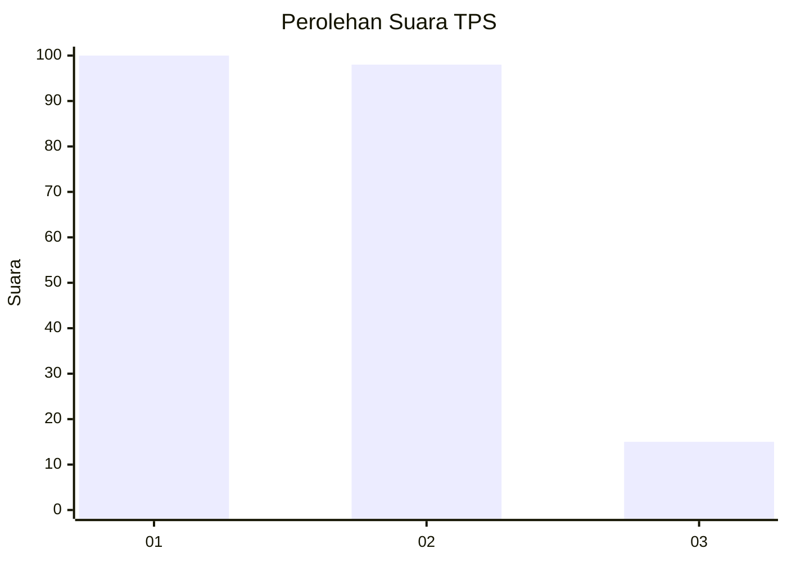
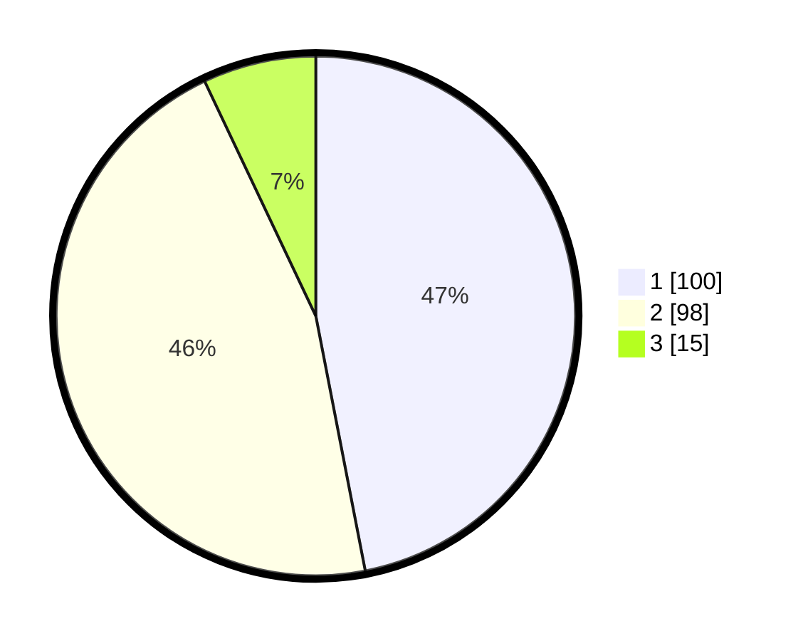

# Hasil

## Grafik

## Tabel

| No. | Nama Paslon    | Suara | Suara (raw) | Persentase |
|:--- |:-------------- | -----:| -----------:| ----------:|
| 1   | ANIES MUHAIMIN | 100   | [100][p-1]  | 46,95      |
| 2   | PRABOWO GIBRAN | 98    | [98][p-2]   | 46,01      |
| 3   | GANJAR MAHFUD  | 15    | [15][p-3]   | 7,04       |

[p-1]: https://github.com/gigit-pemilu/pemilu-2024/blob/main/pilpres/hitung-suara/sub/32-jawa-barat/sub/75-kota-bekasi/sub/01-bekasi-timur/sub/1001-bekasijaya/sub/004-tps/sub/paslon-1.txt
[p-2]: https://github.com/gigit-pemilu/pemilu-2024/blob/main/pilpres/hitung-suara/sub/32-jawa-barat/sub/75-kota-bekasi/sub/01-bekasi-timur/sub/1001-bekasijaya/sub/004-tps/sub/paslon-2.txt
[p-3]: https://github.com/gigit-pemilu/pemilu-2024/blob/main/pilpres/hitung-suara/sub/32-jawa-barat/sub/75-kota-bekasi/sub/01-bekasi-timur/sub/1001-bekasijaya/sub/004-tps/sub/paslon-3.txt

## Foto C Plano

https://sirekap-obj-formc.kpu.go.id/8f85/pemilu/ppwp/32/75/01/10/01/3275011001004-20240214-194443--85e1090d-2fac-4320-9625-4557d439405c.jpg

https://sirekap-obj-formc.kpu.go.id/8f85/pemilu/ppwp/32/75/01/10/01/3275011001004-20240214-193737--7d49bf66-8f6c-4037-8663-95018f071da2.jpg

https://sirekap-obj-formc.kpu.go.id/8f85/pemilu/ppwp/32/75/01/10/01/3275011001004-20240214-194753--b3b16c13-77fa-4551-847c-2370d26c5502.jpg

## Metadata

| Key        | Value               |
| ---------- | ------------------- |
| Time Stamp | 2024-02-15 20:30:46 |

