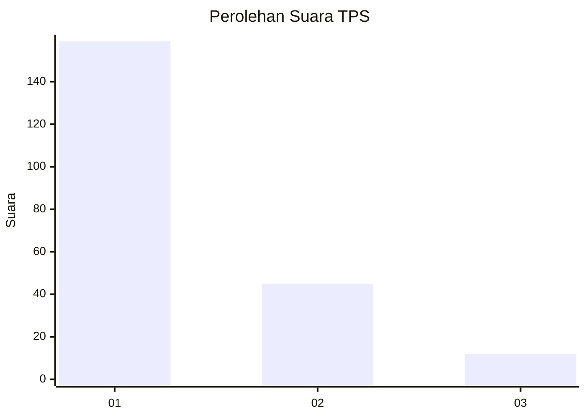
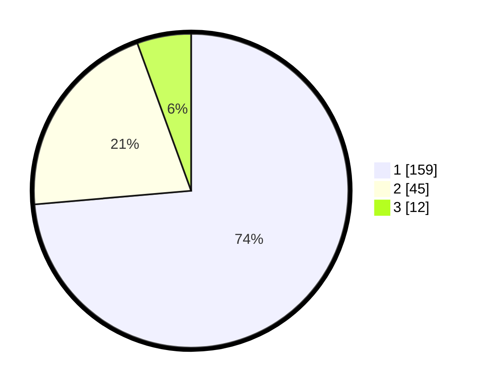

# Hasil

## Grafik

## Tabel

| No. | Nama Paslon    | Suara | Suara (raw) | Persentase |
|:--- |:-------------- | -----:| -----------:| ----------:|
| 1   | ANIES MUHAIMIN | 159   | [159][p-1]  | 73,61      |
| 2   | PRABOWO GIBRAN | 45    | [45][p-2]   | 20,83      |
| 3   | GANJAR MAHFUD  | 12    | [12][p-3]   | 5,56       |

[p-1]: https://github.com/gigit-pemilu/pemilu-2024/blob/main/pilpres/hitung-suara/sub/32-jawa-barat/sub/75-kota-bekasi/sub/01-bekasi-timur/sub/1002-margahayu/sub/019-tps/sub/paslon-1.txt
[p-2]: https://github.com/gigit-pemilu/pemilu-2024/blob/main/pilpres/hitung-suara/sub/32-jawa-barat/sub/75-kota-bekasi/sub/01-bekasi-timur/sub/1002-margahayu/sub/019-tps/sub/paslon-2.txt
[p-3]: https://github.com/gigit-pemilu/pemilu-2024/blob/main/pilpres/hitung-suara/sub/32-jawa-barat/sub/75-kota-bekasi/sub/01-bekasi-timur/sub/1002-margahayu/sub/019-tps/sub/paslon-3.txt

## Foto C Plano

https://sirekap-obj-formc.kpu.go.id/2c37/pemilu/ppwp/32/75/01/10/02/3275011002019-20240215-000202--042e252f-3724-4772-a224-6ec5c633ceae.jpg

https://sirekap-obj-formc.kpu.go.id/2c37/pemilu/ppwp/32/75/01/10/02/3275011002019-20240215-000333--5ea1f8bc-4bec-447e-aa55-cde5510ec5d7.jpg

https://sirekap-obj-formc.kpu.go.id/2c37/pemilu/ppwp/32/75/01/10/02/3275011002019-20240215-000456--a9c85c27-135a-46b2-97eb-fd905f4d8822.jpg

## Metadata

| Key        | Value               |
| ---------- | ------------------- |
| Time Stamp | 2024-02-24 22:31:28 |

