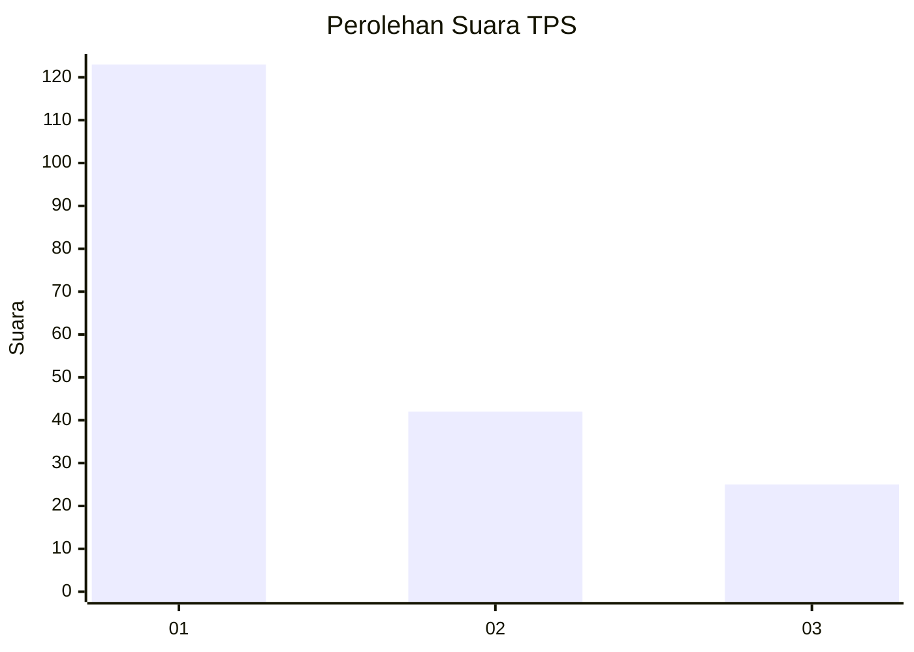
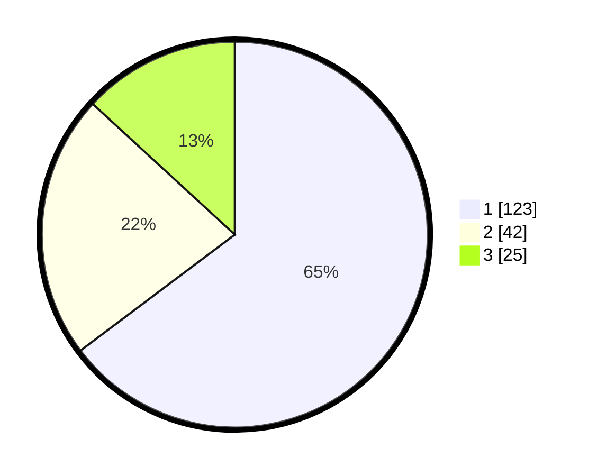

# Hasil

## Grafik

## Tabel

| No. | Nama Paslon    | Suara | Suara (raw) | Persentase |
|:--- |:-------------- | -----:| -----------:| ----------:|
| 1   | ANIES MUHAIMIN | 123   | [123][p-1]  | 64,74      |
| 2   | PRABOWO GIBRAN | 42    | [42][p-2]   | 22,11      |
| 3   | GANJAR MAHFUD  | 25    | [25][p-3]   | 13,16      |

[p-1]: https://github.com/gigit-pemilu/pemilu-2024/blob/main/pilpres/hitung-suara/sub/32-jawa-barat/sub/75-kota-bekasi/sub/01-bekasi-timur/sub/1004-arenjaya/sub/149-tps/sub/paslon-1.txt
[p-2]: https://github.com/gigit-pemilu/pemilu-2024/blob/main/pilpres/hitung-suara/sub/32-jawa-barat/sub/75-kota-bekasi/sub/01-bekasi-timur/sub/1004-arenjaya/sub/149-tps/sub/paslon-2.txt
[p-3]: https://github.com/gigit-pemilu/pemilu-2024/blob/main/pilpres/hitung-suara/sub/32-jawa-barat/sub/75-kota-bekasi/sub/01-bekasi-timur/sub/1004-arenjaya/sub/149-tps/sub/paslon-3.txt

## Foto C Plano

https://sirekap-obj-formc.kpu.go.id/0d0e/pemilu/ppwp/32/75/01/10/04/3275011004149-20240214-215406--9df666c3-32d9-417f-9d2f-63beefa68b5b.jpg

https://sirekap-obj-formc.kpu.go.id/0d0e/pemilu/ppwp/32/75/01/10/04/3275011004149-20240214-215510--e96c07a5-60e7-4d06-8241-d9962d37687d.jpg

https://sirekap-obj-formc.kpu.go.id/0d0e/pemilu/ppwp/32/75/01/10/04/3275011004149-20240214-215554--1905dd1a-243d-43ef-9d2f-960005cc4d9d.jpg

## Metadata

| Key        | Value               |
| ---------- | ------------------- |
| Time Stamp | 2024-02-24 22:31:28 |

