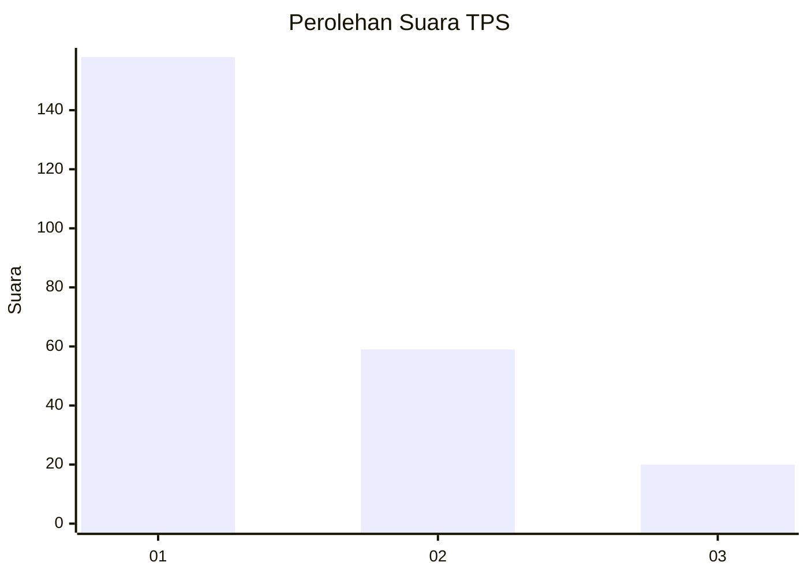
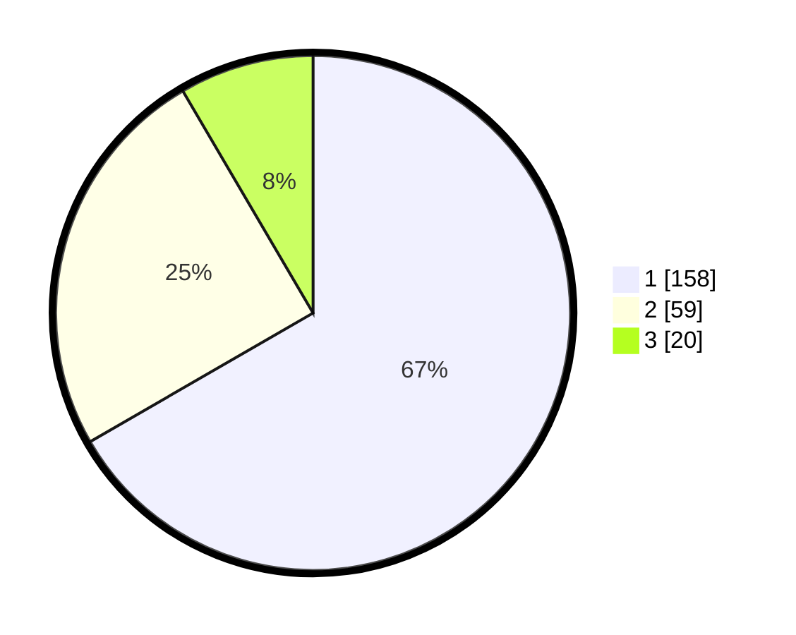

# Hasil

## Grafik

## Tabel

| No. | Nama Paslon    | Suara | Suara (raw) | Persentase |
|:--- |:-------------- | -----:| -----------:| ----------:|
| 1   | ANIES MUHAIMIN | 158   | [158][p-1]  | 66,67      |
| 2   | PRABOWO GIBRAN | 59    | [59][p-2]   | 24,89      |
| 3   | GANJAR MAHFUD  | 20    | [20][p-3]   | 8,44       |

[p-1]: https://github.com/gigit-pemilu/pemilu-2024/blob/main/pilpres/hitung-suara/sub/32-jawa-barat/sub/75-kota-bekasi/sub/01-bekasi-timur/sub/1004-arenjaya/sub/150-tps/sub/paslon-1.txt
[p-2]: https://github.com/gigit-pemilu/pemilu-2024/blob/main/pilpres/hitung-suara/sub/32-jawa-barat/sub/75-kota-bekasi/sub/01-bekasi-timur/sub/1004-arenjaya/sub/150-tps/sub/paslon-2.txt
[p-3]: https://github.com/gigit-pemilu/pemilu-2024/blob/main/pilpres/hitung-suara/sub/32-jawa-barat/sub/75-kota-bekasi/sub/01-bekasi-timur/sub/1004-arenjaya/sub/150-tps/sub/paslon-3.txt

## Foto C Plano

https://sirekap-obj-formc.kpu.go.id/1092/pemilu/ppwp/32/75/01/10/04/3275011004150-20240215-174926--d187ec67-a154-4a06-90d3-e32446c05db2.jpg

https://sirekap-obj-formc.kpu.go.id/1092/pemilu/ppwp/32/75/01/10/04/3275011004150-20240215-174936--5248dceb-4227-4f38-9220-f25a2366c05c.jpg

https://sirekap-obj-formc.kpu.go.id/1092/pemilu/ppwp/32/75/01/10/04/3275011004150-20240215-174943--c71fb00b-0452-4462-86a0-6493544e3160.jpg

## Metadata

| Key        | Value               |
| ---------- | ------------------- |
| Time Stamp | 2024-02-24 22:31:28 |

