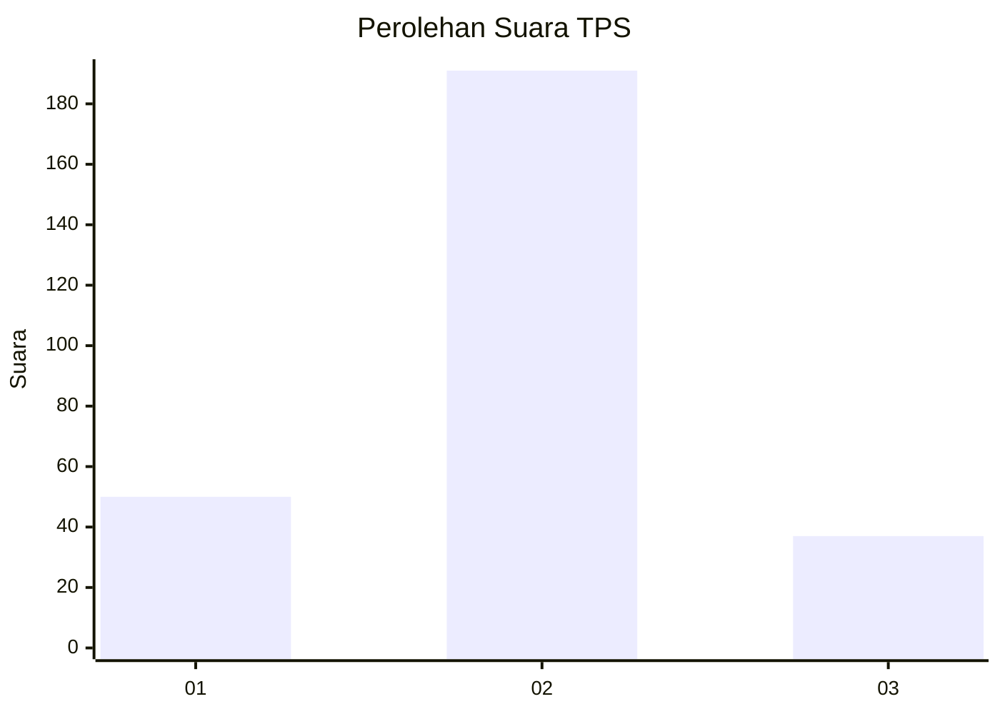
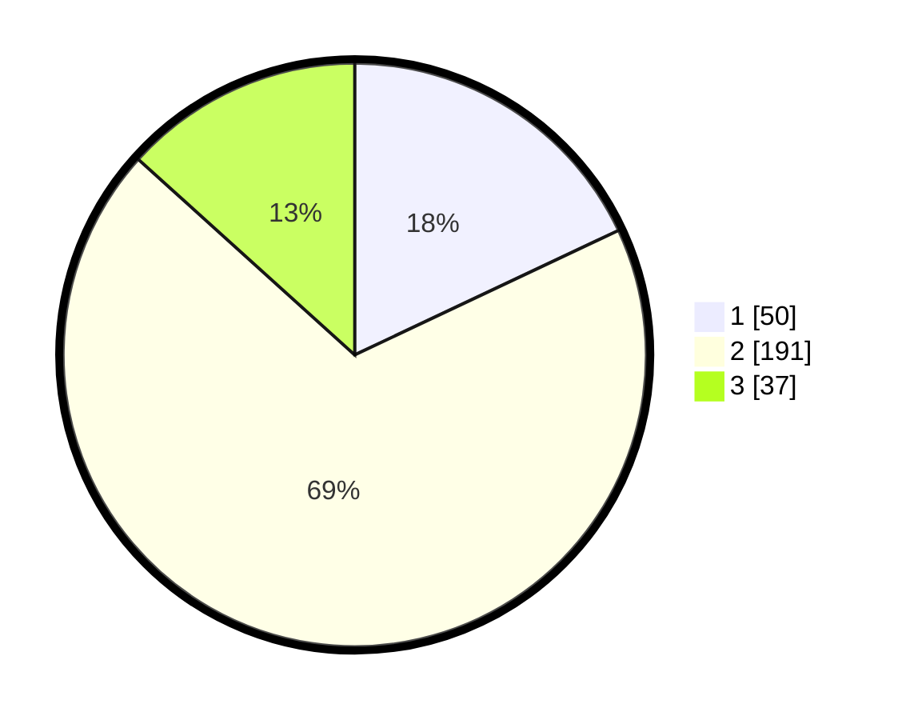

# Hasil

## Grafik

## Tabel

| No. | Nama Paslon    | Suara | Suara (raw) | Persentase |
|:--- |:-------------- | -----:| -----------:| ----------:|
| 1   | ANIES MUHAIMIN | 50    | [50][p-1]   | 17,99      |
| 2   | PRABOWO GIBRAN | 191   | [191][p-2]  | 68,71      |
| 3   | GANJAR MAHFUD  | 37    | [37][p-3]   | 13,31      |

[p-1]: https://github.com/gigit-pemilu/pemilu-2024/blob/main/pilpres/hitung-suara/sub/32-jawa-barat/sub/75-kota-bekasi/sub/01-bekasi-timur/sub/1004-arenjaya/sub/903-tps/sub/paslon-1.txt
[p-2]: https://github.com/gigit-pemilu/pemilu-2024/blob/main/pilpres/hitung-suara/sub/32-jawa-barat/sub/75-kota-bekasi/sub/01-bekasi-timur/sub/1004-arenjaya/sub/903-tps/sub/paslon-2.txt
[p-3]: https://github.com/gigit-pemilu/pemilu-2024/blob/main/pilpres/hitung-suara/sub/32-jawa-barat/sub/75-kota-bekasi/sub/01-bekasi-timur/sub/1004-arenjaya/sub/903-tps/sub/paslon-3.txt

## Foto C Plano

https://sirekap-obj-formc.kpu.go.id/6d9d/pemilu/ppwp/32/75/01/10/04/3275011004903-20240215-015659--c79ddb27-cf92-4737-91dd-66e9a8c5c137.jpg

https://sirekap-obj-formc.kpu.go.id/6d9d/pemilu/ppwp/32/75/01/10/04/3275011004903-20240215-015721--34f51d79-0ab3-4443-b61a-04590d9abfff.jpg

https://sirekap-obj-formc.kpu.go.id/6d9d/pemilu/ppwp/32/75/01/10/04/3275011004903-20240215-015747--c27b7e10-5756-43bb-b62d-27ae105c259a.jpg

## Metadata

| Key        | Value               |
| ---------- | ------------------- |
| Time Stamp | 2024-02-15 22:40:13 |

