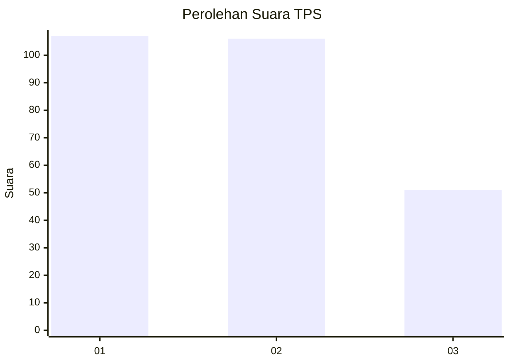
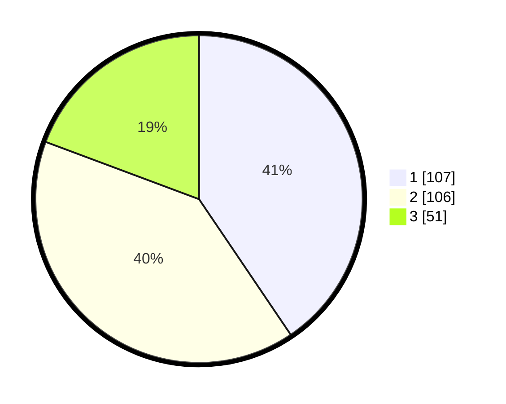

# Hasil

## Grafik

## Tabel

| No. | Nama Paslon    | Suara | Suara (raw) | Persentase |
|:--- |:-------------- | -----:| -----------:| ----------:|
| 1   | ANIES MUHAIMIN | 107   | [107][p-1]  | 40,53      |
| 2   | PRABOWO GIBRAN | 106   | [106][p-2]  | 40,15      |
| 3   | GANJAR MAHFUD  | 51    | [51][p-3]   | 19,32      |

[p-1]: https://github.com/gigit-pemilu/pemilu-2024/blob/main/pilpres/hitung-suara/sub/32-jawa-barat/sub/75-kota-bekasi/sub/02-bekasi-barat/sub/1001-bintara/sub/108-tps/sub/paslon-1.txt
[p-2]: https://github.com/gigit-pemilu/pemilu-2024/blob/main/pilpres/hitung-suara/sub/32-jawa-barat/sub/75-kota-bekasi/sub/02-bekasi-barat/sub/1001-bintara/sub/108-tps/sub/paslon-2.txt
[p-3]: https://github.com/gigit-pemilu/pemilu-2024/blob/main/pilpres/hitung-suara/sub/32-jawa-barat/sub/75-kota-bekasi/sub/02-bekasi-barat/sub/1001-bintara/sub/108-tps/sub/paslon-3.txt

## Foto C Plano

https://sirekap-obj-formc.kpu.go.id/ac38/pemilu/ppwp/32/75/02/10/01/3275021001108-20240214-222138--c0bf8a1d-48aa-4498-96a7-0a014c775bd2.jpg

https://sirekap-obj-formc.kpu.go.id/ac38/pemilu/ppwp/32/75/02/10/01/3275021001108-20240214-222655--61567dcc-caf9-4217-b5e6-919ab2acac7b.jpg

https://sirekap-obj-formc.kpu.go.id/ac38/pemilu/ppwp/32/75/02/10/01/3275021001108-20240214-222741--fa894b2c-03ca-426d-9c76-9f102445306c.jpg

## Metadata

| Key        | Value               |
| ---------- | ------------------- |
| Time Stamp | 2024-02-24 22:31:28 |

