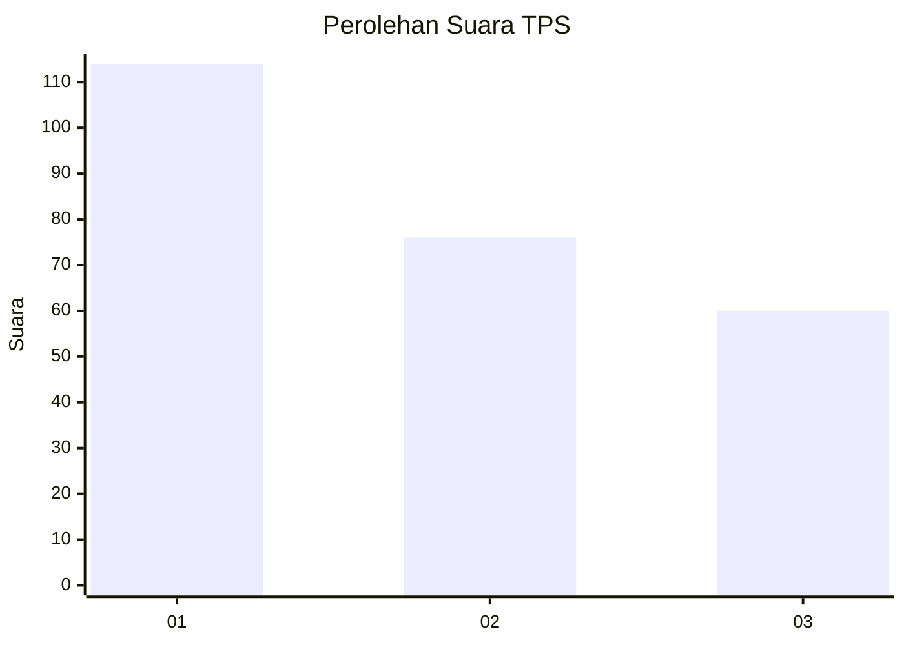
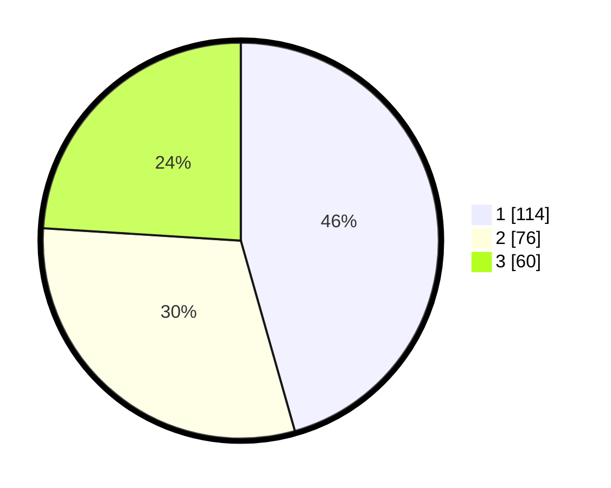

# Hasil

## Grafik

## Tabel

| No. | Nama Paslon    | Suara | Suara (raw) | Persentase |
|:--- |:-------------- | -----:| -----------:| ----------:|
| 1   | ANIES MUHAIMIN | 114   | [114][p-1]  | 45,60      |
| 2   | PRABOWO GIBRAN | 76    | [76][p-2]   | 30,40      |
| 3   | GANJAR MAHFUD  | 60    | [60][p-3]   | 24,00      |

[p-1]: https://github.com/gigit-pemilu/pemilu-2024/blob/main/pilpres/hitung-suara/sub/32-jawa-barat/sub/75-kota-bekasi/sub/02-bekasi-barat/sub/1001-bintara/sub/129-tps/sub/paslon-1.txt
[p-2]: https://github.com/gigit-pemilu/pemilu-2024/blob/main/pilpres/hitung-suara/sub/32-jawa-barat/sub/75-kota-bekasi/sub/02-bekasi-barat/sub/1001-bintara/sub/129-tps/sub/paslon-2.txt
[p-3]: https://github.com/gigit-pemilu/pemilu-2024/blob/main/pilpres/hitung-suara/sub/32-jawa-barat/sub/75-kota-bekasi/sub/02-bekasi-barat/sub/1001-bintara/sub/129-tps/sub/paslon-3.txt

## Foto C Plano

https://sirekap-obj-formc.kpu.go.id/0311/pemilu/ppwp/32/75/02/10/01/3275021001129-20240215-025824--66a21786-9b7a-4317-b905-6b673aef8f30.jpg

https://sirekap-obj-formc.kpu.go.id/0311/pemilu/ppwp/32/75/02/10/01/3275021001129-20240215-025959--9ad4fd55-1c95-41f4-a021-6697b081fd5e.jpg

https://sirekap-obj-formc.kpu.go.id/0311/pemilu/ppwp/32/75/02/10/01/3275021001129-20240215-030105--80273f0c-2a2d-40a0-9008-80309d3d5f68.jpg

## Metadata

| Key        | Value               |
| ---------- | ------------------- |
| Time Stamp | 2024-02-25 11:00:00 |

