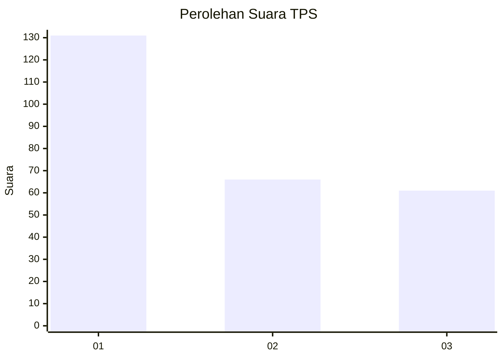
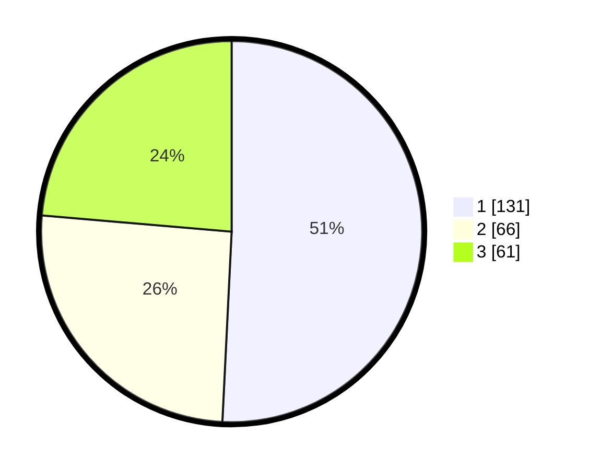

# Hasil

## Grafik

## Tabel

| No. | Nama Paslon    | Suara | Suara (raw) | Persentase |
|:--- |:-------------- | -----:| -----------:| ----------:|
| 1   | ANIES MUHAIMIN | 131   | [131][p-1]  | 50,78      |
| 2   | PRABOWO GIBRAN | 66    | [66][p-2]   | 25,58      |
| 3   | GANJAR MAHFUD  | 61    | [61][p-3]   | 23,64      |

[p-1]: https://github.com/gigit-pemilu/pemilu-2024/blob/main/pilpres/hitung-suara/sub/32-jawa-barat/sub/75-kota-bekasi/sub/02-bekasi-barat/sub/1001-bintara/sub/130-tps/sub/paslon-1.txt
[p-2]: https://github.com/gigit-pemilu/pemilu-2024/blob/main/pilpres/hitung-suara/sub/32-jawa-barat/sub/75-kota-bekasi/sub/02-bekasi-barat/sub/1001-bintara/sub/130-tps/sub/paslon-2.txt
[p-3]: https://github.com/gigit-pemilu/pemilu-2024/blob/main/pilpres/hitung-suara/sub/32-jawa-barat/sub/75-kota-bekasi/sub/02-bekasi-barat/sub/1001-bintara/sub/130-tps/sub/paslon-3.txt

## Foto C Plano

https://sirekap-obj-formc.kpu.go.id/c548/pemilu/ppwp/32/75/02/10/01/3275021001130-20240214-200801--e67ec83d-a71c-42c4-a87d-2dd9ffc89ec1.jpg

https://sirekap-obj-formc.kpu.go.id/c548/pemilu/ppwp/32/75/02/10/01/3275021001130-20240214-221813--b0f6a178-dffd-4460-84ab-37f4a3c48873.jpg

https://sirekap-obj-formc.kpu.go.id/c548/pemilu/ppwp/32/75/02/10/01/3275021001130-20240214-201128--b4654865-5bdc-4328-af71-bbae64878d9f.jpg

## Metadata

| Key        | Value               |
| ---------- | ------------------- |
| Time Stamp | 2024-02-25 15:00:00 |

