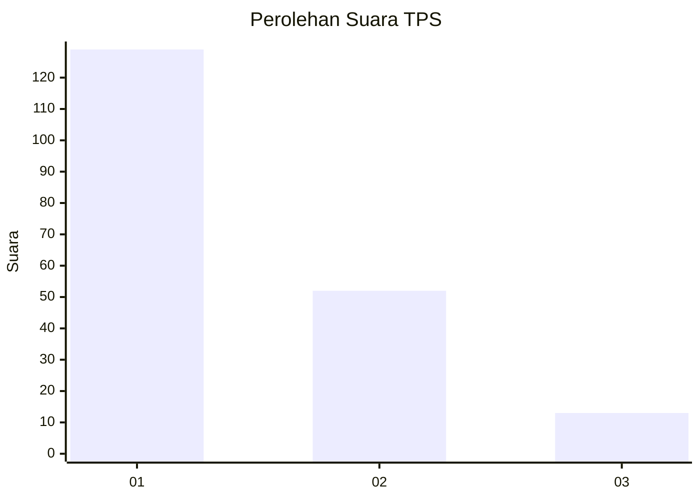
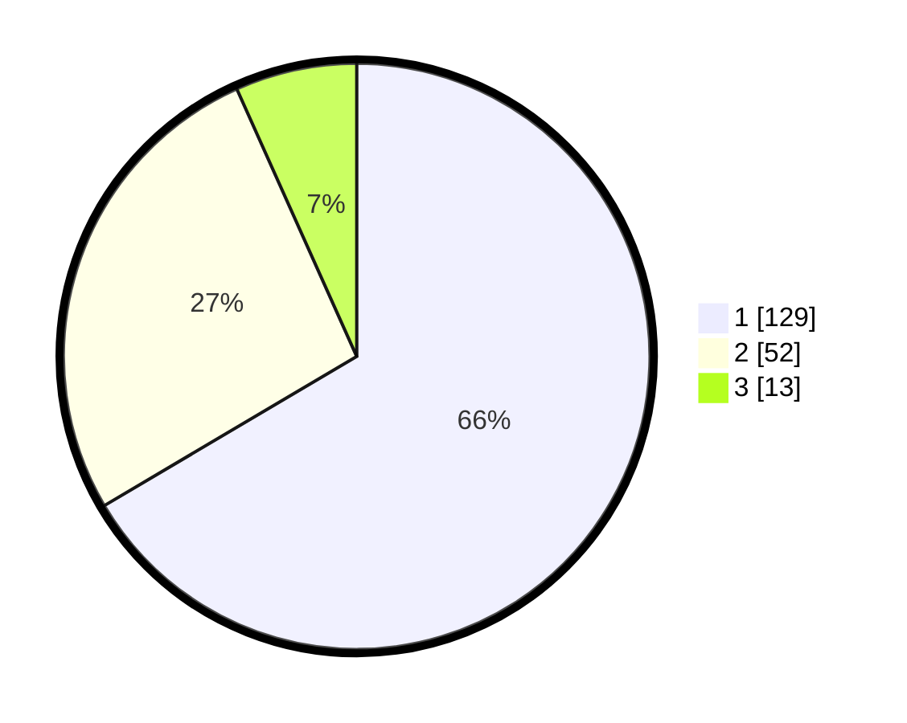

# Hasil

## Grafik

## Tabel

| No. | Nama Paslon    | Suara | Suara (raw) | Persentase |
|:--- |:-------------- | -----:| -----------:| ----------:|
| 1   | ANIES MUHAIMIN | 129   | [129][p-1]  | 66,49      |
| 2   | PRABOWO GIBRAN | 52    | [52][p-2]   | 26,80      |
| 3   | GANJAR MAHFUD  | 13    | [13][p-3]   | 6,70       |

[p-1]: https://github.com/gigit-pemilu/pemilu-2024/blob/main/pilpres/hitung-suara/sub/32-jawa-barat/sub/75-kota-bekasi/sub/02-bekasi-barat/sub/1004-bintarajaya/sub/016-tps/sub/paslon-1.txt
[p-2]: https://github.com/gigit-pemilu/pemilu-2024/blob/main/pilpres/hitung-suara/sub/32-jawa-barat/sub/75-kota-bekasi/sub/02-bekasi-barat/sub/1004-bintarajaya/sub/016-tps/sub/paslon-2.txt
[p-3]: https://github.com/gigit-pemilu/pemilu-2024/blob/main/pilpres/hitung-suara/sub/32-jawa-barat/sub/75-kota-bekasi/sub/02-bekasi-barat/sub/1004-bintarajaya/sub/016-tps/sub/paslon-3.txt

## Foto C Plano

https://sirekap-obj-formc.kpu.go.id/aa25/pemilu/ppwp/32/75/02/10/04/3275021004016-20240215-160640--0fb6685c-fdb5-4b79-b3ca-98d5b6fbe7dc.jpg

https://sirekap-obj-formc.kpu.go.id/aa25/pemilu/ppwp/32/75/02/10/04/3275021004016-20240215-160711--ea5b2ad4-b5a9-44c9-b468-ca5bfc04eb9c.jpg

https://sirekap-obj-formc.kpu.go.id/aa25/pemilu/ppwp/32/75/02/10/04/3275021004016-20240215-160753--be1def1e-1849-48d5-b68f-055a993337f9.jpg

## Metadata

| Key        | Value               |
| ---------- | ------------------- |
| Time Stamp | 2024-02-15 22:00:27 |

