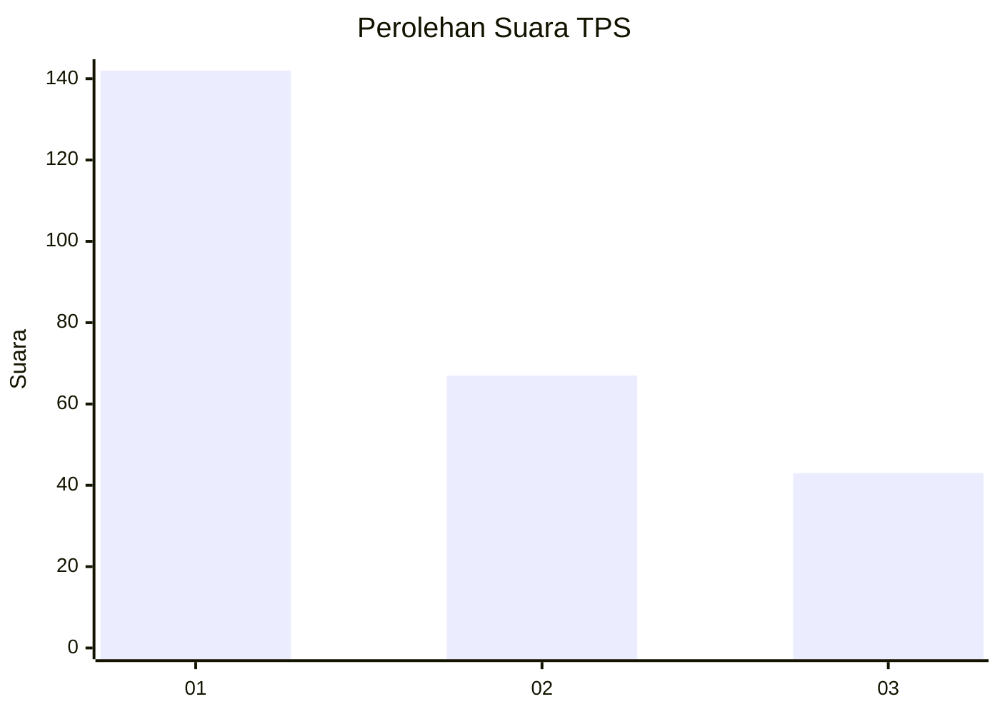
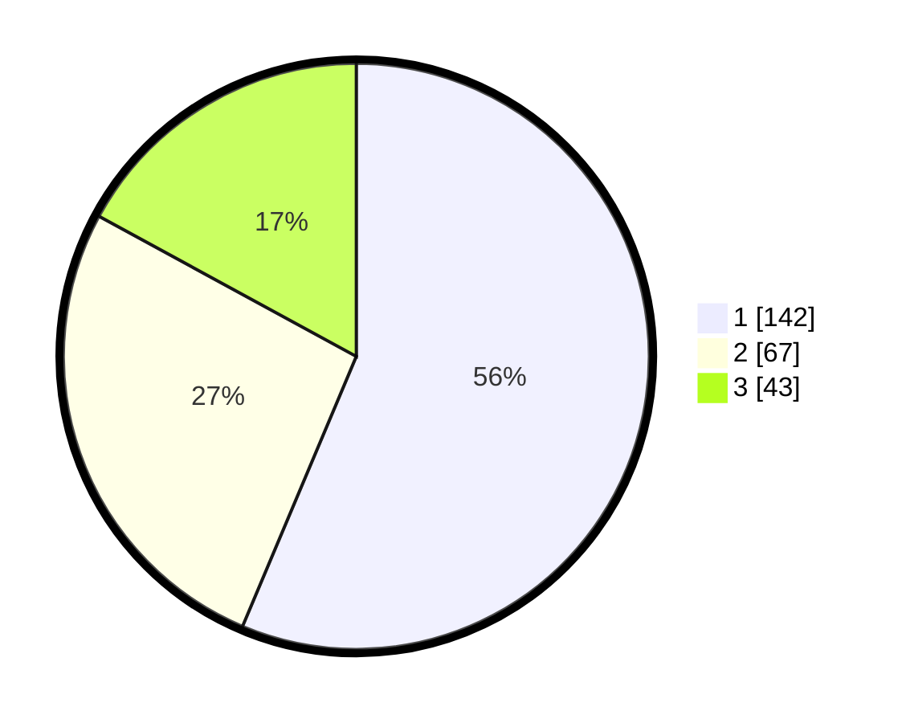

# Hasil

## Grafik

## Tabel

| No. | Nama Paslon    | Suara | Suara (raw) | Persentase |
|:--- |:-------------- | -----:| -----------:| ----------:|
| 1   | ANIES MUHAIMIN | 142   | [142][p-1]  | 56,35      |
| 2   | PRABOWO GIBRAN | 67    | [67][p-2]   | 26,59      |
| 3   | GANJAR MAHFUD  | 43    | [43][p-3]   | 17,06      |

[p-1]: https://github.com/gigit-pemilu/pemilu-2024/blob/main/pilpres/hitung-suara/sub/32-jawa-barat/sub/75-kota-bekasi/sub/02-bekasi-barat/sub/1004-bintarajaya/sub/090-tps/sub/paslon-1.txt
[p-2]: https://github.com/gigit-pemilu/pemilu-2024/blob/main/pilpres/hitung-suara/sub/32-jawa-barat/sub/75-kota-bekasi/sub/02-bekasi-barat/sub/1004-bintarajaya/sub/090-tps/sub/paslon-2.txt
[p-3]: https://github.com/gigit-pemilu/pemilu-2024/blob/main/pilpres/hitung-suara/sub/32-jawa-barat/sub/75-kota-bekasi/sub/02-bekasi-barat/sub/1004-bintarajaya/sub/090-tps/sub/paslon-3.txt

## Foto C Plano

https://sirekap-obj-formc.kpu.go.id/922a/pemilu/ppwp/32/75/02/10/04/3275021004090-20240214-233259--bc7b0e0e-f1d3-4e26-8c89-3532f0702214.jpg

https://sirekap-obj-formc.kpu.go.id/922a/pemilu/ppwp/32/75/02/10/04/3275021004090-20240220-142559--e0719afe-3e93-4f4a-ab62-30afe522a475.jpg

https://sirekap-obj-formc.kpu.go.id/922a/pemilu/ppwp/32/75/02/10/04/3275021004090-20240214-233757--6fe11558-576d-462a-adfe-6a9babd68279.jpg

## Metadata

| Key        | Value               |
| ---------- | ------------------- |
| Time Stamp | 2024-02-20 19:00:00 |

