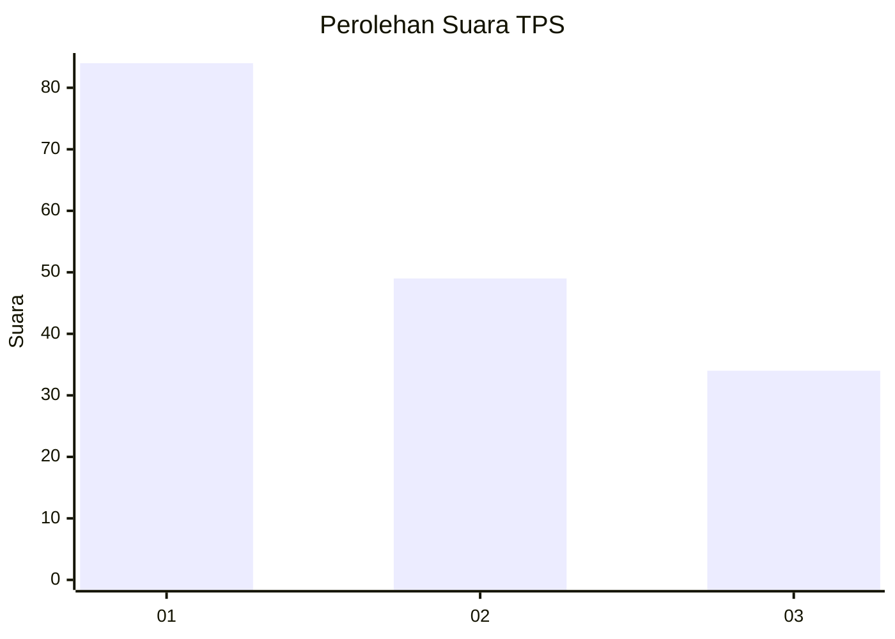
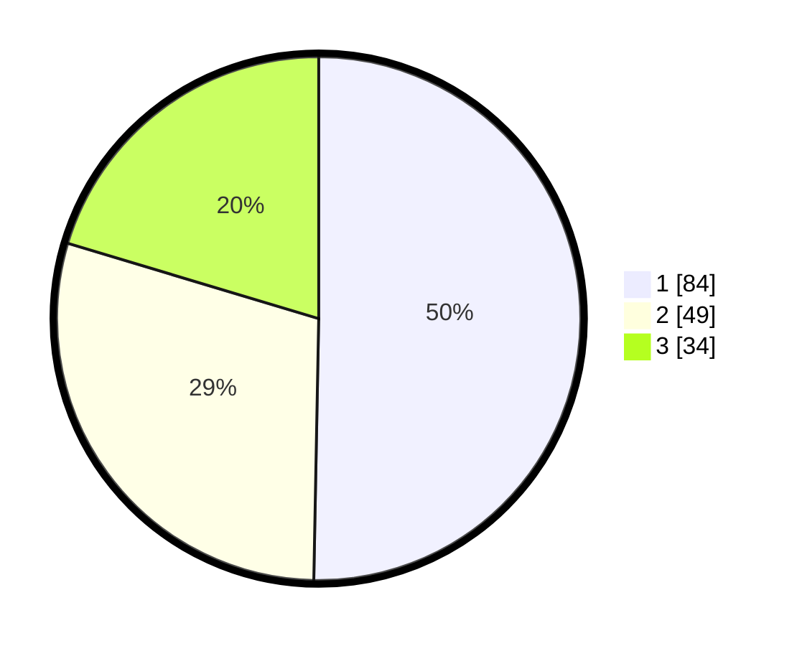

# Hasil

## Grafik

## Tabel

| No. | Nama Paslon    | Suara | Suara (raw) | Persentase |
|:--- |:-------------- | -----:| -----------:| ----------:|
| 1   | ANIES MUHAIMIN | 84    | [84][p-1]   | 50,30      |
| 2   | PRABOWO GIBRAN | 49    | [49][p-2]   | 29,34      |
| 3   | GANJAR MAHFUD  | 34    | [34][p-3]   | 20,36      |

[p-1]: https://github.com/gigit-pemilu/pemilu-2024/blob/main/pilpres/hitung-suara/sub/32-jawa-barat/sub/75-kota-bekasi/sub/02-bekasi-barat/sub/1004-bintarajaya/sub/094-tps/sub/paslon-1.txt
[p-2]: https://github.com/gigit-pemilu/pemilu-2024/blob/main/pilpres/hitung-suara/sub/32-jawa-barat/sub/75-kota-bekasi/sub/02-bekasi-barat/sub/1004-bintarajaya/sub/094-tps/sub/paslon-2.txt
[p-3]: https://github.com/gigit-pemilu/pemilu-2024/blob/main/pilpres/hitung-suara/sub/32-jawa-barat/sub/75-kota-bekasi/sub/02-bekasi-barat/sub/1004-bintarajaya/sub/094-tps/sub/paslon-3.txt

## Foto C Plano

https://sirekap-obj-formc.kpu.go.id/871d/pemilu/ppwp/32/75/02/10/04/3275021004094-20240214-225808--c0220127-5a6b-4f83-841b-58a6e9f6b8c7.jpg

https://sirekap-obj-formc.kpu.go.id/871d/pemilu/ppwp/32/75/02/10/04/3275021004094-20240214-225815--aa472ce6-807f-4a68-8af6-9bae16506501.jpg

https://sirekap-obj-formc.kpu.go.id/871d/pemilu/ppwp/32/75/02/10/04/3275021004094-20240214-225821--7418049d-31ad-441e-acbf-44cfc0c19cd7.jpg

## Metadata

| Key        | Value               |
| ---------- | ------------------- |
| Time Stamp | 2024-02-15 22:00:27 |

