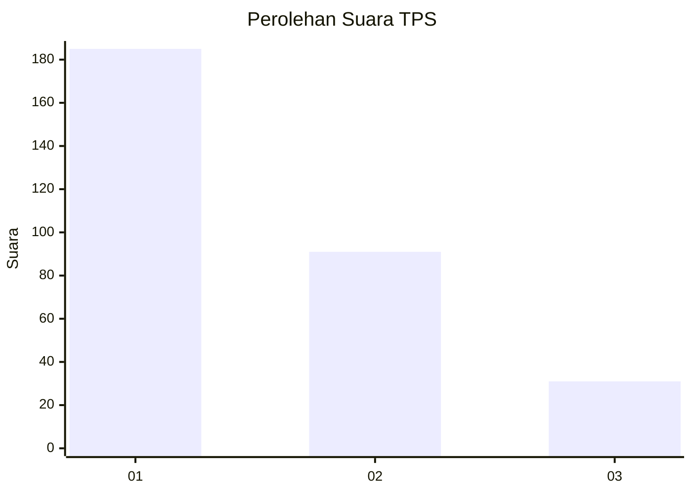
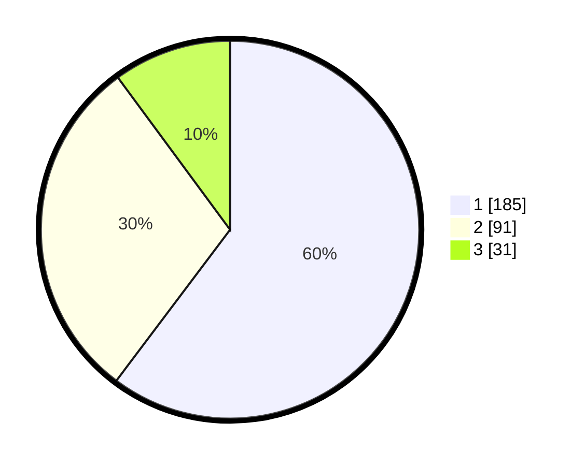

# Hasil

## Grafik

## Tabel

| No. | Nama Paslon    | Suara | Suara (raw) | Persentase |
|:--- |:-------------- | -----:| -----------:| ----------:|
| 1   | ANIES MUHAIMIN | 185   | [185][p-1]  | 60,26      |
| 2   | PRABOWO GIBRAN | 91    | [91][p-2]   | 29,64      |
| 3   | GANJAR MAHFUD  | 31    | [31][p-3]   | 10,10      |

[p-1]: https://github.com/gigit-pemilu/pemilu-2024-32-jawa-barat/blob/main/pilpres/hitung-suara/sub/32-jawa-barat/sub/75-kota-bekasi/sub/02-bekasi-barat/sub/1005-jakasampurna/sub/150-tps/sub/paslon-1.txt
[p-2]: https://github.com/gigit-pemilu/pemilu-2024-32-jawa-barat/blob/main/pilpres/hitung-suara/sub/32-jawa-barat/sub/75-kota-bekasi/sub/02-bekasi-barat/sub/1005-jakasampurna/sub/150-tps/sub/paslon-2.txt
[p-3]: https://github.com/gigit-pemilu/pemilu-2024-32-jawa-barat/blob/main/pilpres/hitung-suara/sub/32-jawa-barat/sub/75-kota-bekasi/sub/02-bekasi-barat/sub/1005-jakasampurna/sub/150-tps/sub/paslon-3.txt

## Foto C Plano

https://sirekap-obj-formc.kpu.go.id/76d7/pemilu/ppwp/32/75/02/10/05/3275021005150-20240216-194551--96787a93-e3c9-4c1c-9e33-5b416ff4489f.jpg

https://sirekap-obj-formc.kpu.go.id/76d7/pemilu/ppwp/32/75/02/10/05/3275021005150-20240216-194404--2d6bd2dd-5c9b-4b2c-b334-2d0eaa880dfc.jpg

https://sirekap-obj-formc.kpu.go.id/76d7/pemilu/ppwp/32/75/02/10/05/3275021005150-20240216-194645--eac1ea53-6c67-4a1b-9950-69c38951e8c6.jpg

## Metadata

| Key        | Value               |
| ---------- | ------------------- |
| Time Stamp | 2024-02-24 22:31:28 |

