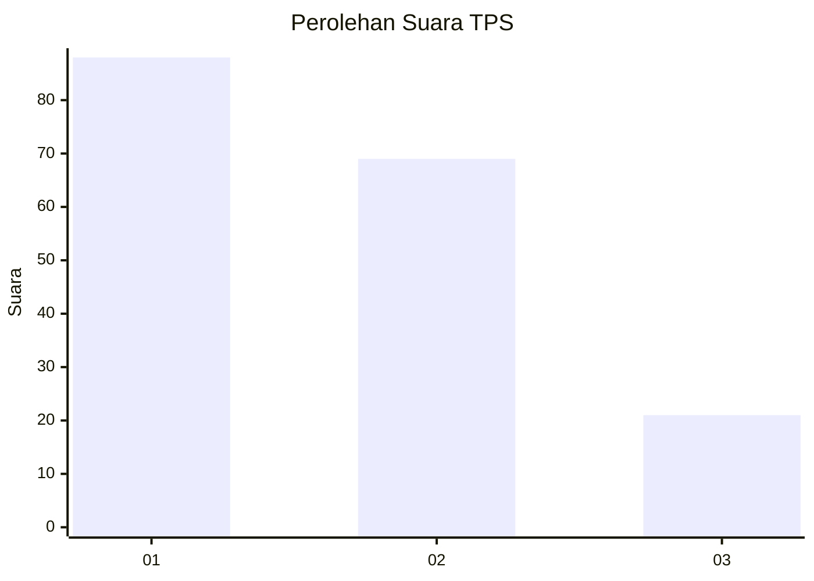
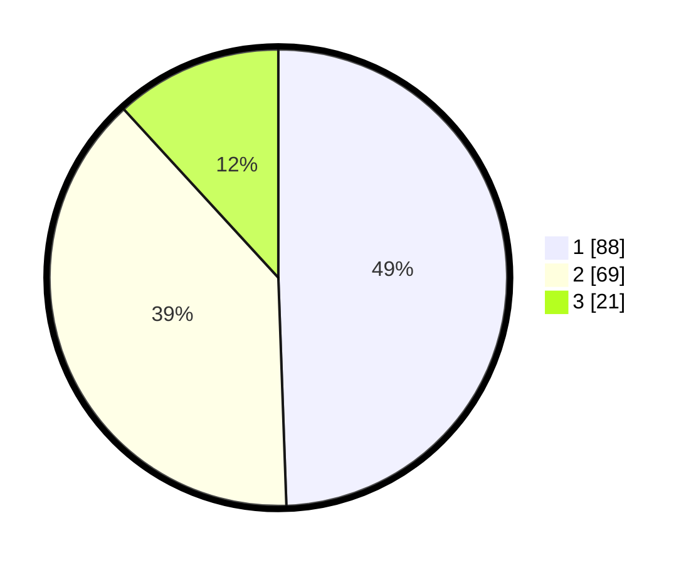

# Hasil

## Grafik

## Tabel

| No. | Nama Paslon    | Suara | Suara (raw) | Persentase |
|:--- |:-------------- | -----:| -----------:| ----------:|
| 1   | ANIES MUHAIMIN | 88    | [88][p-1]   | 49,44      |
| 2   | PRABOWO GIBRAN | 69    | [69][p-2]   | 38,76      |
| 3   | GANJAR MAHFUD  | 21    | [21][p-3]   | 11,80      |

[p-1]: https://github.com/gigit-pemilu/pemilu-2024/blob/main/pilpres/hitung-suara/sub/32-jawa-barat/sub/75-kota-bekasi/sub/03-bekasi-utara/sub/1001-kaliabang-tengah/sub/001-tps/sub/paslon-1.txt
[p-2]: https://github.com/gigit-pemilu/pemilu-2024/blob/main/pilpres/hitung-suara/sub/32-jawa-barat/sub/75-kota-bekasi/sub/03-bekasi-utara/sub/1001-kaliabang-tengah/sub/001-tps/sub/paslon-2.txt
[p-3]: https://github.com/gigit-pemilu/pemilu-2024/blob/main/pilpres/hitung-suara/sub/32-jawa-barat/sub/75-kota-bekasi/sub/03-bekasi-utara/sub/1001-kaliabang-tengah/sub/001-tps/sub/paslon-3.txt

## Foto C Plano

https://sirekap-obj-formc.kpu.go.id/4639/pemilu/ppwp/32/75/03/10/01/3275031001001-20240214-224741--31a36487-48cb-47c8-8ce0-24c4250e4506.jpg

https://sirekap-obj-formc.kpu.go.id/4639/pemilu/ppwp/32/75/03/10/01/3275031001001-20240214-224744--95ac73da-9043-49f0-a2b2-59a59ea248b3.jpg

https://sirekap-obj-formc.kpu.go.id/4639/pemilu/ppwp/32/75/03/10/01/3275031001001-20240214-224747--8822609b-7199-48fb-a9a6-903e162e2665.jpg

## Metadata

| Key        | Value               |
| ---------- | ------------------- |
| Time Stamp | 2024-02-15 19:00:26 |

