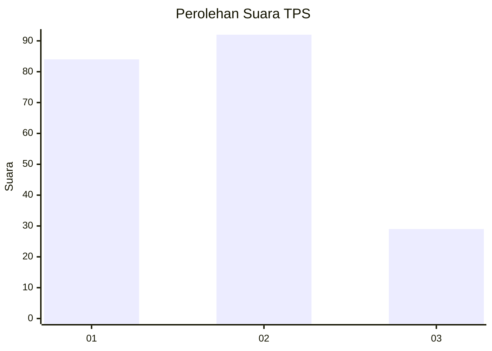
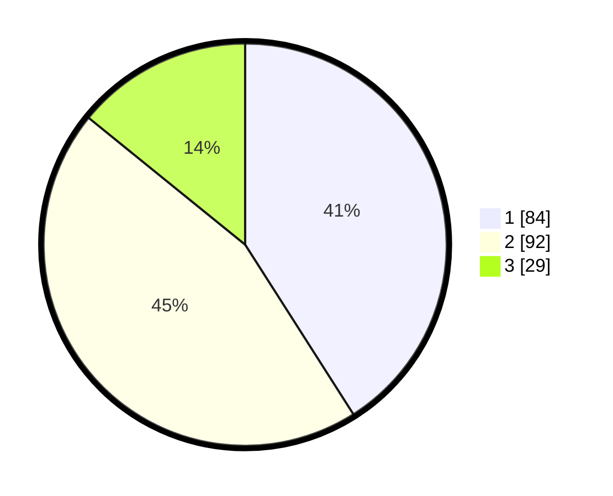

# Hasil

## Grafik

## Tabel

| No. | Nama Paslon    | Suara | Suara (raw) | Persentase |
|:--- |:-------------- | -----:| -----------:| ----------:|
| 1   | ANIES MUHAIMIN | 84    | [84][p-1]   | 40,98      |
| 2   | PRABOWO GIBRAN | 92    | [92][p-2]   | 44,88      |
| 3   | GANJAR MAHFUD  | 29    | [29][p-3]   | 14,15      |

[p-1]: https://github.com/gigit-pemilu/pemilu-2024/blob/main/pilpres/hitung-suara/sub/32-jawa-barat/sub/75-kota-bekasi/sub/03-bekasi-utara/sub/1001-kaliabang-tengah/sub/009-tps/sub/paslon-1.txt
[p-2]: https://github.com/gigit-pemilu/pemilu-2024/blob/main/pilpres/hitung-suara/sub/32-jawa-barat/sub/75-kota-bekasi/sub/03-bekasi-utara/sub/1001-kaliabang-tengah/sub/009-tps/sub/paslon-2.txt
[p-3]: https://github.com/gigit-pemilu/pemilu-2024/blob/main/pilpres/hitung-suara/sub/32-jawa-barat/sub/75-kota-bekasi/sub/03-bekasi-utara/sub/1001-kaliabang-tengah/sub/009-tps/sub/paslon-3.txt

## Foto C Plano

https://sirekap-obj-formc.kpu.go.id/16c5/pemilu/ppwp/32/75/03/10/01/3275031001009-20240215-015131--5cebcd8e-f519-4ef6-aecc-8b1e357bc824.jpg

https://sirekap-obj-formc.kpu.go.id/16c5/pemilu/ppwp/32/75/03/10/01/3275031001009-20240214-175316--89ea5c89-6a81-48af-8446-93b68a0cf8f3.jpg

https://sirekap-obj-formc.kpu.go.id/16c5/pemilu/ppwp/32/75/03/10/01/3275031001009-20240215-015155--1a7b5278-1222-4b49-b63d-2a39539c9fd6.jpg

## Metadata

| Key        | Value               |
| ---------- | ------------------- |
| Time Stamp | 2024-02-15 20:00:44 |

