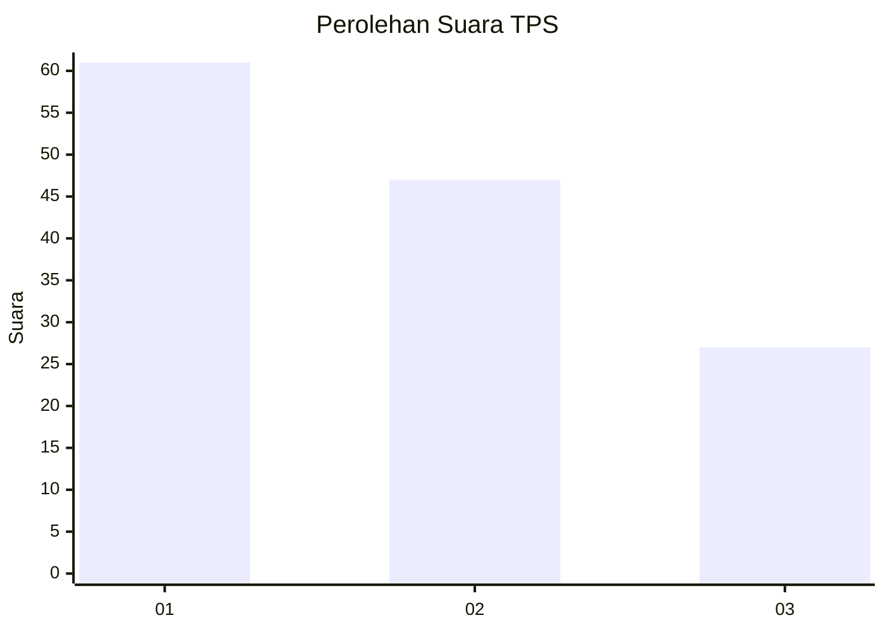
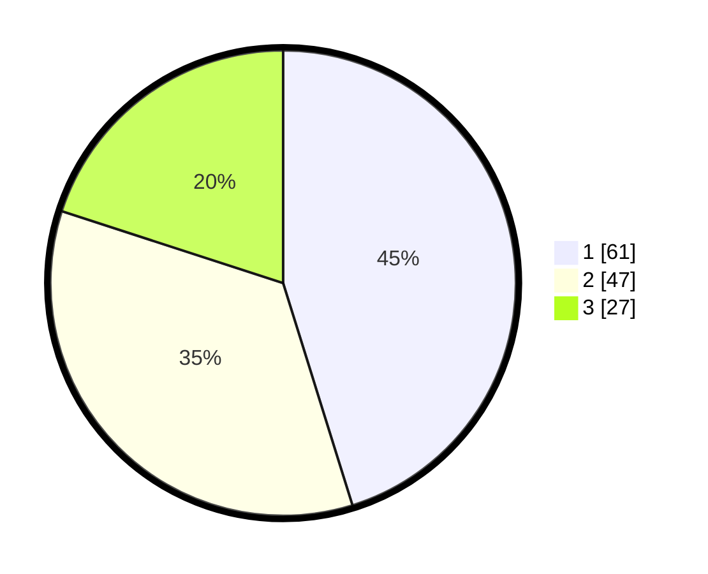

# Hasil

## Grafik

## Tabel

| No. | Nama Paslon    | Suara | Suara (raw) | Persentase |
|:--- |:-------------- | -----:| -----------:| ----------:|
| 1   | ANIES MUHAIMIN | 61    | [61][p-1]   | 45,19      |
| 2   | PRABOWO GIBRAN | 47    | [47][p-2]   | 34,81      |
| 3   | GANJAR MAHFUD  | 27    | [27][p-3]   | 20,00      |

[p-1]: https://github.com/gigit-pemilu/pemilu-2024/blob/main/pilpres/hitung-suara/sub/32-jawa-barat/sub/75-kota-bekasi/sub/03-bekasi-utara/sub/1001-kaliabang-tengah/sub/186-tps/sub/paslon-1.txt
[p-2]: https://github.com/gigit-pemilu/pemilu-2024/blob/main/pilpres/hitung-suara/sub/32-jawa-barat/sub/75-kota-bekasi/sub/03-bekasi-utara/sub/1001-kaliabang-tengah/sub/186-tps/sub/paslon-2.txt
[p-3]: https://github.com/gigit-pemilu/pemilu-2024/blob/main/pilpres/hitung-suara/sub/32-jawa-barat/sub/75-kota-bekasi/sub/03-bekasi-utara/sub/1001-kaliabang-tengah/sub/186-tps/sub/paslon-3.txt

## Foto C Plano

https://sirekap-obj-formc.kpu.go.id/b74b/pemilu/ppwp/32/75/03/10/01/3275031001186-20240222-140750--e060cbbe-d55a-4a47-9d35-7e0263af14b4.jpg

https://sirekap-obj-formc.kpu.go.id/b74b/pemilu/ppwp/32/75/03/10/01/3275031001186-20240222-135918--cdbba3df-62b1-4a41-85db-b3fd76b5f6f6.jpg

https://sirekap-obj-formc.kpu.go.id/b74b/pemilu/ppwp/32/75/03/10/01/3275031001186-20240222-141128--349b7576-5c48-43c3-9279-c692090d96e8.jpg

## Metadata

| Key        | Value               |
| ---------- | ------------------- |
| Time Stamp | 2024-02-22 15:00:00 |

