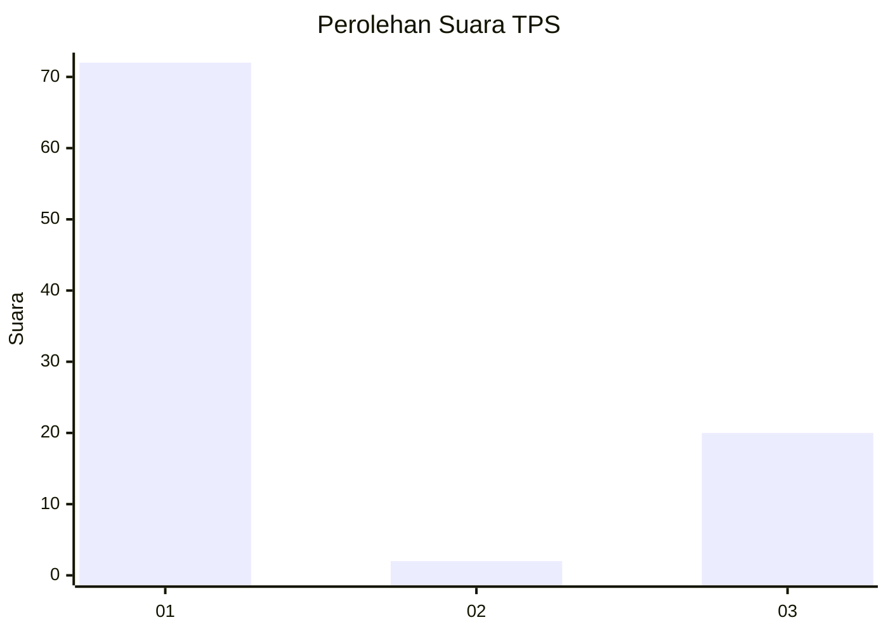
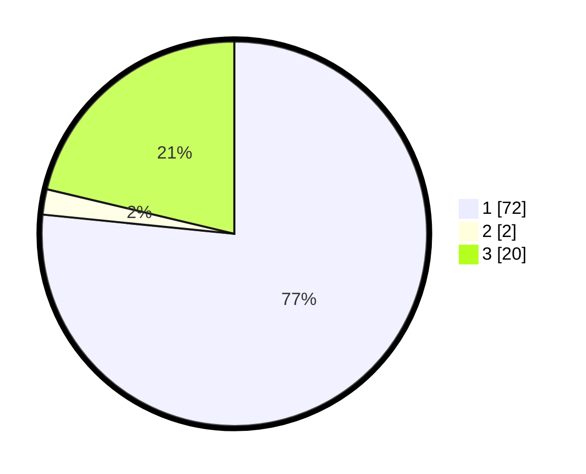

# Hasil

## Grafik

## Tabel

| No. | Nama Paslon    | Suara | Suara (raw) | Persentase |
|:--- |:-------------- | -----:| -----------:| ----------:|
| 1   | ANIES MUHAIMIN | 72    | [72][p-1]   | 76,60      |
| 2   | PRABOWO GIBRAN | 2     | [2][p-2]    | 2,13       |
| 3   | GANJAR MAHFUD  | 20    | [20][p-3]   | 21,28      |

[p-1]: https://github.com/gigit-pemilu/pemilu-2024/blob/main/pilpres/hitung-suara/sub/32-jawa-barat/sub/75-kota-bekasi/sub/03-bekasi-utara/sub/1002-perwira/sub/049-tps/sub/paslon-1.txt
[p-2]: https://github.com/gigit-pemilu/pemilu-2024/blob/main/pilpres/hitung-suara/sub/32-jawa-barat/sub/75-kota-bekasi/sub/03-bekasi-utara/sub/1002-perwira/sub/049-tps/sub/paslon-2.txt
[p-3]: https://github.com/gigit-pemilu/pemilu-2024/blob/main/pilpres/hitung-suara/sub/32-jawa-barat/sub/75-kota-bekasi/sub/03-bekasi-utara/sub/1002-perwira/sub/049-tps/sub/paslon-3.txt

## Foto C Plano

https://sirekap-obj-formc.kpu.go.id/6dd8/pemilu/ppwp/32/75/03/10/02/3275031002049-20240215-012716--6a992764-acf1-442f-af08-eedc7ec5b1d6.jpg

https://sirekap-obj-formc.kpu.go.id/6dd8/pemilu/ppwp/32/75/03/10/02/3275031002049-20240215-012732--604b8c1e-0e9a-4dfc-9c88-71b7b80be77a.jpg

https://sirekap-obj-formc.kpu.go.id/6dd8/pemilu/ppwp/32/75/03/10/02/3275031002049-20240215-012745--89c563b3-93c0-40ed-982e-3ead1a811929.jpg

## Metadata

| Key        | Value               |
| ---------- | ------------------- |
| Time Stamp | 2024-02-15 16:00:26 |

