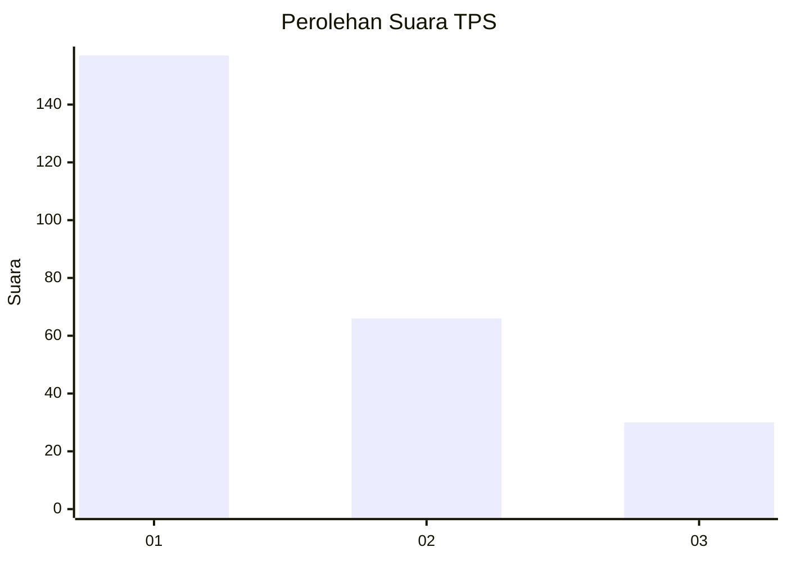
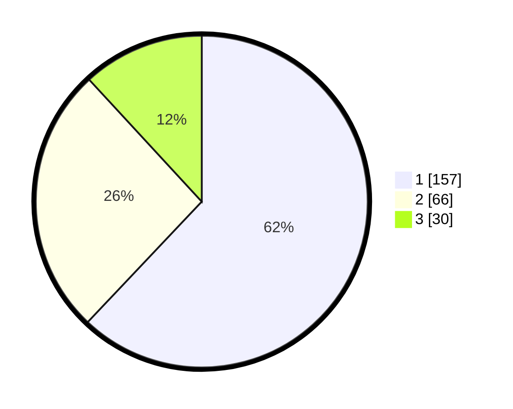

# Hasil

## Grafik

## Tabel

| No. | Nama Paslon    | Suara | Suara (raw) | Persentase |
|:--- |:-------------- | -----:| -----------:| ----------:|
| 1   | ANIES MUHAIMIN | 157   | [157][p-1]  | 62,06      |
| 2   | PRABOWO GIBRAN | 66    | [66][p-2]   | 26,09      |
| 3   | GANJAR MAHFUD  | 30    | [30][p-3]   | 11,86      |

[p-1]: https://github.com/gigit-pemilu/pemilu-2024/blob/main/pilpres/hitung-suara/sub/32-jawa-barat/sub/75-kota-bekasi/sub/03-bekasi-utara/sub/1003-harapanbaru/sub/049-tps/sub/paslon-1.txt
[p-2]: https://github.com/gigit-pemilu/pemilu-2024/blob/main/pilpres/hitung-suara/sub/32-jawa-barat/sub/75-kota-bekasi/sub/03-bekasi-utara/sub/1003-harapanbaru/sub/049-tps/sub/paslon-2.txt
[p-3]: https://github.com/gigit-pemilu/pemilu-2024/blob/main/pilpres/hitung-suara/sub/32-jawa-barat/sub/75-kota-bekasi/sub/03-bekasi-utara/sub/1003-harapanbaru/sub/049-tps/sub/paslon-3.txt

## Foto C Plano

https://sirekap-obj-formc.kpu.go.id/9451/pemilu/ppwp/32/75/03/10/03/3275031003049-20240215-032450--df98d45d-3b9c-490c-a836-4b8e2f59b0ed.jpg

https://sirekap-obj-formc.kpu.go.id/9451/pemilu/ppwp/32/75/03/10/03/3275031003049-20240215-032544--364cfde3-71c2-4eed-af73-a33c810b6922.jpg

https://sirekap-obj-formc.kpu.go.id/9451/pemilu/ppwp/32/75/03/10/03/3275031003049-20240215-032638--877a7f14-e2f1-4d0b-8775-1176dbd45f9a.jpg

## Metadata

| Key        | Value               |
| ---------- | ------------------- |
| Time Stamp | 2024-02-15 06:00:23 |

