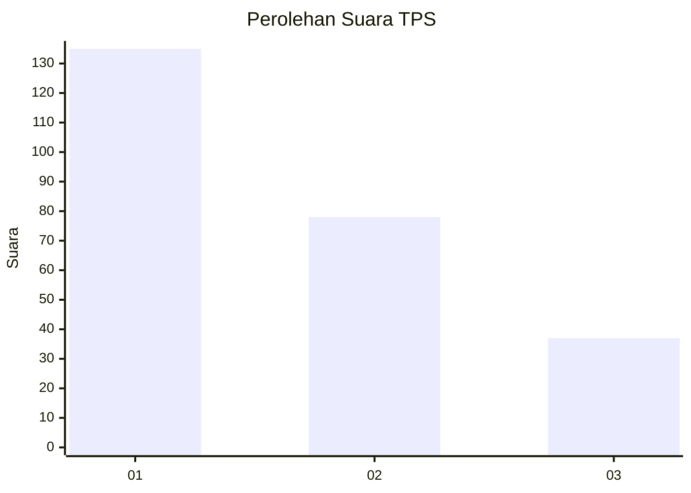
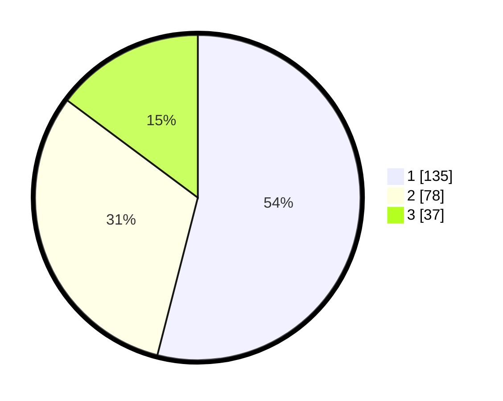

# Hasil

## Grafik

## Tabel

| No. | Nama Paslon    | Suara | Suara (raw) | Persentase |
|:--- |:-------------- | -----:| -----------:| ----------:|
| 1   | ANIES MUHAIMIN | 135   | [135][p-1]  | 54,00      |
| 2   | PRABOWO GIBRAN | 78    | [78][p-2]   | 31,20      |
| 3   | GANJAR MAHFUD  | 37    | [37][p-3]   | 14,80      |

[p-1]: https://github.com/gigit-pemilu/pemilu-2024-32-jawa-barat/blob/main/pilpres/hitung-suara/sub/32-jawa-barat/sub/75-kota-bekasi/sub/03-bekasi-utara/sub/1003-harapanbaru/sub/074-tps/sub/paslon-1.txt
[p-2]: https://github.com/gigit-pemilu/pemilu-2024-32-jawa-barat/blob/main/pilpres/hitung-suara/sub/32-jawa-barat/sub/75-kota-bekasi/sub/03-bekasi-utara/sub/1003-harapanbaru/sub/074-tps/sub/paslon-2.txt
[p-3]: https://github.com/gigit-pemilu/pemilu-2024-32-jawa-barat/blob/main/pilpres/hitung-suara/sub/32-jawa-barat/sub/75-kota-bekasi/sub/03-bekasi-utara/sub/1003-harapanbaru/sub/074-tps/sub/paslon-3.txt

## Foto C Plano

https://sirekap-obj-formc.kpu.go.id/639d/pemilu/ppwp/32/75/03/10/03/3275031003074-20240214-222646--3cbede05-623e-4344-92a2-262e9d6d09c1.jpg

https://sirekap-obj-formc.kpu.go.id/639d/pemilu/ppwp/32/75/03/10/03/3275031003074-20240214-222807--f74a2487-8337-447b-9986-51fc99580459.jpg

https://sirekap-obj-formc.kpu.go.id/639d/pemilu/ppwp/32/75/03/10/03/3275031003074-20240214-222943--aa907a56-eae8-4ad9-93e7-b497b3b03038.jpg

## Metadata

| Key        | Value               |
| ---------- | ------------------- |
| Time Stamp | 2024-02-15 22:30:27 |

