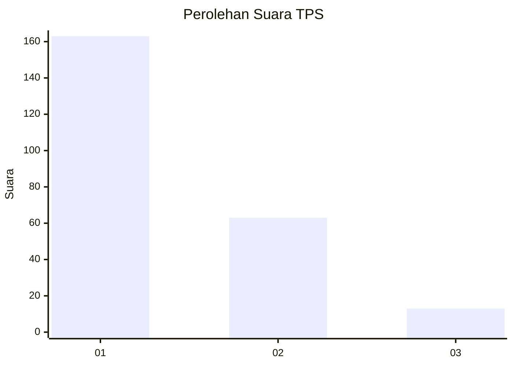
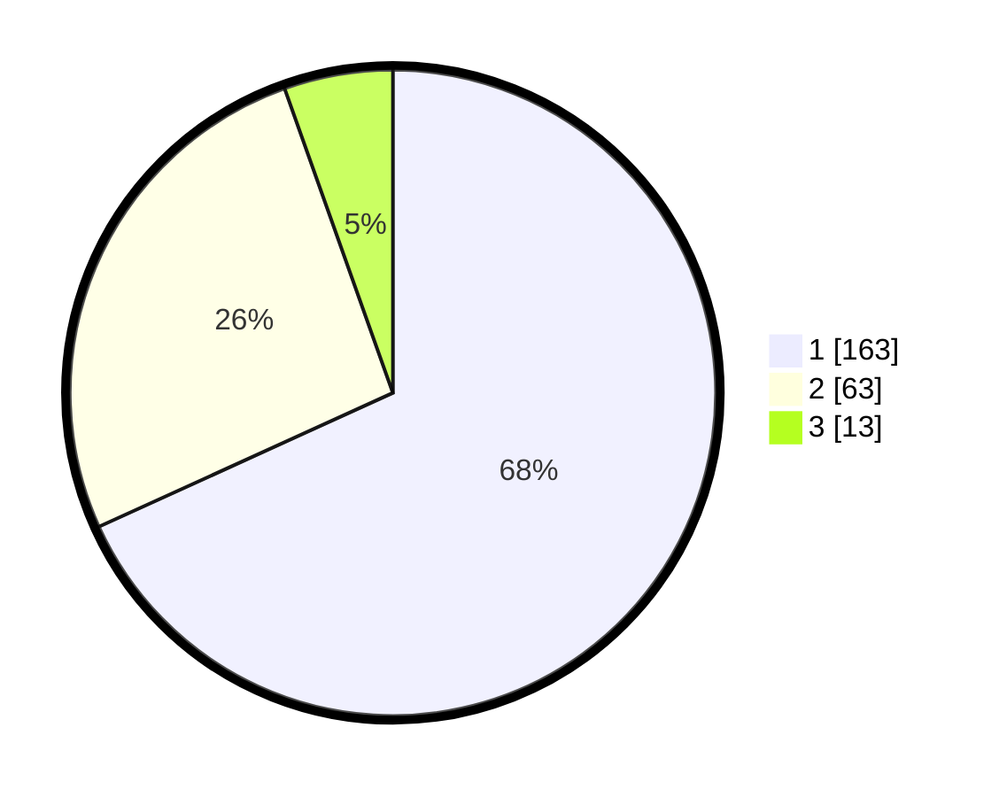

# Hasil

## Grafik

## Tabel

| No. | Nama Paslon    | Suara | Suara (raw) | Persentase |
|:--- |:-------------- | -----:| -----------:| ----------:|
| 1   | ANIES MUHAIMIN | 163   | [163][p-1]  | 68,20      |
| 2   | PRABOWO GIBRAN | 63    | [63][p-2]   | 26,36      |
| 3   | GANJAR MAHFUD  | 13    | [13][p-3]   | 5,44       |

[p-1]: https://github.com/gigit-pemilu/pemilu-2024/blob/main/pilpres/hitung-suara/sub/32-jawa-barat/sub/75-kota-bekasi/sub/03-bekasi-utara/sub/1004-teluk-pucung/sub/192-tps/sub/paslon-1.txt
[p-2]: https://github.com/gigit-pemilu/pemilu-2024/blob/main/pilpres/hitung-suara/sub/32-jawa-barat/sub/75-kota-bekasi/sub/03-bekasi-utara/sub/1004-teluk-pucung/sub/192-tps/sub/paslon-2.txt
[p-3]: https://github.com/gigit-pemilu/pemilu-2024/blob/main/pilpres/hitung-suara/sub/32-jawa-barat/sub/75-kota-bekasi/sub/03-bekasi-utara/sub/1004-teluk-pucung/sub/192-tps/sub/paslon-3.txt

## Foto C Plano

https://sirekap-obj-formc.kpu.go.id/0c8a/pemilu/ppwp/32/75/03/10/04/3275031004192-20240214-205116--5ed6e48a-4f1a-4ffe-ab31-2addded6b486.jpg

https://sirekap-obj-formc.kpu.go.id/0c8a/pemilu/ppwp/32/75/03/10/04/3275031004192-20240214-215107--2e2f8a6c-4338-4651-8c26-8626a6d8f092.jpg

https://sirekap-obj-formc.kpu.go.id/0c8a/pemilu/ppwp/32/75/03/10/04/3275031004192-20240214-184713--cdc40b8f-2ad6-4505-9640-c670b46e87bb.jpg

## Metadata

| Key        | Value               |
| ---------- | ------------------- |
| Time Stamp | 2024-02-24 22:31:28 |

