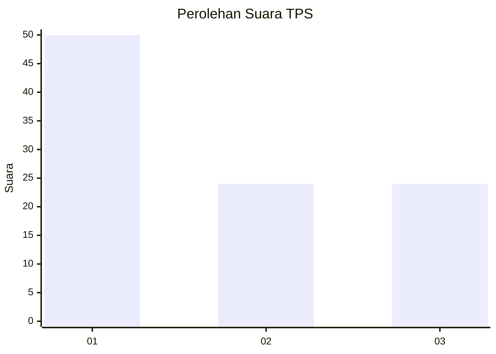
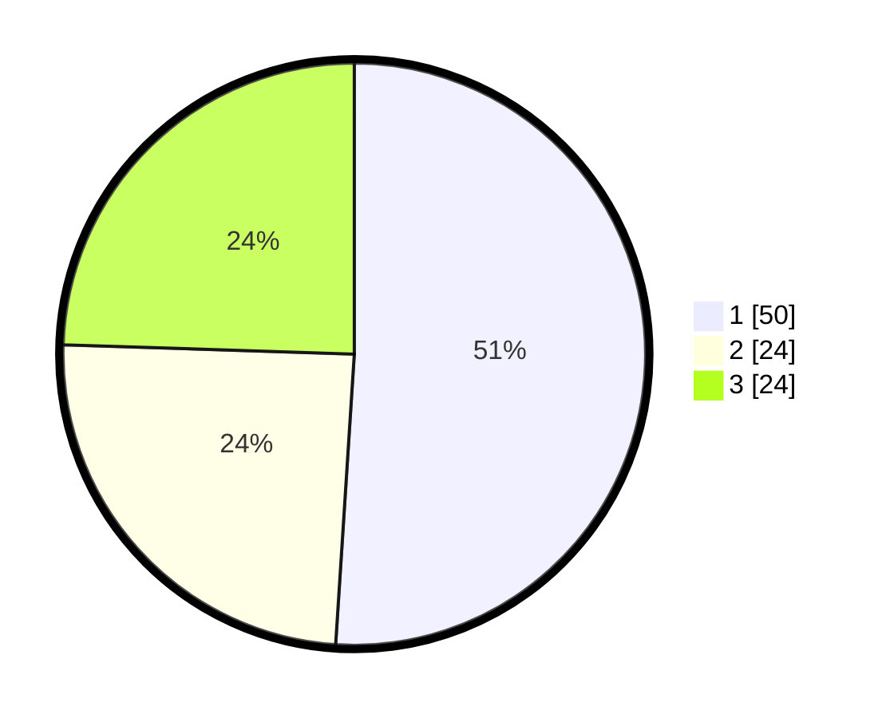

# Hasil

## Grafik

## Tabel

| No. | Nama Paslon    | Suara | Suara (raw) | Persentase |
|:--- |:-------------- | -----:| -----------:| ----------:|
| 1   | ANIES MUHAIMIN | 50    | [50][p-1]   | 51,02      |
| 2   | PRABOWO GIBRAN | 24    | [24][p-2]   | 24,49      |
| 3   | GANJAR MAHFUD  | 24    | [24][p-3]   | 24,49      |

[p-1]: https://github.com/gigit-pemilu/pemilu-2024/blob/main/pilpres/hitung-suara/sub/32-jawa-barat/sub/75-kota-bekasi/sub/03-bekasi-utara/sub/1005-margamulya/sub/056-tps/sub/paslon-1.txt
[p-2]: https://github.com/gigit-pemilu/pemilu-2024/blob/main/pilpres/hitung-suara/sub/32-jawa-barat/sub/75-kota-bekasi/sub/03-bekasi-utara/sub/1005-margamulya/sub/056-tps/sub/paslon-2.txt
[p-3]: https://github.com/gigit-pemilu/pemilu-2024/blob/main/pilpres/hitung-suara/sub/32-jawa-barat/sub/75-kota-bekasi/sub/03-bekasi-utara/sub/1005-margamulya/sub/056-tps/sub/paslon-3.txt

## Foto C Plano

https://sirekap-obj-formc.kpu.go.id/6730/pemilu/ppwp/32/75/03/10/05/3275031005056-20240214-225540--4fbd7095-6171-46f2-9eb5-5296e854c140.jpg

https://sirekap-obj-formc.kpu.go.id/6730/pemilu/ppwp/32/75/03/10/05/3275031005056-20240214-225549--667f6db0-e004-4422-99e9-6984d079475e.jpg

https://sirekap-obj-formc.kpu.go.id/6730/pemilu/ppwp/32/75/03/10/05/3275031005056-20240214-225602--3368d7ff-8fe4-4eb9-a6d7-9e3318bdd2f1.jpg

## Metadata

| Key        | Value               |
| ---------- | ------------------- |
| Time Stamp | 2024-02-25 12:00:00 |

