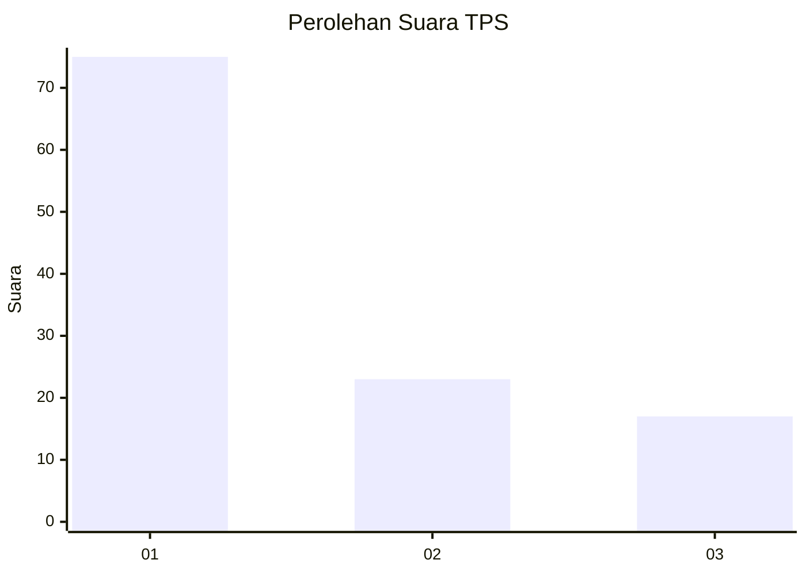
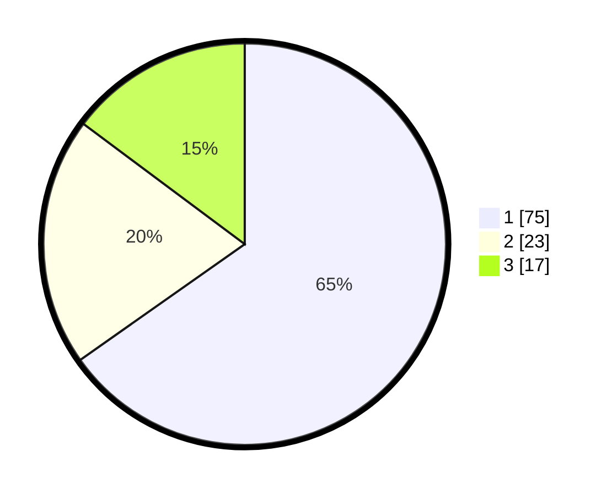

# Hasil

## Grafik

## Tabel

| No. | Nama Paslon    | Suara | Suara (raw) | Persentase |
|:--- |:-------------- | -----:| -----------:| ----------:|
| 1   | ANIES MUHAIMIN | 75    | [75][p-1]   | 65,22      |
| 2   | PRABOWO GIBRAN | 23    | [23][p-2]   | 20,00      |
| 3   | GANJAR MAHFUD  | 17    | [17][p-3]   | 14,78      |

[p-1]: https://github.com/gigit-pemilu/pemilu-2024-32-jawa-barat/blob/main/pilpres/hitung-suara/sub/32-jawa-barat/sub/75-kota-bekasi/sub/04-bekasi-selatan/sub/1001-pekayonjaya/sub/001-tps/sub/paslon-1.txt
[p-2]: https://github.com/gigit-pemilu/pemilu-2024-32-jawa-barat/blob/main/pilpres/hitung-suara/sub/32-jawa-barat/sub/75-kota-bekasi/sub/04-bekasi-selatan/sub/1001-pekayonjaya/sub/001-tps/sub/paslon-2.txt
[p-3]: https://github.com/gigit-pemilu/pemilu-2024-32-jawa-barat/blob/main/pilpres/hitung-suara/sub/32-jawa-barat/sub/75-kota-bekasi/sub/04-bekasi-selatan/sub/1001-pekayonjaya/sub/001-tps/sub/paslon-3.txt

## Foto C Plano

https://sirekap-obj-formc.kpu.go.id/616a/pemilu/ppwp/32/75/04/10/01/3275041001001-20240214-225106--12855c2d-dc3a-4f8a-bf59-0f20e724dbd5.jpg

https://sirekap-obj-formc.kpu.go.id/616a/pemilu/ppwp/32/75/04/10/01/3275041001001-20240214-225258--9169b1f2-0347-48f0-b134-23f419838d9a.jpg

https://sirekap-obj-formc.kpu.go.id/616a/pemilu/ppwp/32/75/04/10/01/3275041001001-20240214-225359--6854903b-3bf6-446b-a0a4-160997a1efce.jpg

## Metadata

| Key        | Value               |
| ---------- | ------------------- |
| Time Stamp | 2024-02-15 20:30:46 |

