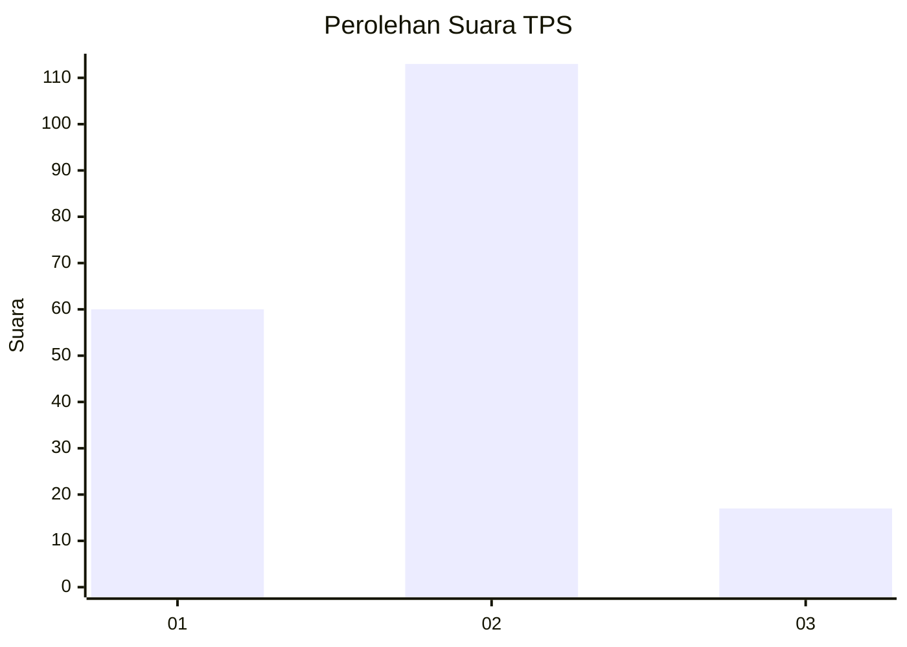
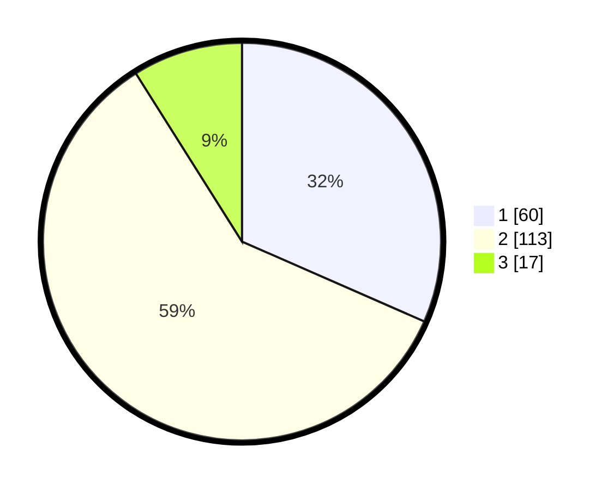

# Hasil

## Grafik

## Tabel

| No. | Nama Paslon    | Suara | Suara (raw) | Persentase |
|:--- |:-------------- | -----:| -----------:| ----------:|
| 1   | ANIES MUHAIMIN | 60    | [60][p-1]   | 31,58      |
| 2   | PRABOWO GIBRAN | 113   | [113][p-2]  | 59,47      |
| 3   | GANJAR MAHFUD  | 17    | [17][p-3]   | 8,95       |

[p-1]: https://github.com/gigit-pemilu/pemilu-2024-32-jawa-barat/blob/main/pilpres/hitung-suara/sub/32-jawa-barat/sub/75-kota-bekasi/sub/04-bekasi-selatan/sub/1001-pekayonjaya/sub/002-tps/sub/paslon-1.txt
[p-2]: https://github.com/gigit-pemilu/pemilu-2024-32-jawa-barat/blob/main/pilpres/hitung-suara/sub/32-jawa-barat/sub/75-kota-bekasi/sub/04-bekasi-selatan/sub/1001-pekayonjaya/sub/002-tps/sub/paslon-2.txt
[p-3]: https://github.com/gigit-pemilu/pemilu-2024-32-jawa-barat/blob/main/pilpres/hitung-suara/sub/32-jawa-barat/sub/75-kota-bekasi/sub/04-bekasi-selatan/sub/1001-pekayonjaya/sub/002-tps/sub/paslon-3.txt

## Foto C Plano

https://sirekap-obj-formc.kpu.go.id/261f/pemilu/ppwp/32/75/04/10/01/3275041001002-20240219-102225--61352cb4-d9a3-418b-9ef1-f90c420ffd31.jpg

https://sirekap-obj-formc.kpu.go.id/261f/pemilu/ppwp/32/75/04/10/01/3275041001002-20240219-102229--616f947e-a13d-457c-86fe-7fa84fe8fbdb.jpg

https://sirekap-obj-formc.kpu.go.id/261f/pemilu/ppwp/32/75/04/10/01/3275041001002-20240219-102233--1518b829-b8fb-4b07-9861-67c5c21594e3.jpg

## Metadata

| Key        | Value               |
| ---------- | ------------------- |
| Time Stamp | 2024-02-19 21:00:00 |

