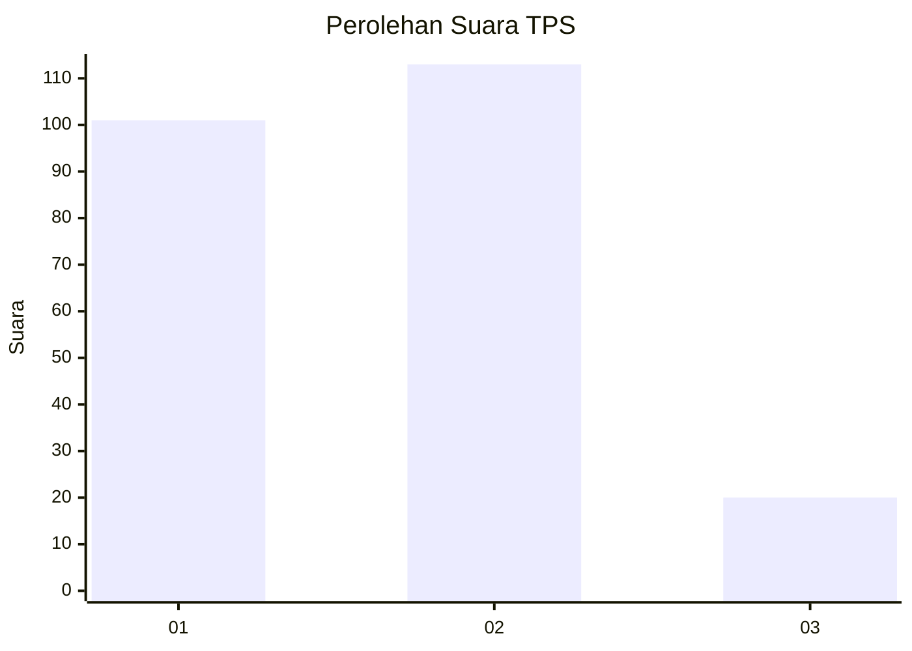
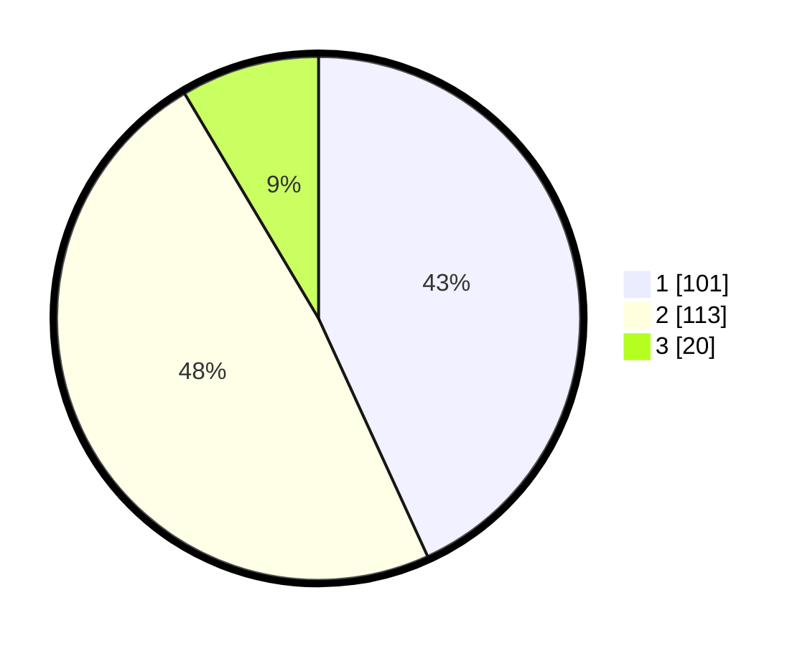

# Hasil

## Grafik

## Tabel

| No. | Nama Paslon    | Suara | Suara (raw) | Persentase |
|:--- |:-------------- | -----:| -----------:| ----------:|
| 1   | ANIES MUHAIMIN | 101   | [101][p-1]  | 43,16      |
| 2   | PRABOWO GIBRAN | 113   | [113][p-2]  | 48,29      |
| 3   | GANJAR MAHFUD  | 20    | [20][p-3]   | 8,55       |

[p-1]: https://github.com/gigit-pemilu/pemilu-2024-32-jawa-barat/blob/main/pilpres/hitung-suara/sub/32-jawa-barat/sub/75-kota-bekasi/sub/04-bekasi-selatan/sub/1001-pekayonjaya/sub/003-tps/sub/paslon-1.txt
[p-2]: https://github.com/gigit-pemilu/pemilu-2024-32-jawa-barat/blob/main/pilpres/hitung-suara/sub/32-jawa-barat/sub/75-kota-bekasi/sub/04-bekasi-selatan/sub/1001-pekayonjaya/sub/003-tps/sub/paslon-2.txt
[p-3]: https://github.com/gigit-pemilu/pemilu-2024-32-jawa-barat/blob/main/pilpres/hitung-suara/sub/32-jawa-barat/sub/75-kota-bekasi/sub/04-bekasi-selatan/sub/1001-pekayonjaya/sub/003-tps/sub/paslon-3.txt

## Foto C Plano

https://sirekap-obj-formc.kpu.go.id/bccd/pemilu/ppwp/32/75/04/10/01/3275041001003-20240214-213427--03e29b2b-0206-454e-936d-9590eee10056.jpg

https://sirekap-obj-formc.kpu.go.id/bccd/pemilu/ppwp/32/75/04/10/01/3275041001003-20240214-214021--d3b61605-a5cc-47ba-917a-145f1bc0dd7e.jpg

https://sirekap-obj-formc.kpu.go.id/bccd/pemilu/ppwp/32/75/04/10/01/3275041001003-20240214-214204--241b15a4-1b92-410d-99e7-3c4e41630d1b.jpg

## Metadata

| Key        | Value               |
| ---------- | ------------------- |
| Time Stamp | 2024-02-15 12:00:28 |

