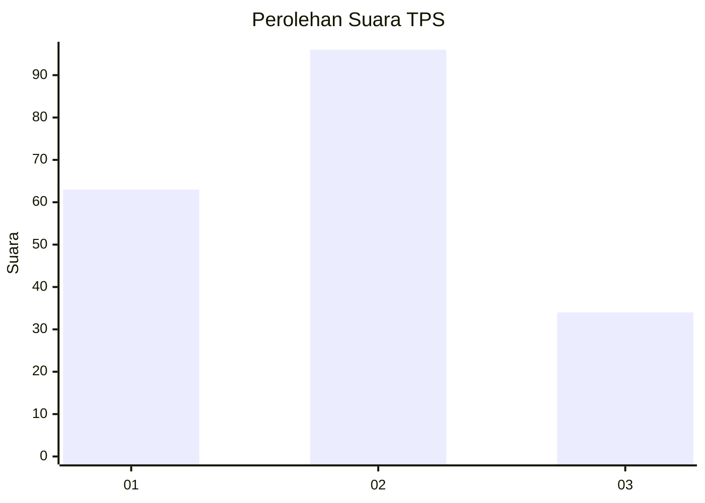
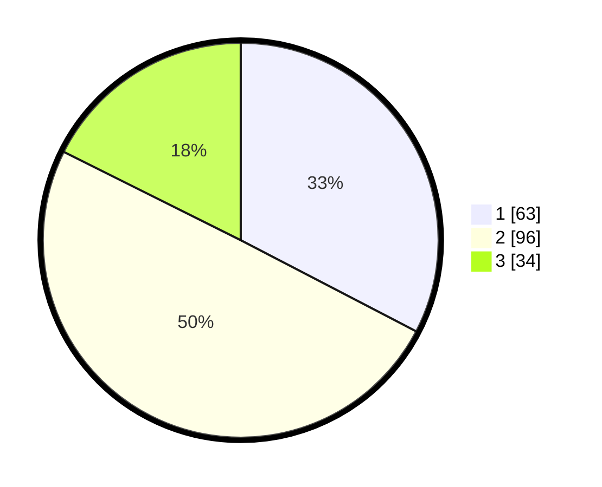

# Hasil

## Grafik

## Tabel

| No. | Nama Paslon    | Suara | Suara (raw) | Persentase |
|:--- |:-------------- | -----:| -----------:| ----------:|
| 1   | ANIES MUHAIMIN | 63    | [63][p-1]   | 32,64      |
| 2   | PRABOWO GIBRAN | 96    | [96][p-2]   | 49,74      |
| 3   | GANJAR MAHFUD  | 34    | [34][p-3]   | 17,62      |

[p-1]: https://github.com/gigit-pemilu/pemilu-2024/blob/main/pilpres/hitung-suara/sub/32-jawa-barat/sub/75-kota-bekasi/sub/04-bekasi-selatan/sub/1001-pekayonjaya/sub/004-tps/sub/paslon-1.txt
[p-2]: https://github.com/gigit-pemilu/pemilu-2024/blob/main/pilpres/hitung-suara/sub/32-jawa-barat/sub/75-kota-bekasi/sub/04-bekasi-selatan/sub/1001-pekayonjaya/sub/004-tps/sub/paslon-2.txt
[p-3]: https://github.com/gigit-pemilu/pemilu-2024/blob/main/pilpres/hitung-suara/sub/32-jawa-barat/sub/75-kota-bekasi/sub/04-bekasi-selatan/sub/1001-pekayonjaya/sub/004-tps/sub/paslon-3.txt

## Foto C Plano

https://sirekap-obj-formc.kpu.go.id/207c/pemilu/ppwp/32/75/04/10/01/3275041001004-20240214-193454--44241c7b-53c0-4be6-9463-7f02dcad9abf.jpg

https://sirekap-obj-formc.kpu.go.id/207c/pemilu/ppwp/32/75/04/10/01/3275041001004-20240214-193605--2adc1969-041e-4d7b-8c45-43b52a679d92.jpg

https://sirekap-obj-formc.kpu.go.id/207c/pemilu/ppwp/32/75/04/10/01/3275041001004-20240214-193718--249158a5-e745-4ccb-be9e-e96f4770dfae.jpg

## Metadata

| Key        | Value               |
| ---------- | ------------------- |
| Time Stamp | 2024-02-24 22:31:28 |

