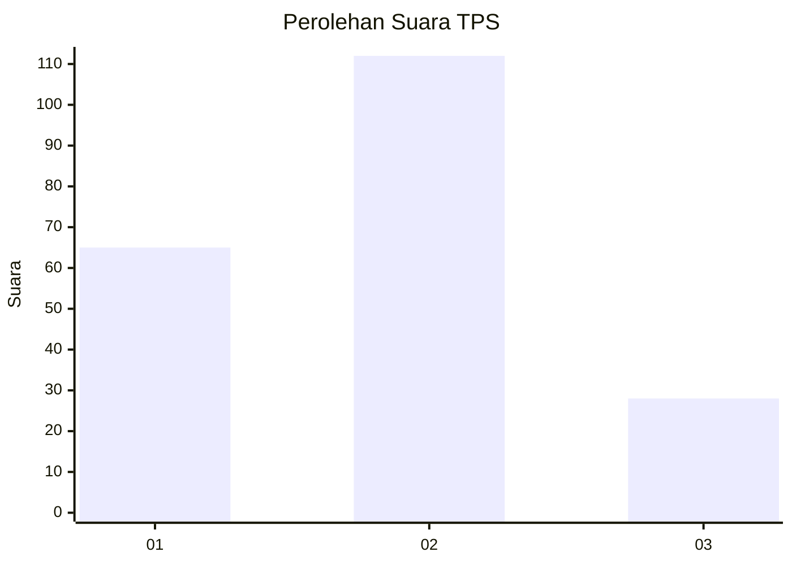
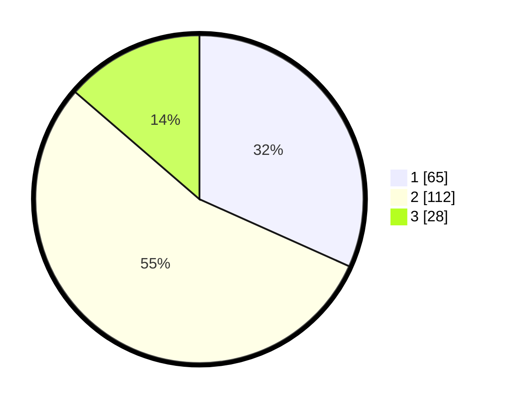

# Hasil

## Grafik

## Tabel

| No. | Nama Paslon    | Suara | Suara (raw) | Persentase |
|:--- |:-------------- | -----:| -----------:| ----------:|
| 1   | ANIES MUHAIMIN | 65    | [65][p-1]   | 31,71      |
| 2   | PRABOWO GIBRAN | 112   | [112][p-2]  | 54,63      |
| 3   | GANJAR MAHFUD  | 28    | [28][p-3]   | 13,66      |

[p-1]: https://github.com/gigit-pemilu/pemilu-2024/blob/main/pilpres/hitung-suara/sub/32-jawa-barat/sub/75-kota-bekasi/sub/04-bekasi-selatan/sub/1001-pekayonjaya/sub/006-tps/sub/paslon-1.txt
[p-2]: https://github.com/gigit-pemilu/pemilu-2024/blob/main/pilpres/hitung-suara/sub/32-jawa-barat/sub/75-kota-bekasi/sub/04-bekasi-selatan/sub/1001-pekayonjaya/sub/006-tps/sub/paslon-2.txt
[p-3]: https://github.com/gigit-pemilu/pemilu-2024/blob/main/pilpres/hitung-suara/sub/32-jawa-barat/sub/75-kota-bekasi/sub/04-bekasi-selatan/sub/1001-pekayonjaya/sub/006-tps/sub/paslon-3.txt

## Foto C Plano

https://sirekap-obj-formc.kpu.go.id/4070/pemilu/ppwp/32/75/04/10/01/3275041001006-20240219-215237--ea5c813a-5f0e-4b63-adff-c6f6c5a4a5cd.jpg

https://sirekap-obj-formc.kpu.go.id/4070/pemilu/ppwp/32/75/04/10/01/3275041001006-20240219-230148--0c011b6b-7992-4662-9874-7ad4e38b9ea1.jpg

https://sirekap-obj-formc.kpu.go.id/4070/pemilu/ppwp/32/75/04/10/01/3275041001006-20240219-225218--1f4136db-6044-4c0b-864e-4443e332e2fa.jpg

## Metadata

| Key        | Value               |
| ---------- | ------------------- |
| Time Stamp | 2024-02-22 12:00:00 |

