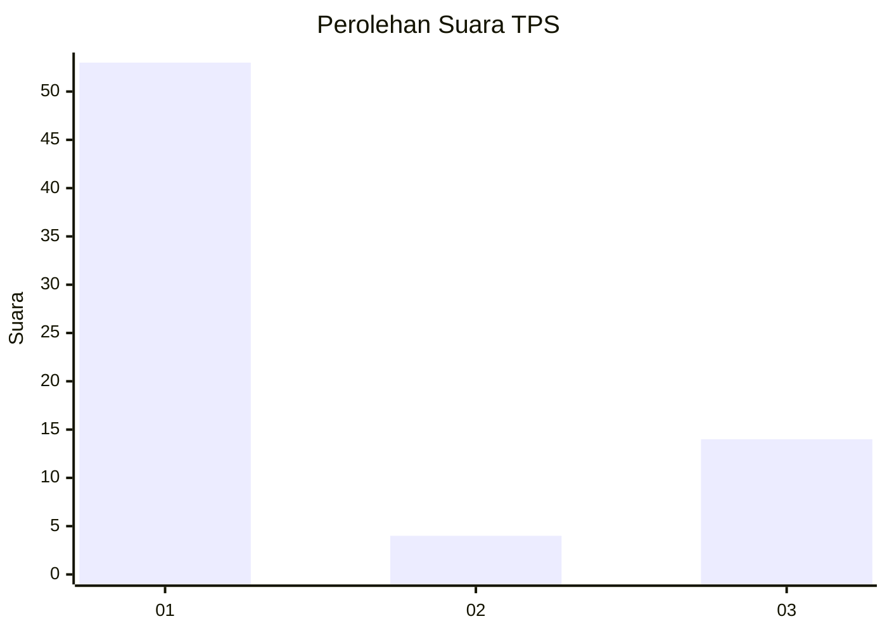
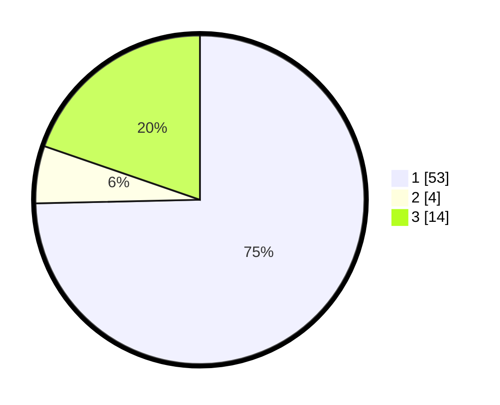

# Hasil

## Grafik

## Tabel

| No. | Nama Paslon    | Suara | Suara (raw) | Persentase |
|:--- |:-------------- | -----:| -----------:| ----------:|
| 1   | ANIES MUHAIMIN | 53    | [53][p-1]   | 74,65      |
| 2   | PRABOWO GIBRAN | 4     | [4][p-2]    | 5,63       |
| 3   | GANJAR MAHFUD  | 14    | [14][p-3]   | 19,72      |

[p-1]: https://github.com/gigit-pemilu/pemilu-2024/blob/main/pilpres/hitung-suara/sub/32-jawa-barat/sub/75-kota-bekasi/sub/04-bekasi-selatan/sub/1003-jakamulya/sub/071-tps/sub/paslon-1.txt
[p-2]: https://github.com/gigit-pemilu/pemilu-2024/blob/main/pilpres/hitung-suara/sub/32-jawa-barat/sub/75-kota-bekasi/sub/04-bekasi-selatan/sub/1003-jakamulya/sub/071-tps/sub/paslon-2.txt
[p-3]: https://github.com/gigit-pemilu/pemilu-2024/blob/main/pilpres/hitung-suara/sub/32-jawa-barat/sub/75-kota-bekasi/sub/04-bekasi-selatan/sub/1003-jakamulya/sub/071-tps/sub/paslon-3.txt

## Foto C Plano

https://sirekap-obj-formc.kpu.go.id/daed/pemilu/ppwp/32/75/04/10/03/3275041003071-20240214-155233--66c80274-c4ba-4c26-97e1-d4e6cfb25bca.jpg

https://sirekap-obj-formc.kpu.go.id/daed/pemilu/ppwp/32/75/04/10/03/3275041003071-20240214-155411--02c810e7-33cc-4978-8174-99dba3554ef5.jpg

https://sirekap-obj-formc.kpu.go.id/daed/pemilu/ppwp/32/75/04/10/03/3275041003071-20240214-155610--adcdf2ec-83ce-4be0-8fdc-8803e722f90f.jpg

## Metadata

| Key        | Value               |
| ---------- | ------------------- |
| Time Stamp | 2024-02-15 20:30:46 |

