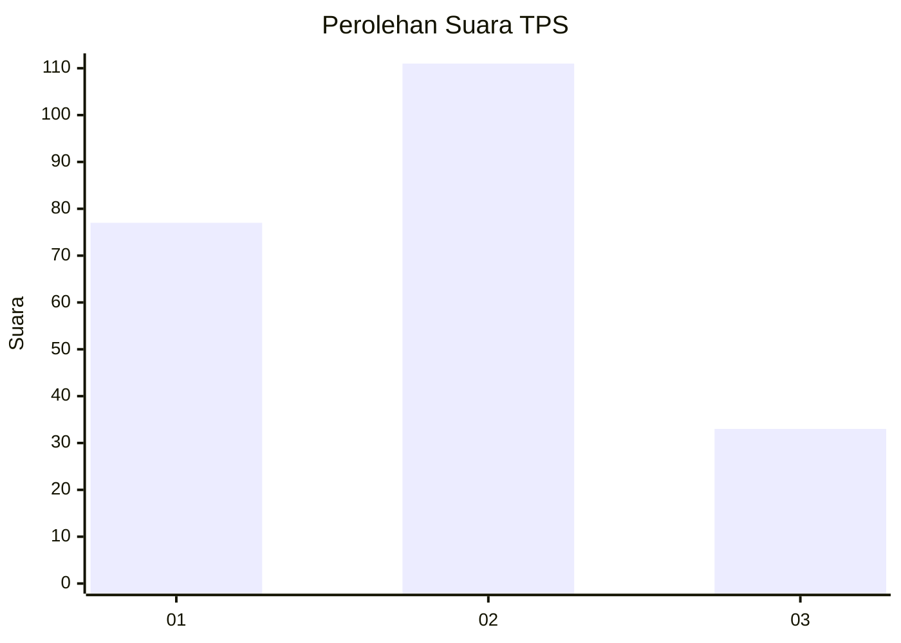
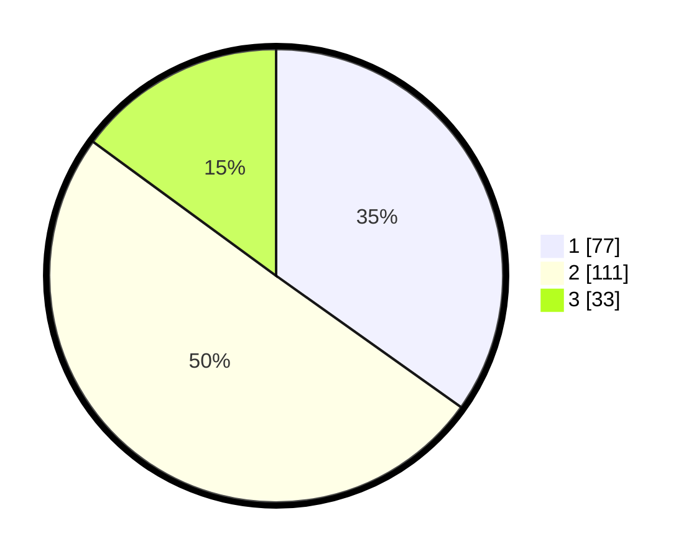

# Hasil

## Grafik

## Tabel

| No. | Nama Paslon    | Suara | Suara (raw) | Persentase |
|:--- |:-------------- | -----:| -----------:| ----------:|
| 1   | ANIES MUHAIMIN | 77    | [77][p-1]   | 34,84      |
| 2   | PRABOWO GIBRAN | 111   | [111][p-2]  | 50,23      |
| 3   | GANJAR MAHFUD  | 33    | [33][p-3]   | 14,93      |

[p-1]: https://github.com/gigit-pemilu/pemilu-2024-32-jawa-barat/blob/main/pilpres/hitung-suara/sub/32-jawa-barat/sub/75-kota-bekasi/sub/05-rawalumbu/sub/1001-bojong-rawalumbu/sub/004-tps/sub/paslon-1.txt
[p-2]: https://github.com/gigit-pemilu/pemilu-2024-32-jawa-barat/blob/main/pilpres/hitung-suara/sub/32-jawa-barat/sub/75-kota-bekasi/sub/05-rawalumbu/sub/1001-bojong-rawalumbu/sub/004-tps/sub/paslon-2.txt
[p-3]: https://github.com/gigit-pemilu/pemilu-2024-32-jawa-barat/blob/main/pilpres/hitung-suara/sub/32-jawa-barat/sub/75-kota-bekasi/sub/05-rawalumbu/sub/1001-bojong-rawalumbu/sub/004-tps/sub/paslon-3.txt

## Foto C Plano

https://sirekap-obj-formc.kpu.go.id/5efe/pemilu/ppwp/32/75/05/10/01/3275051001004-20240214-224444--13efad5e-9706-4c4f-94c9-d6f2cdf83677.jpg

https://sirekap-obj-formc.kpu.go.id/5efe/pemilu/ppwp/32/75/05/10/01/3275051001004-20240214-224506--d76eb4a9-b2c6-4c62-bf56-8d34a09f0507.jpg

https://sirekap-obj-formc.kpu.go.id/5efe/pemilu/ppwp/32/75/05/10/01/3275051001004-20240214-224419--130a64b1-27fd-4ec6-85aa-4d986fbaaa9a.jpg

## Metadata

| Key        | Value               |
| ---------- | ------------------- |
| Time Stamp | 2024-02-16 01:30:27 |

