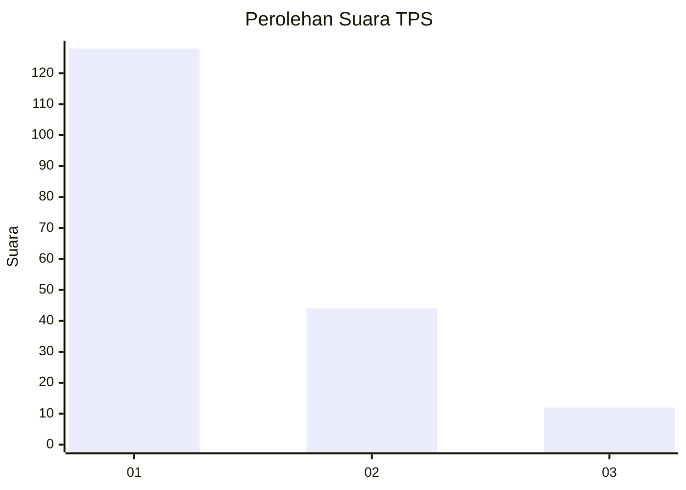
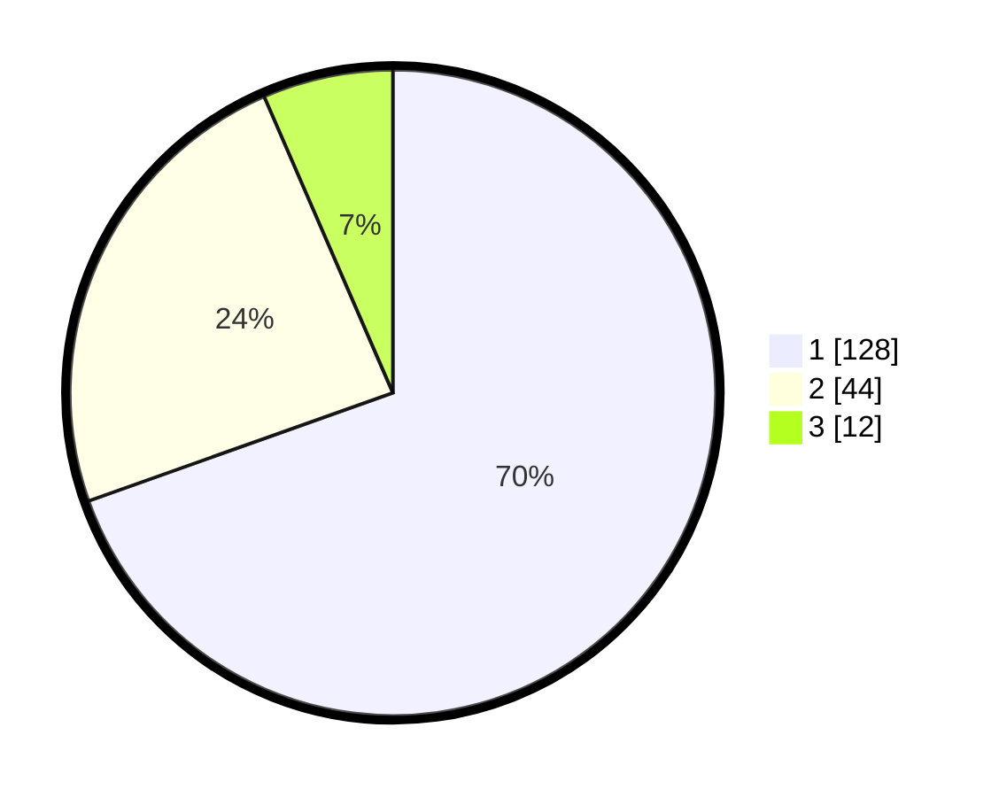

# Hasil

## Grafik

## Tabel

| No. | Nama Paslon    | Suara | Suara (raw) | Persentase |
|:--- |:-------------- | -----:| -----------:| ----------:|
| 1   | ANIES MUHAIMIN | 128   | [128][p-1]  | 69,57      |
| 2   | PRABOWO GIBRAN | 44    | [44][p-2]   | 23,91      |
| 3   | GANJAR MAHFUD  | 12    | [12][p-3]   | 6,52       |

[p-1]: https://github.com/gigit-pemilu/pemilu-2024/blob/main/pilpres/hitung-suara/sub/32-jawa-barat/sub/75-kota-bekasi/sub/05-rawalumbu/sub/1002-pengasinan/sub/032-tps/sub/paslon-1.txt
[p-2]: https://github.com/gigit-pemilu/pemilu-2024/blob/main/pilpres/hitung-suara/sub/32-jawa-barat/sub/75-kota-bekasi/sub/05-rawalumbu/sub/1002-pengasinan/sub/032-tps/sub/paslon-2.txt
[p-3]: https://github.com/gigit-pemilu/pemilu-2024/blob/main/pilpres/hitung-suara/sub/32-jawa-barat/sub/75-kota-bekasi/sub/05-rawalumbu/sub/1002-pengasinan/sub/032-tps/sub/paslon-3.txt

## Foto C Plano

https://sirekap-obj-formc.kpu.go.id/b5d8/pemilu/ppwp/32/75/05/10/02/3275051002032-20240214-204710--e1211bfa-fb63-4543-9711-c18dba35165d.jpg

https://sirekap-obj-formc.kpu.go.id/b5d8/pemilu/ppwp/32/75/05/10/02/3275051002032-20240214-204857--c7c350ea-74bf-4c68-b238-63565883353e.jpg

https://sirekap-obj-formc.kpu.go.id/b5d8/pemilu/ppwp/32/75/05/10/02/3275051002032-20240214-204957--5454bdad-dd20-40bb-952b-dbde58d431fa.jpg

## Metadata

| Key        | Value               |
| ---------- | ------------------- |
| Time Stamp | 2024-02-15 23:29:50 |

