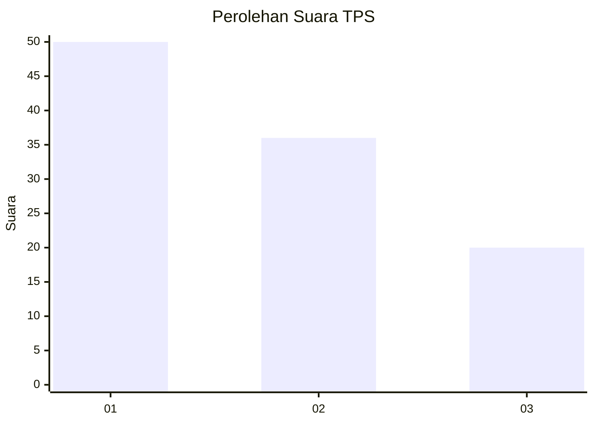
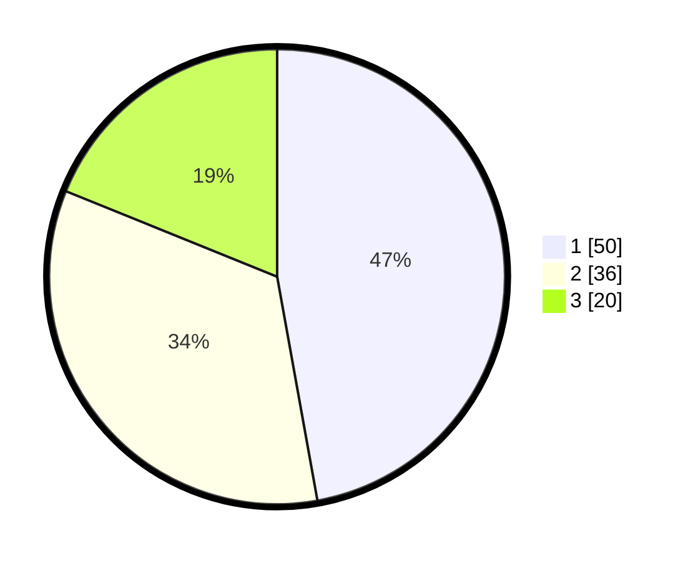

# Hasil

## Grafik

## Tabel

| No. | Nama Paslon    | Suara | Suara (raw) | Persentase |
|:--- |:-------------- | -----:| -----------:| ----------:|
| 1   | ANIES MUHAIMIN | 50    | [50][p-1]   | 47,17      |
| 2   | PRABOWO GIBRAN | 36    | [36][p-2]   | 33,96      |
| 3   | GANJAR MAHFUD  | 20    | [20][p-3]   | 18,87      |

[p-1]: https://github.com/gigit-pemilu/pemilu-2024/blob/main/pilpres/hitung-suara/sub/32-jawa-barat/sub/75-kota-bekasi/sub/05-rawalumbu/sub/1002-pengasinan/sub/154-tps/sub/paslon-1.txt
[p-2]: https://github.com/gigit-pemilu/pemilu-2024/blob/main/pilpres/hitung-suara/sub/32-jawa-barat/sub/75-kota-bekasi/sub/05-rawalumbu/sub/1002-pengasinan/sub/154-tps/sub/paslon-2.txt
[p-3]: https://github.com/gigit-pemilu/pemilu-2024/blob/main/pilpres/hitung-suara/sub/32-jawa-barat/sub/75-kota-bekasi/sub/05-rawalumbu/sub/1002-pengasinan/sub/154-tps/sub/paslon-3.txt

## Foto C Plano

https://sirekap-obj-formc.kpu.go.id/c1be/pemilu/ppwp/32/75/05/10/02/3275051002154-20240214-223825--c9248137-9327-4ad7-9bbc-0cd225ec4fa4.jpg

https://sirekap-obj-formc.kpu.go.id/c1be/pemilu/ppwp/32/75/05/10/02/3275051002154-20240214-221343--e48b52a7-4a8b-456d-80fc-04f67b0a258e.jpg

https://sirekap-obj-formc.kpu.go.id/c1be/pemilu/ppwp/32/75/05/10/02/3275051002154-20240214-221642--f47a5a63-59f8-4109-9160-145d0e163cac.jpg

## Metadata

| Key        | Value               |
| ---------- | ------------------- |
| Time Stamp | 2024-02-16 01:30:27 |

