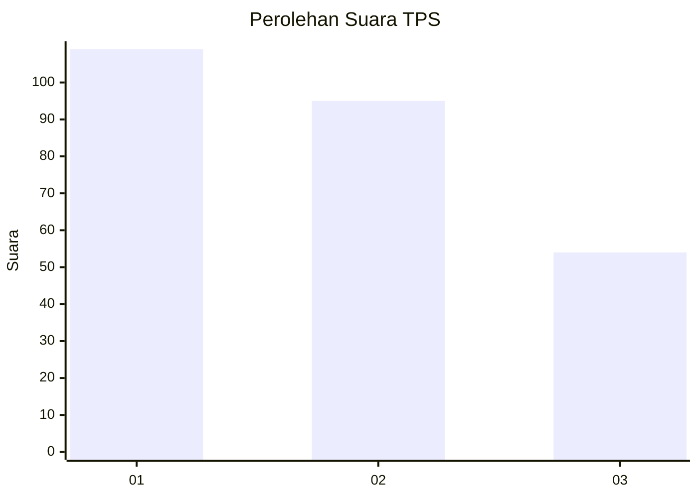
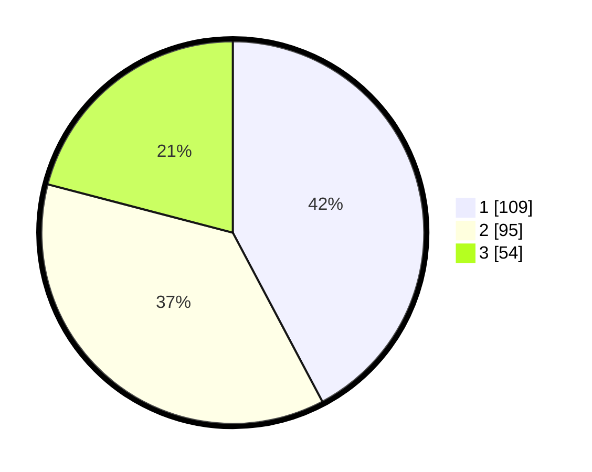

# Hasil

## Grafik

## Tabel

| No. | Nama Paslon    | Suara | Suara (raw) | Persentase |
|:--- |:-------------- | -----:| -----------:| ----------:|
| 1   | ANIES MUHAIMIN | 109   | [109][p-1]  | 42,25      |
| 2   | PRABOWO GIBRAN | 95    | [95][p-2]   | 36,82      |
| 3   | GANJAR MAHFUD  | 54    | [54][p-3]   | 20,93      |

[p-1]: https://github.com/gigit-pemilu/pemilu-2024/blob/main/pilpres/hitung-suara/sub/32-jawa-barat/sub/75-kota-bekasi/sub/05-rawalumbu/sub/1002-pengasinan/sub/175-tps/sub/paslon-1.txt
[p-2]: https://github.com/gigit-pemilu/pemilu-2024/blob/main/pilpres/hitung-suara/sub/32-jawa-barat/sub/75-kota-bekasi/sub/05-rawalumbu/sub/1002-pengasinan/sub/175-tps/sub/paslon-2.txt
[p-3]: https://github.com/gigit-pemilu/pemilu-2024/blob/main/pilpres/hitung-suara/sub/32-jawa-barat/sub/75-kota-bekasi/sub/05-rawalumbu/sub/1002-pengasinan/sub/175-tps/sub/paslon-3.txt

## Foto C Plano

https://sirekap-obj-formc.kpu.go.id/6267/pemilu/ppwp/32/75/05/10/02/3275051002175-20240214-233911--f8c1d451-3ef4-4d03-9845-6107a163078f.jpg

https://sirekap-obj-formc.kpu.go.id/6267/pemilu/ppwp/32/75/05/10/02/3275051002175-20240214-233945--3bfad4a8-bfb0-4f02-9c1d-a786b155088f.jpg

https://sirekap-obj-formc.kpu.go.id/6267/pemilu/ppwp/32/75/05/10/02/3275051002175-20240214-234013--2db4a1cd-d878-40d4-bb61-c440412582bd.jpg

## Metadata

| Key        | Value               |
| ---------- | ------------------- |
| Time Stamp | 2024-02-15 15:00:29 |

