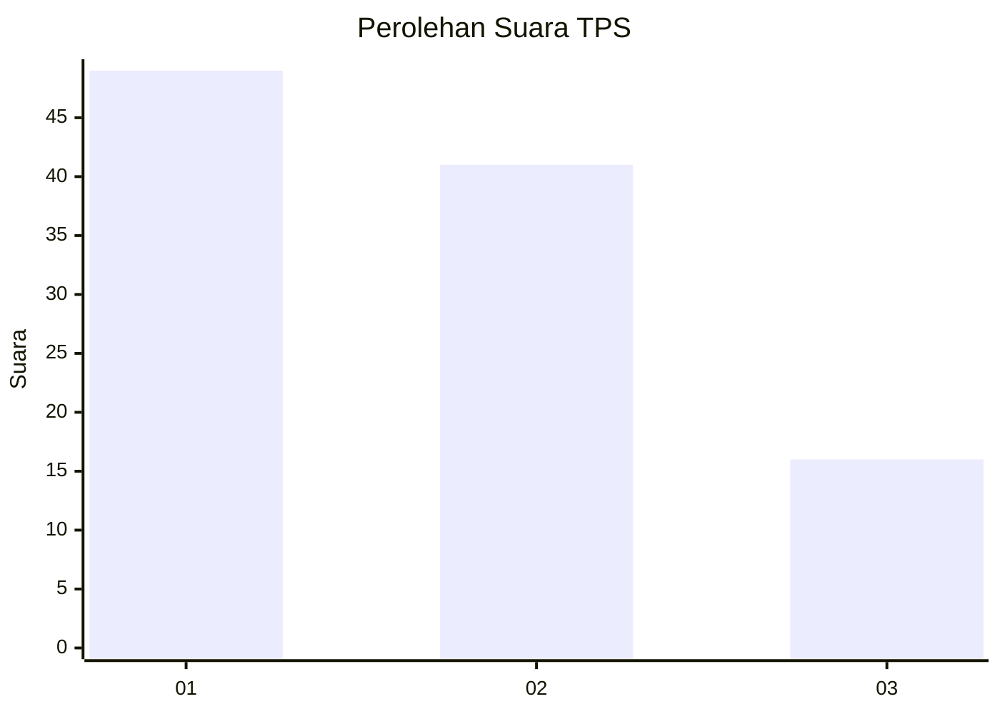
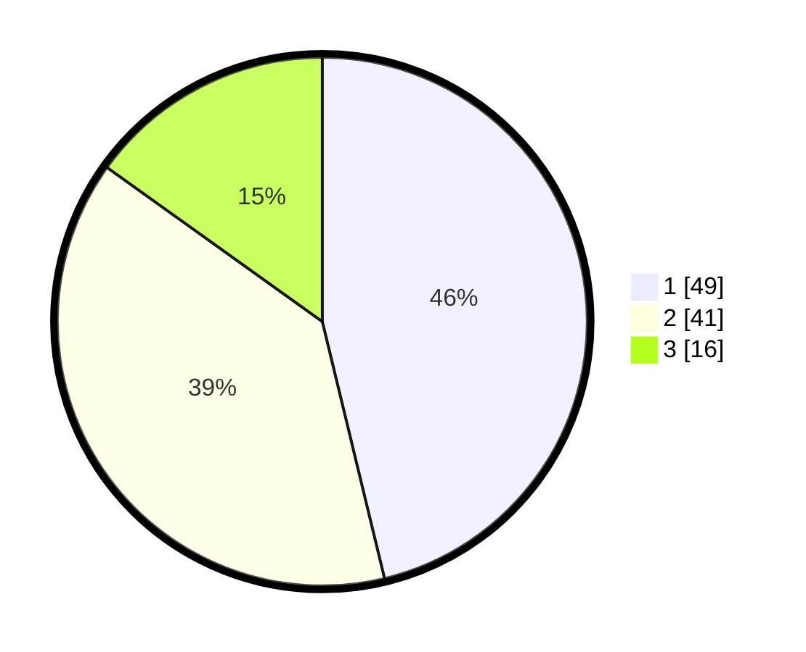

# Hasil

## Grafik

## Tabel

| No. | Nama Paslon    | Suara | Suara (raw) | Persentase |
|:--- |:-------------- | -----:| -----------:| ----------:|
| 1   | ANIES MUHAIMIN | 49    | [49][p-1]   | 46,23      |
| 2   | PRABOWO GIBRAN | 41    | [41][p-2]   | 38,68      |
| 3   | GANJAR MAHFUD  | 16    | [16][p-3]   | 15,09      |

[p-1]: https://github.com/gigit-pemilu/pemilu-2024-32-jawa-barat/blob/main/pilpres/hitung-suara/sub/32-jawa-barat/sub/75-kota-bekasi/sub/05-rawalumbu/sub/1004-bojongmenteng/sub/050-tps/sub/paslon-1.txt
[p-2]: https://github.com/gigit-pemilu/pemilu-2024-32-jawa-barat/blob/main/pilpres/hitung-suara/sub/32-jawa-barat/sub/75-kota-bekasi/sub/05-rawalumbu/sub/1004-bojongmenteng/sub/050-tps/sub/paslon-2.txt
[p-3]: https://github.com/gigit-pemilu/pemilu-2024-32-jawa-barat/blob/main/pilpres/hitung-suara/sub/32-jawa-barat/sub/75-kota-bekasi/sub/05-rawalumbu/sub/1004-bojongmenteng/sub/050-tps/sub/paslon-3.txt

## Foto C Plano

https://sirekap-obj-formc.kpu.go.id/aee6/pemilu/ppwp/32/75/05/10/04/3275051004050-20240214-230221--3c4b0d02-e16a-4801-a0cc-1f7e9c3aa444.jpg

https://sirekap-obj-formc.kpu.go.id/aee6/pemilu/ppwp/32/75/05/10/04/3275051004050-20240214-230322--8d69e2f9-d40d-4c63-8371-33d66b8a9b43.jpg

https://sirekap-obj-formc.kpu.go.id/aee6/pemilu/ppwp/32/75/05/10/04/3275051004050-20240214-230414--6750a660-7060-4ecb-80b4-6efbf9c2fed6.jpg

## Metadata

| Key        | Value               |
| ---------- | ------------------- |
| Time Stamp | 2024-02-16 00:00:26 |

