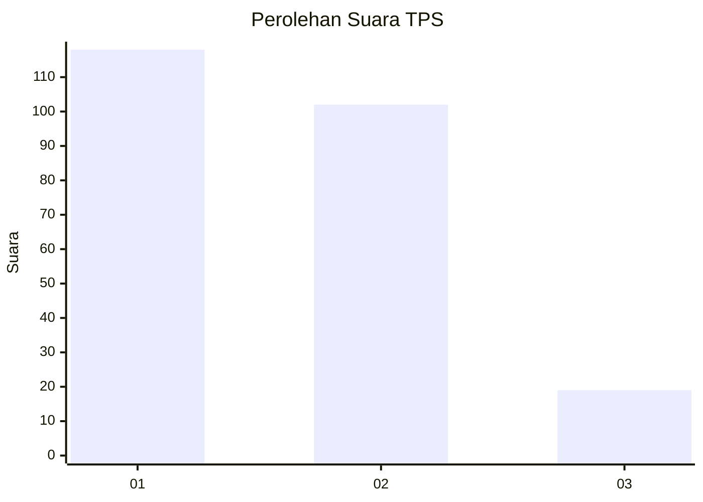
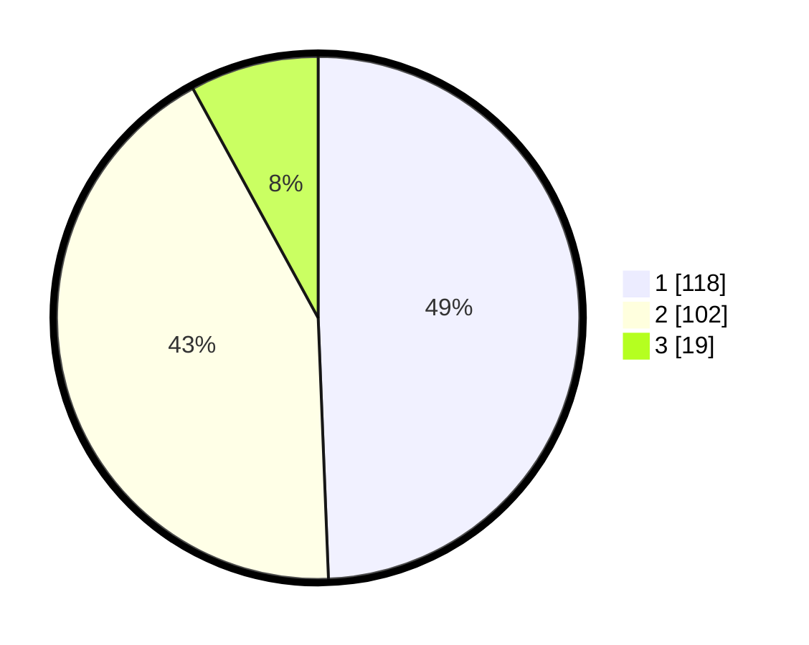

# Hasil

## Grafik

## Tabel

| No. | Nama Paslon    | Suara | Suara (raw) | Persentase |
|:--- |:-------------- | -----:| -----------:| ----------:|
| 1   | ANIES MUHAIMIN | 118   | [118][p-1]  | 49,37      |
| 2   | PRABOWO GIBRAN | 102   | [102][p-2]  | 42,68      |
| 3   | GANJAR MAHFUD  | 19    | [19][p-3]   | 7,95       |

[p-1]: https://github.com/gigit-pemilu/pemilu-2024/blob/main/pilpres/hitung-suara/sub/32-jawa-barat/sub/75-kota-bekasi/sub/06-medansatria/sub/1001-medansatria/sub/006-tps/sub/paslon-1.txt
[p-2]: https://github.com/gigit-pemilu/pemilu-2024/blob/main/pilpres/hitung-suara/sub/32-jawa-barat/sub/75-kota-bekasi/sub/06-medansatria/sub/1001-medansatria/sub/006-tps/sub/paslon-2.txt
[p-3]: https://github.com/gigit-pemilu/pemilu-2024/blob/main/pilpres/hitung-suara/sub/32-jawa-barat/sub/75-kota-bekasi/sub/06-medansatria/sub/1001-medansatria/sub/006-tps/sub/paslon-3.txt

## Foto C Plano

https://sirekap-obj-formc.kpu.go.id/9713/pemilu/ppwp/32/75/06/10/01/3275061001006-20240215-032936--453f7b5b-446c-47a4-a5b0-3360e081f18f.jpg

https://sirekap-obj-formc.kpu.go.id/9713/pemilu/ppwp/32/75/06/10/01/3275061001006-20240215-033049--5b543100-99a9-4972-9c47-717fc587e319.jpg

https://sirekap-obj-formc.kpu.go.id/9713/pemilu/ppwp/32/75/06/10/01/3275061001006-20240215-033156--e70b207e-0b0a-462d-95ff-05f3c5ea6bf3.jpg

## Metadata

| Key        | Value               |
| ---------- | ------------------- |
| Time Stamp | 2024-02-15 20:30:46 |

