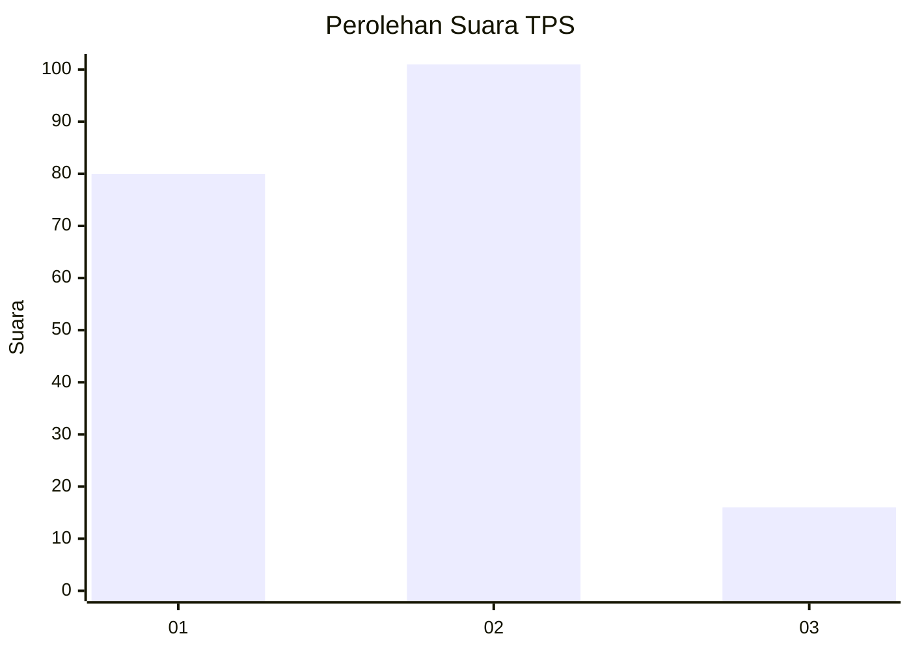
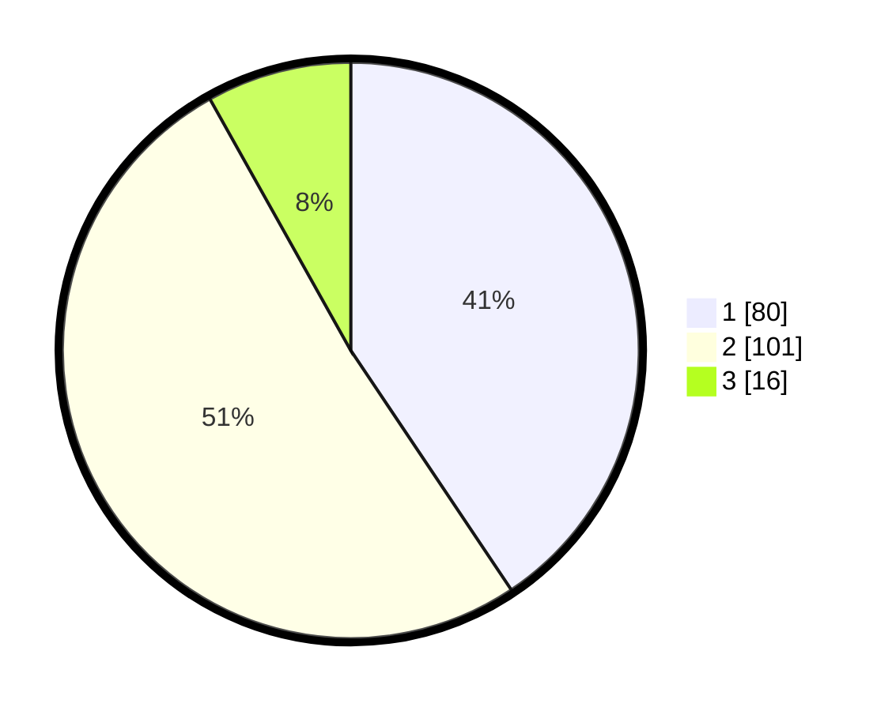

# Hasil

## Grafik

## Tabel

| No. | Nama Paslon    | Suara | Suara (raw) | Persentase |
|:--- |:-------------- | -----:| -----------:| ----------:|
| 1   | ANIES MUHAIMIN | 80    | [80][p-1]   | 40,61      |
| 2   | PRABOWO GIBRAN | 101   | [101][p-2]  | 51,27      |
| 3   | GANJAR MAHFUD  | 16    | [16][p-3]   | 8,12       |

[p-1]: https://github.com/gigit-pemilu/pemilu-2024-32-jawa-barat/blob/main/pilpres/hitung-suara/sub/32-jawa-barat/sub/75-kota-bekasi/sub/06-medansatria/sub/1001-medansatria/sub/009-tps/sub/paslon-1.txt
[p-2]: https://github.com/gigit-pemilu/pemilu-2024-32-jawa-barat/blob/main/pilpres/hitung-suara/sub/32-jawa-barat/sub/75-kota-bekasi/sub/06-medansatria/sub/1001-medansatria/sub/009-tps/sub/paslon-2.txt
[p-3]: https://github.com/gigit-pemilu/pemilu-2024-32-jawa-barat/blob/main/pilpres/hitung-suara/sub/32-jawa-barat/sub/75-kota-bekasi/sub/06-medansatria/sub/1001-medansatria/sub/009-tps/sub/paslon-3.txt

## Foto C Plano

https://sirekap-obj-formc.kpu.go.id/4b85/pemilu/ppwp/32/75/06/10/01/3275061001009-20240214-224027--6358b73d-767f-4778-92c6-e071b347f22b.jpg

https://sirekap-obj-formc.kpu.go.id/4b85/pemilu/ppwp/32/75/06/10/01/3275061001009-20240214-224156--256d91ff-d15c-4382-9080-10cccf76e29e.jpg

https://sirekap-obj-formc.kpu.go.id/4b85/pemilu/ppwp/32/75/06/10/01/3275061001009-20240214-224422--0a5a7097-104b-470c-b551-5988a3d157b0.jpg

## Metadata

| Key        | Value               |
| ---------- | ------------------- |
| Time Stamp | 2024-02-25 11:00:00 |

