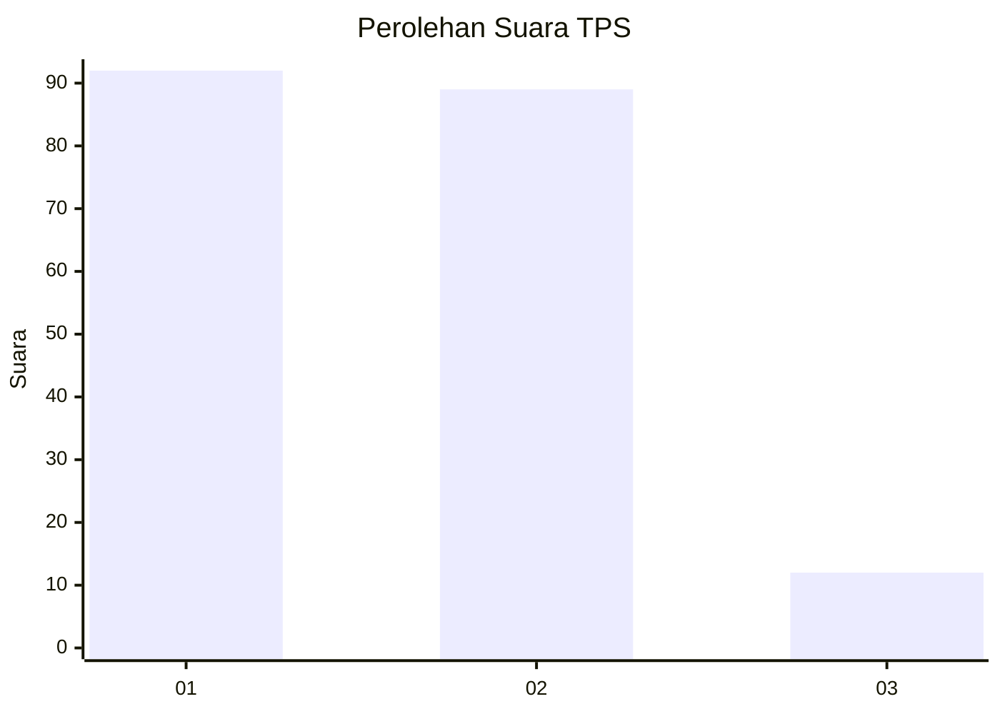
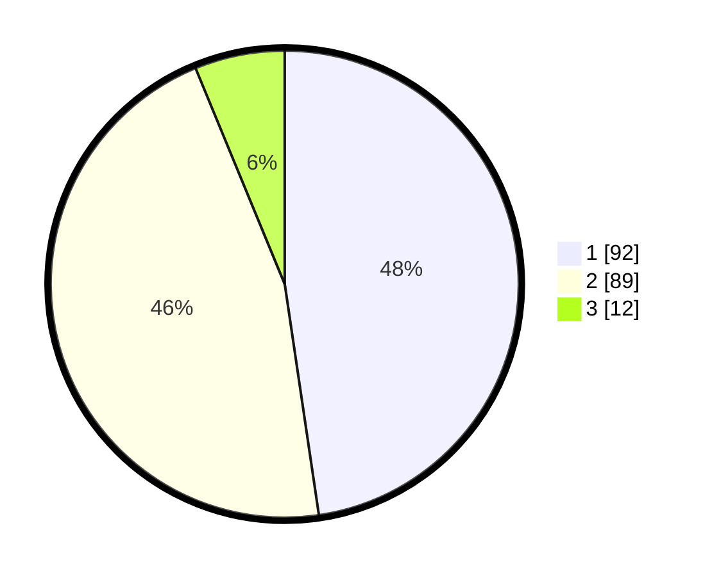

# Hasil

## Grafik

## Tabel

| No. | Nama Paslon    | Suara | Suara (raw) | Persentase |
|:--- |:-------------- | -----:| -----------:| ----------:|
| 1   | ANIES MUHAIMIN | 92    | [92][p-1]   | 47,67      |
| 2   | PRABOWO GIBRAN | 89    | [89][p-2]   | 46,11      |
| 3   | GANJAR MAHFUD  | 12    | [12][p-3]   | 6,22       |

[p-1]: https://github.com/gigit-pemilu/pemilu-2024/blob/main/pilpres/hitung-suara/sub/32-jawa-barat/sub/75-kota-bekasi/sub/06-medansatria/sub/1001-medansatria/sub/014-tps/sub/paslon-1.txt
[p-2]: https://github.com/gigit-pemilu/pemilu-2024/blob/main/pilpres/hitung-suara/sub/32-jawa-barat/sub/75-kota-bekasi/sub/06-medansatria/sub/1001-medansatria/sub/014-tps/sub/paslon-2.txt
[p-3]: https://github.com/gigit-pemilu/pemilu-2024/blob/main/pilpres/hitung-suara/sub/32-jawa-barat/sub/75-kota-bekasi/sub/06-medansatria/sub/1001-medansatria/sub/014-tps/sub/paslon-3.txt

## Foto C Plano

https://sirekap-obj-formc.kpu.go.id/e850/pemilu/ppwp/32/75/06/10/01/3275061001014-20240214-234637--722ebfd1-99fd-4b5b-bf9b-aa406b83e530.jpg

https://sirekap-obj-formc.kpu.go.id/e850/pemilu/ppwp/32/75/06/10/01/3275061001014-20240214-234823--579abb4d-3a17-4d84-8c1f-7fb5101d4f42.jpg

https://sirekap-obj-formc.kpu.go.id/e850/pemilu/ppwp/32/75/06/10/01/3275061001014-20240214-235002--7e9e8157-55cf-4ec5-8915-43d2a4325db7.jpg

## Metadata

| Key        | Value               |
| ---------- | ------------------- |
| Time Stamp | 2024-02-24 23:00:00 |

