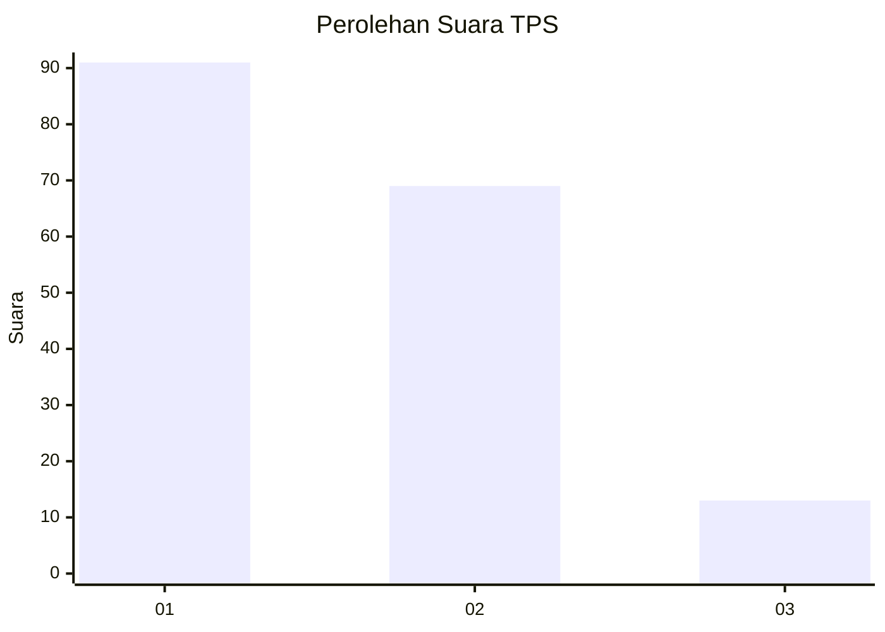
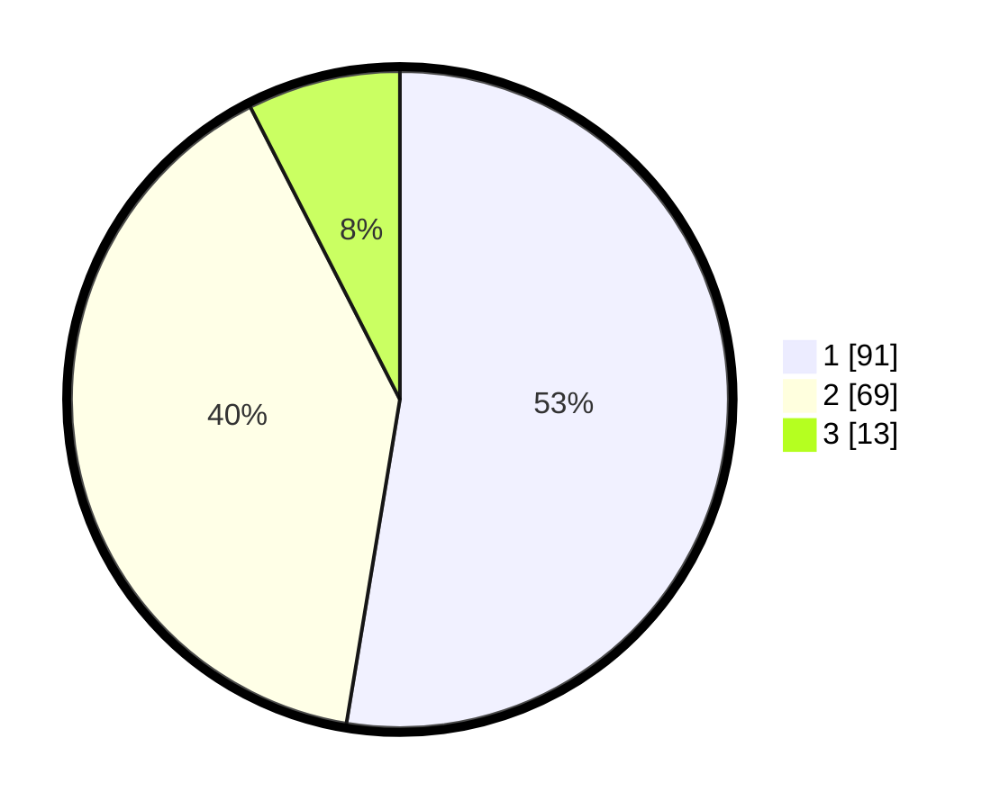

# Hasil

## Grafik

## Tabel

| No. | Nama Paslon    | Suara | Suara (raw) | Persentase |
|:--- |:-------------- | -----:| -----------:| ----------:|
| 1   | ANIES MUHAIMIN | 91    | [91][p-1]   | 52,60      |
| 2   | PRABOWO GIBRAN | 69    | [69][p-2]   | 39,88      |
| 3   | GANJAR MAHFUD  | 13    | [13][p-3]   | 7,51       |

[p-1]: https://github.com/gigit-pemilu/pemilu-2024-32-jawa-barat/blob/main/pilpres/hitung-suara/sub/32-jawa-barat/sub/75-kota-bekasi/sub/06-medansatria/sub/1001-medansatria/sub/015-tps/sub/paslon-1.txt
[p-2]: https://github.com/gigit-pemilu/pemilu-2024-32-jawa-barat/blob/main/pilpres/hitung-suara/sub/32-jawa-barat/sub/75-kota-bekasi/sub/06-medansatria/sub/1001-medansatria/sub/015-tps/sub/paslon-2.txt
[p-3]: https://github.com/gigit-pemilu/pemilu-2024-32-jawa-barat/blob/main/pilpres/hitung-suara/sub/32-jawa-barat/sub/75-kota-bekasi/sub/06-medansatria/sub/1001-medansatria/sub/015-tps/sub/paslon-3.txt

## Foto C Plano

https://sirekap-obj-formc.kpu.go.id/895a/pemilu/ppwp/32/75/06/10/01/3275061001015-20240214-213855--5c6a417f-bd85-42ca-86d5-856289eee067.jpg

https://sirekap-obj-formc.kpu.go.id/895a/pemilu/ppwp/32/75/06/10/01/3275061001015-20240214-214050--f6f23626-b340-45d5-9760-a78b1e362dd5.jpg

https://sirekap-obj-formc.kpu.go.id/895a/pemilu/ppwp/32/75/06/10/01/3275061001015-20240214-214243--b353ec75-a8b1-4f74-9058-a65b921cf9be.jpg

## Metadata

| Key        | Value               |
| ---------- | ------------------- |
| Time Stamp | 2024-02-15 20:30:46 |

