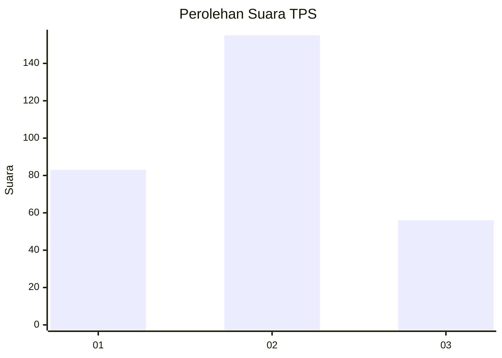
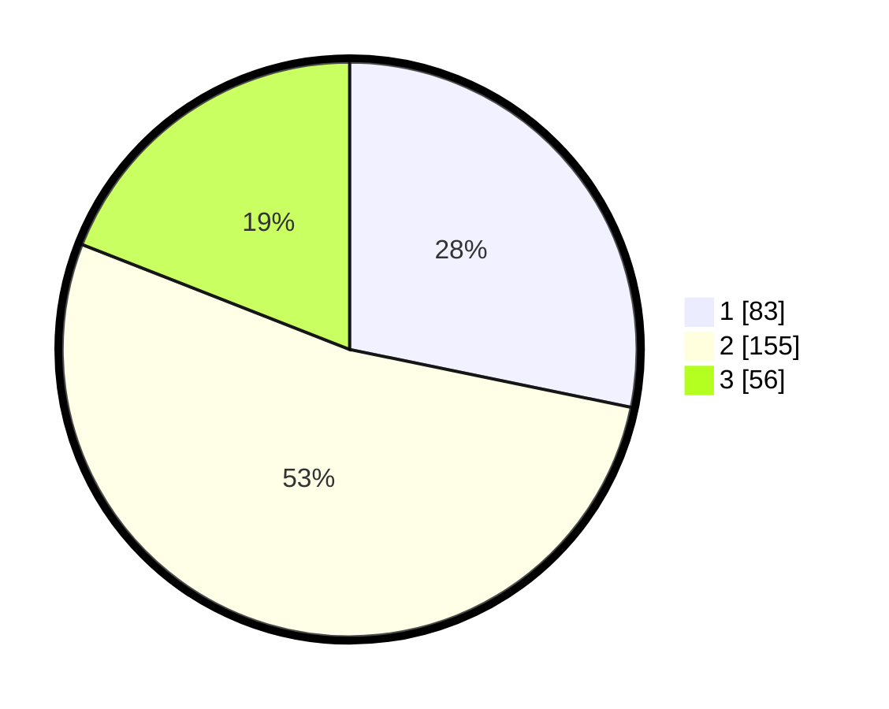

# Hasil

## Grafik

## Tabel

| No. | Nama Paslon    | Suara | Suara (raw) | Persentase |
|:--- |:-------------- | -----:| -----------:| ----------:|
| 1   | ANIES MUHAIMIN | 83    | [83][p-1]   | 28,23      |
| 2   | PRABOWO GIBRAN | 155   | [155][p-2]  | 52,72      |
| 3   | GANJAR MAHFUD  | 56    | [56][p-3]   | 19,05      |

[p-1]: https://github.com/gigit-pemilu/pemilu-2024/blob/main/pilpres/hitung-suara/sub/32-jawa-barat/sub/75-kota-bekasi/sub/06-medansatria/sub/1002-harapanmulya/sub/072-tps/sub/paslon-1.txt
[p-2]: https://github.com/gigit-pemilu/pemilu-2024/blob/main/pilpres/hitung-suara/sub/32-jawa-barat/sub/75-kota-bekasi/sub/06-medansatria/sub/1002-harapanmulya/sub/072-tps/sub/paslon-2.txt
[p-3]: https://github.com/gigit-pemilu/pemilu-2024/blob/main/pilpres/hitung-suara/sub/32-jawa-barat/sub/75-kota-bekasi/sub/06-medansatria/sub/1002-harapanmulya/sub/072-tps/sub/paslon-3.txt

## Foto C Plano

https://sirekap-obj-formc.kpu.go.id/48ee/pemilu/ppwp/32/75/06/10/02/3275061002072-20240214-204819--db799275-f1e5-4ee0-b717-2ebb316d5cc8.jpg

https://sirekap-obj-formc.kpu.go.id/48ee/pemilu/ppwp/32/75/06/10/02/3275061002072-20240214-204922--ae7168ec-a8db-4bd2-bdd8-9645d86d8715.jpg

https://sirekap-obj-formc.kpu.go.id/48ee/pemilu/ppwp/32/75/06/10/02/3275061002072-20240214-205040--bba22ece-3894-4111-aeea-0589fb3cb561.jpg

## Metadata

| Key        | Value               |
| ---------- | ------------------- |
| Time Stamp | 2024-02-24 22:31:28 |

