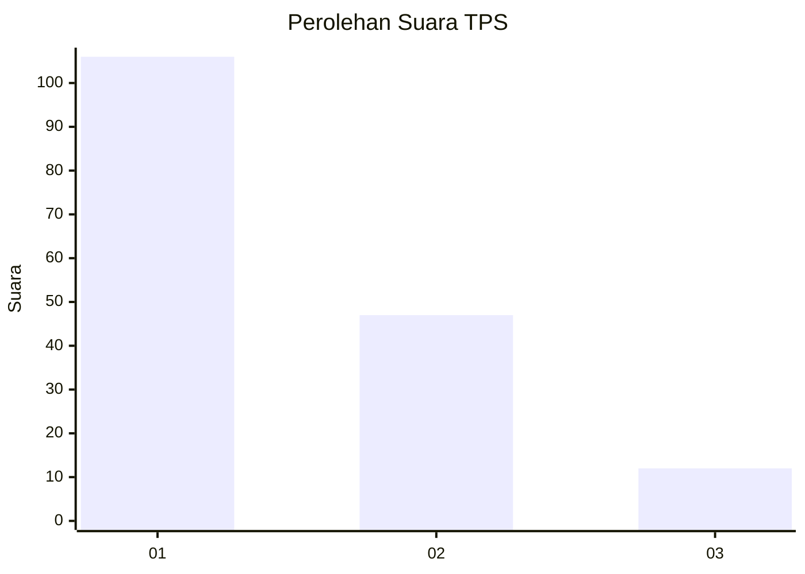
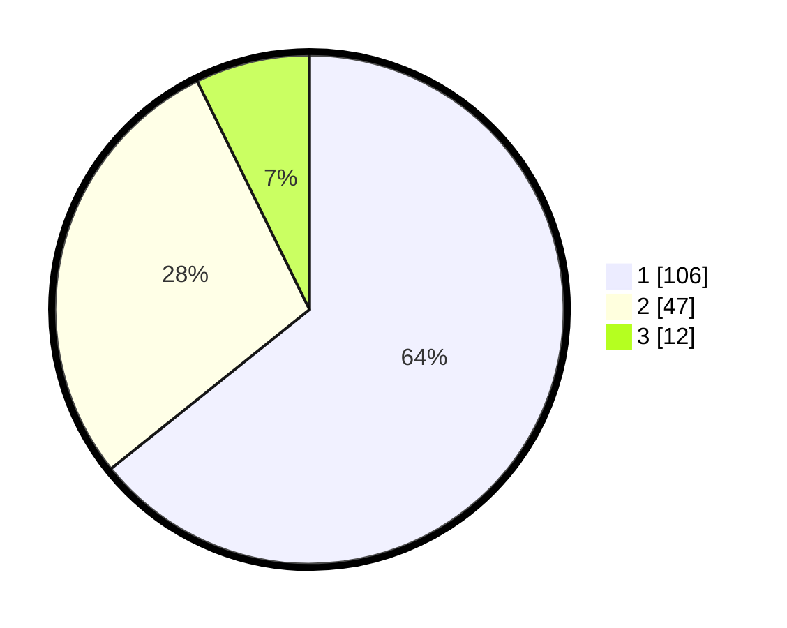

# Hasil

## Grafik

## Tabel

| No. | Nama Paslon    | Suara | Suara (raw) | Persentase |
|:--- |:-------------- | -----:| -----------:| ----------:|
| 1   | ANIES MUHAIMIN | 106   | [106][p-1]  | 64,24      |
| 2   | PRABOWO GIBRAN | 47    | [47][p-2]   | 28,48      |
| 3   | GANJAR MAHFUD  | 12    | [12][p-3]   | 7,27       |

[p-1]: https://github.com/gigit-pemilu/pemilu-2024/blob/main/pilpres/hitung-suara/sub/32-jawa-barat/sub/75-kota-bekasi/sub/06-medansatria/sub/1003-pejuang/sub/063-tps/sub/paslon-1.txt
[p-2]: https://github.com/gigit-pemilu/pemilu-2024/blob/main/pilpres/hitung-suara/sub/32-jawa-barat/sub/75-kota-bekasi/sub/06-medansatria/sub/1003-pejuang/sub/063-tps/sub/paslon-2.txt
[p-3]: https://github.com/gigit-pemilu/pemilu-2024/blob/main/pilpres/hitung-suara/sub/32-jawa-barat/sub/75-kota-bekasi/sub/06-medansatria/sub/1003-pejuang/sub/063-tps/sub/paslon-3.txt

## Foto C Plano

https://sirekap-obj-formc.kpu.go.id/c2aa/pemilu/ppwp/32/75/06/10/03/3275061003063-20240215-213115--4dcf2cc5-2c97-4311-9d43-3bfa1005c040.jpg

https://sirekap-obj-formc.kpu.go.id/c2aa/pemilu/ppwp/32/75/06/10/03/3275061003063-20240215-213124--c993e6eb-babf-4661-a684-ff3917fc06cd.jpg

https://sirekap-obj-formc.kpu.go.id/c2aa/pemilu/ppwp/32/75/06/10/03/3275061003063-20240215-213130--b60fba2f-29f2-4fd5-ab0f-56d6171f5ea5.jpg

## Metadata

| Key        | Value               |
| ---------- | ------------------- |
| Time Stamp | 2024-02-16 04:30:27 |

