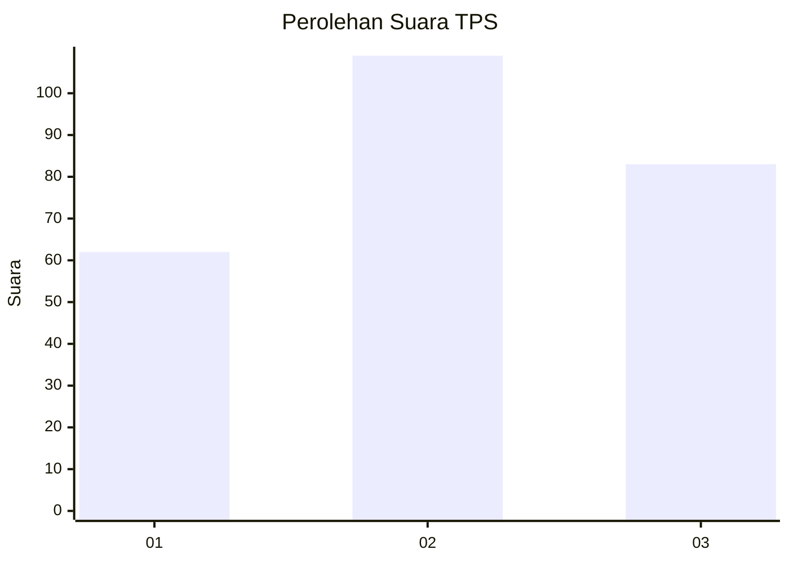
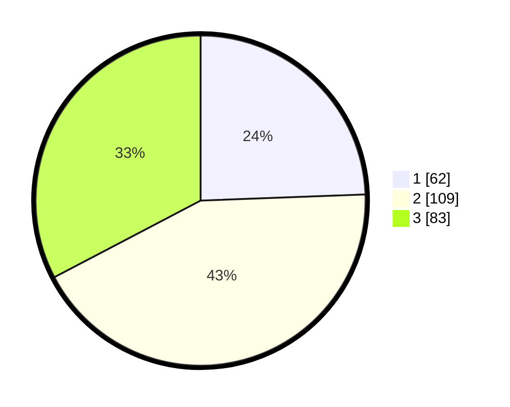

# Hasil

## Grafik

## Tabel

| No. | Nama Paslon    | Suara | Suara (raw) | Persentase |
|:--- |:-------------- | -----:| -----------:| ----------:|
| 1   | ANIES MUHAIMIN | 62    | [62][p-1]   | 24,41      |
| 2   | PRABOWO GIBRAN | 109   | [109][p-2]  | 42,91      |
| 3   | GANJAR MAHFUD  | 83    | [83][p-3]   | 32,68      |

[p-1]: https://github.com/gigit-pemilu/pemilu-2024-32-jawa-barat/blob/main/pilpres/hitung-suara/sub/32-jawa-barat/sub/75-kota-bekasi/sub/06-medansatria/sub/1003-pejuang/sub/220-tps/sub/paslon-1.txt
[p-2]: https://github.com/gigit-pemilu/pemilu-2024-32-jawa-barat/blob/main/pilpres/hitung-suara/sub/32-jawa-barat/sub/75-kota-bekasi/sub/06-medansatria/sub/1003-pejuang/sub/220-tps/sub/paslon-2.txt
[p-3]: https://github.com/gigit-pemilu/pemilu-2024-32-jawa-barat/blob/main/pilpres/hitung-suara/sub/32-jawa-barat/sub/75-kota-bekasi/sub/06-medansatria/sub/1003-pejuang/sub/220-tps/sub/paslon-3.txt

## Foto C Plano

https://sirekap-obj-formc.kpu.go.id/0f6b/pemilu/ppwp/32/75/06/10/03/3275061003220-20240215-013547--1bc3acea-894e-4b85-9122-c29bbb0631da.jpg

https://sirekap-obj-formc.kpu.go.id/0f6b/pemilu/ppwp/32/75/06/10/03/3275061003220-20240215-013642--d69a9010-6926-44b8-806e-d6096802f9ad.jpg

https://sirekap-obj-formc.kpu.go.id/0f6b/pemilu/ppwp/32/75/06/10/03/3275061003220-20240215-025505--9d0e4243-ef87-4a66-ae29-275967e633c0.jpg

## Metadata

| Key        | Value               |
| ---------- | ------------------- |
| Time Stamp | 2024-02-25 11:00:00 |

