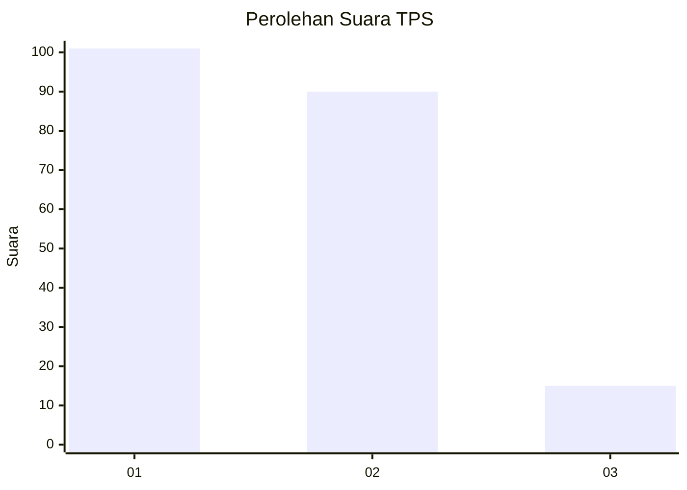
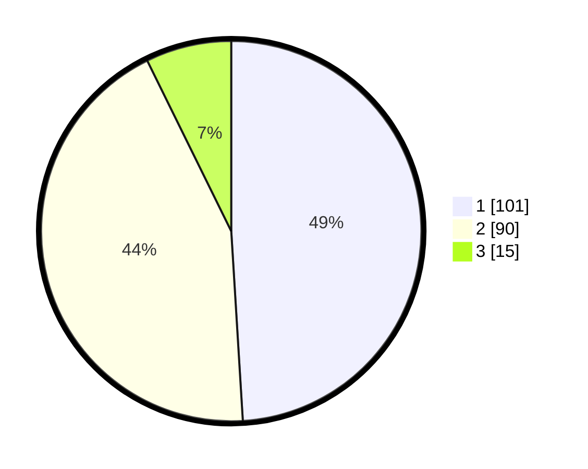

# Hasil

## Grafik

## Tabel

| No. | Nama Paslon    | Suara | Suara (raw) | Persentase |
|:--- |:-------------- | -----:| -----------:| ----------:|
| 1   | ANIES MUHAIMIN | 101   | [101][p-1]  | 49,03      |
| 2   | PRABOWO GIBRAN | 90    | [90][p-2]   | 43,69      |
| 3   | GANJAR MAHFUD  | 15    | [15][p-3]   | 7,28       |

[p-1]: https://github.com/gigit-pemilu/pemilu-2024/blob/main/pilpres/hitung-suara/sub/32-jawa-barat/sub/75-kota-bekasi/sub/07-bantargebang/sub/1003-bantargebang/sub/002-tps/sub/paslon-1.txt
[p-2]: https://github.com/gigit-pemilu/pemilu-2024/blob/main/pilpres/hitung-suara/sub/32-jawa-barat/sub/75-kota-bekasi/sub/07-bantargebang/sub/1003-bantargebang/sub/002-tps/sub/paslon-2.txt
[p-3]: https://github.com/gigit-pemilu/pemilu-2024/blob/main/pilpres/hitung-suara/sub/32-jawa-barat/sub/75-kota-bekasi/sub/07-bantargebang/sub/1003-bantargebang/sub/002-tps/sub/paslon-3.txt

## Foto C Plano

https://sirekap-obj-formc.kpu.go.id/88fd/pemilu/ppwp/32/75/07/10/03/3275071003002-20240214-222403--a37c7174-591b-46a7-9ad6-78592c78762f.jpg

https://sirekap-obj-formc.kpu.go.id/88fd/pemilu/ppwp/32/75/07/10/03/3275071003002-20240214-222532--17c67b6f-2d01-41ac-a399-24a4317cf4ae.jpg

https://sirekap-obj-formc.kpu.go.id/88fd/pemilu/ppwp/32/75/07/10/03/3275071003002-20240214-222655--a7afb84c-2d12-4895-bea6-0770fd755c9f.jpg

## Metadata

| Key        | Value               |
| ---------- | ------------------- |
| Time Stamp | 2024-02-15 21:30:27 |

