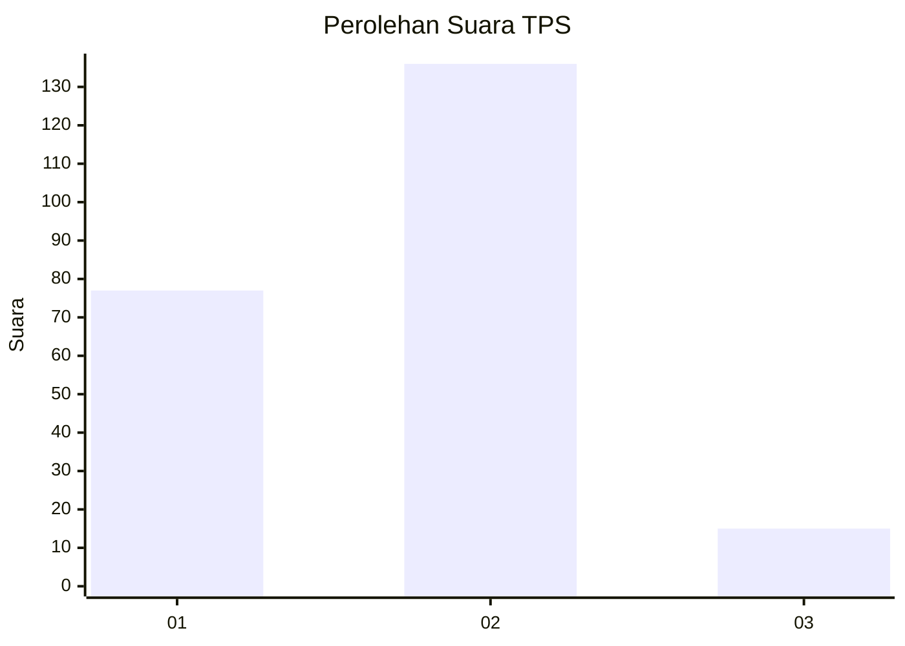
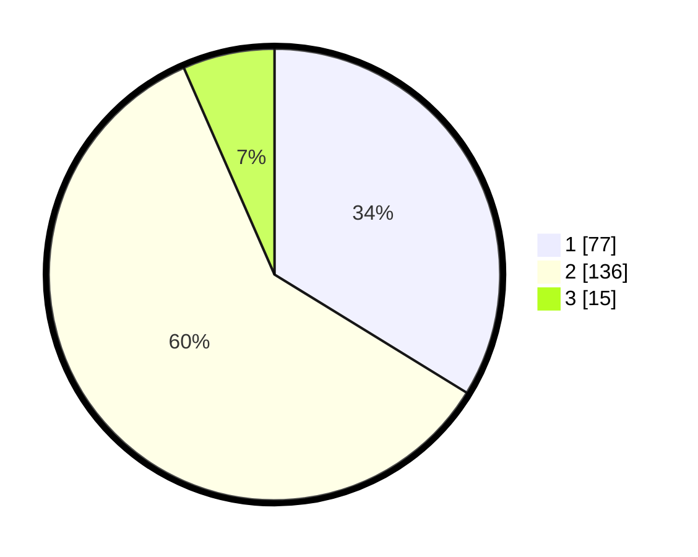

# Hasil

## Grafik

## Tabel

| No. | Nama Paslon    | Suara | Suara (raw) | Persentase |
|:--- |:-------------- | -----:| -----------:| ----------:|
| 1   | ANIES MUHAIMIN | 77    | [77][p-1]   | 33,77      |
| 2   | PRABOWO GIBRAN | 136   | [136][p-2]  | 59,65      |
| 3   | GANJAR MAHFUD  | 15    | [15][p-3]   | 6,58       |

[p-1]: https://github.com/gigit-pemilu/pemilu-2024-32-jawa-barat/blob/main/pilpres/hitung-suara/sub/32-jawa-barat/sub/75-kota-bekasi/sub/07-bantargebang/sub/1003-bantargebang/sub/004-tps/sub/paslon-1.txt
[p-2]: https://github.com/gigit-pemilu/pemilu-2024-32-jawa-barat/blob/main/pilpres/hitung-suara/sub/32-jawa-barat/sub/75-kota-bekasi/sub/07-bantargebang/sub/1003-bantargebang/sub/004-tps/sub/paslon-2.txt
[p-3]: https://github.com/gigit-pemilu/pemilu-2024-32-jawa-barat/blob/main/pilpres/hitung-suara/sub/32-jawa-barat/sub/75-kota-bekasi/sub/07-bantargebang/sub/1003-bantargebang/sub/004-tps/sub/paslon-3.txt

## Foto C Plano

https://sirekap-obj-formc.kpu.go.id/a3bd/pemilu/ppwp/32/75/07/10/03/3275071003004-20240215-010123--38be2567-841c-45a9-ade7-8b235984bda8.jpg

https://sirekap-obj-formc.kpu.go.id/a3bd/pemilu/ppwp/32/75/07/10/03/3275071003004-20240215-010326--e576dd83-c51e-4e36-ad3e-b99e9cd4f3f7.jpg

https://sirekap-obj-formc.kpu.go.id/a3bd/pemilu/ppwp/32/75/07/10/03/3275071003004-20240215-010532--81b9605a-5a4b-49fb-88e5-534906a31607.jpg

## Metadata

| Key        | Value               |
| ---------- | ------------------- |
| Time Stamp | 2024-02-24 22:31:28 |

