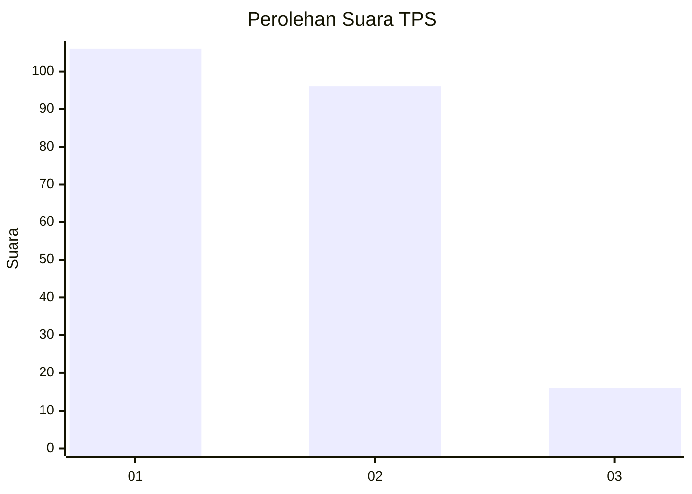
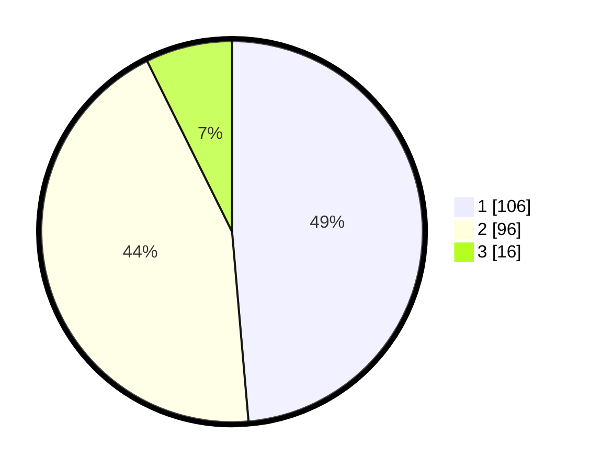

# Hasil

## Grafik

## Tabel

| No. | Nama Paslon    | Suara | Suara (raw) | Persentase |
|:--- |:-------------- | -----:| -----------:| ----------:|
| 1   | ANIES MUHAIMIN | 106   | [106][p-1]  | 48,62      |
| 2   | PRABOWO GIBRAN | 96    | [96][p-2]   | 44,04      |
| 3   | GANJAR MAHFUD  | 16    | [16][p-3]   | 7,34       |

[p-1]: https://github.com/gigit-pemilu/pemilu-2024/blob/main/pilpres/hitung-suara/sub/32-jawa-barat/sub/75-kota-bekasi/sub/07-bantargebang/sub/1003-bantargebang/sub/006-tps/sub/paslon-1.txt
[p-2]: https://github.com/gigit-pemilu/pemilu-2024/blob/main/pilpres/hitung-suara/sub/32-jawa-barat/sub/75-kota-bekasi/sub/07-bantargebang/sub/1003-bantargebang/sub/006-tps/sub/paslon-2.txt
[p-3]: https://github.com/gigit-pemilu/pemilu-2024/blob/main/pilpres/hitung-suara/sub/32-jawa-barat/sub/75-kota-bekasi/sub/07-bantargebang/sub/1003-bantargebang/sub/006-tps/sub/paslon-3.txt

## Foto C Plano

https://sirekap-obj-formc.kpu.go.id/cf26/pemilu/ppwp/32/75/07/10/03/3275071003006-20240214-160130--ccd865e7-12cb-49a7-99f1-79dc214341b6.jpg

https://sirekap-obj-formc.kpu.go.id/cf26/pemilu/ppwp/32/75/07/10/03/3275071003006-20240214-155559--a2e06da7-0dd2-4611-84f6-baf9bed2b522.jpg

https://sirekap-obj-formc.kpu.go.id/cf26/pemilu/ppwp/32/75/07/10/03/3275071003006-20240214-155726--e64257c3-eba8-4977-ba5a-10ea2c118e7b.jpg

## Metadata

| Key        | Value               |
| ---------- | ------------------- |
| Time Stamp | 2024-02-15 21:30:27 |

